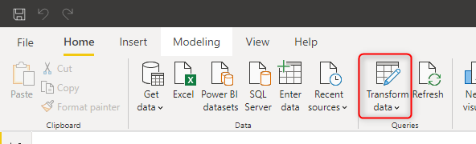
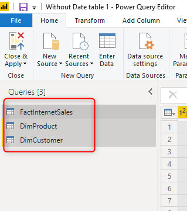
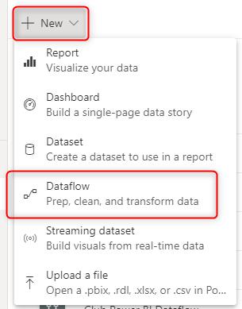
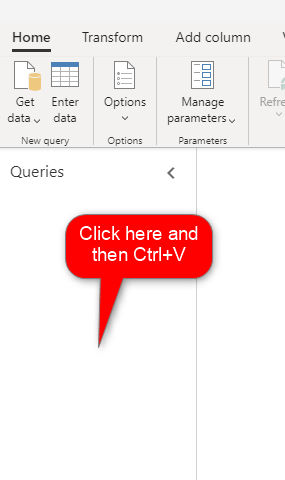
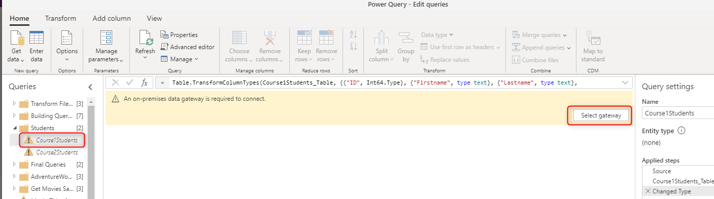
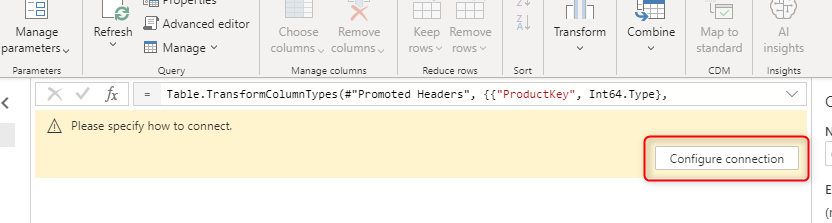
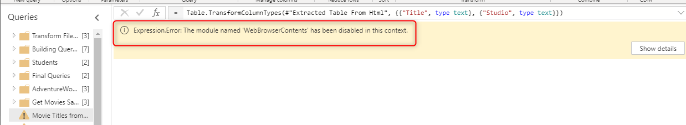
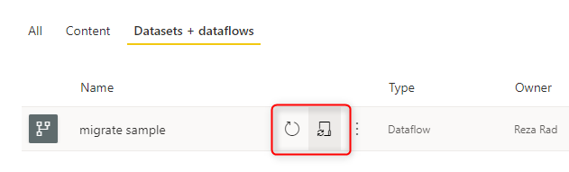
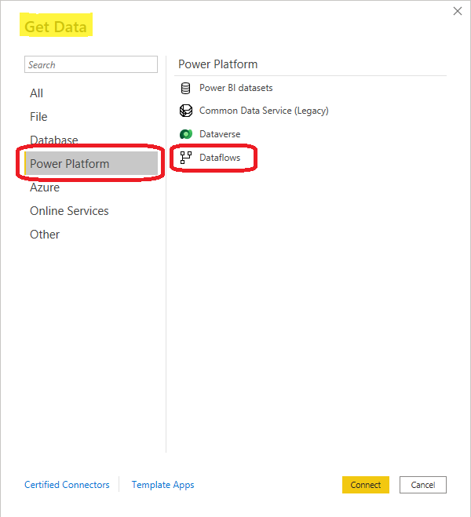

# How to migrate queries from Power Query in the desktop (Power BI and Excel) to dataflows

If you already have queries in Power Query, either in Power BI Desktop or in Excel, you might want to migrate the queries into dataflows. The migration process is simple and straightforward. In this article, you'll learn the steps to do so.

To learn how to create a dataflow in Microsoft Power Platform, go to [Create and use dataflows in Power Platform](/data-integration/dataflows/dataflows-integration-overview). To learn how to create a dataflow in Power BI, go to [Creating and using dataflows in Power BI](/power-bi/service-dataflows-create-use).

## Migrating the queries from the desktop

To migrate queries from Power Query in the desktop tools:

1. Open Power Query Editor:

   * In Power BI Desktop on the **Home** tab, select **Transform data**.

     > [!div class="mx-imgBorder"]
     > 

   * In Excel on the **Data** tab, select **Get Data**> **Launch Power Query Editor**.

     > [!div class="mx-imgBorder"]
     > 

2. Copy the queries:

   If you've organized your queries into folders (called *groups* in Power Query):

   1. In the **Queries** pane, select **Ctrl** as you select the folders you want to migrate to the dataflow.
   2. Select **Ctrl**+C.

      > [!div class="mx-imgBorder"]
      > 

   If you don't have folders:

   1. In the **Queries** pane, select **Ctrl** as you select the queries you want to migrate.
   1. Select **Ctrl**+C.

      > [!div class="mx-imgBorder"]
      > 

3. Paste the copied queries into a dataflow:

   1. Create a dataflow, if you don't have one already. 

      > [!div class="mx-imgBorder"]
      > 

   2. Open the dataflow in Power Query Editor, and in the **Queries** pane, select **Ctrl**+V to paste the copied folders or queries.

      > [!div class="mx-imgBorder"]
      > 

   The image below shows an example of successfully copied folders.
   
   > [!div class="mx-imgBorder"]
   > 

4. Connect the on-premises data gateway.

   If your data source is an on-premises source, you need to perform an extra step. Examples of on-premises sources can be Excel files in a shared folder in a local domain, or a SQL Server database hosted in an on-premises server.

   A dataflow, as a cloud-based service, requires the on-premises data gateway to connect to the on-premises data source. You need to [install and configure the gateway](/data-integration/gateway/service-gateway-install) for that source system, and then add [the data source for it](/data-integration/gateway/service-gateway-manage). After you've completed these steps, you can select the on-premises data gateway when you create the entity in the dataflow.

   > [!div class="mx-imgBorder"]
   > 

   The gateway isn't needed for data sources residing in the cloud, such as an Azure SQL database.

5. Configure the connection to the data source by selecting **Configure connection** and entering credentials or anything else you need to connect to the data source at this stage.

   

6. Verify the connection:

   If you've done all the steps successfully, you'll see a preview of the data in the Power Query Editor.

## Some Power Query Desktop functions require a gateway in Power Query Online

Some of the functions might require a gateway, even if their source is not located on-premises. Among these are functions such as `Web.BrowserContents ` and `Web.Page`. If this happens, you might get an error message indicating which specific function isn't supported. The figure below shows an example of one of these scenarios.

> [!div class="mx-imgBorder"]
> 

If a scenario like this happens, you have two options. You can set up the gateway for that data source, or you can update the query in the Power Query Editor for the dataflow by using a set of steps that are supported without the need for the gateway.

## Refresh the dataflow entities

After migrating your queries to the dataflow, you must refresh the dataflow to get data loaded into these entities. You can refresh a dataflow manually or configure an automatic refresh based on the schedule of your choice.

> [!div class="mx-imgBorder"]
> 

## Get data from Power Query Desktop

You can now get data from dataflow entities in Power BI Desktop by using the Power Platform dataflow or Dataverse connectors (depending on what type of dataflow you're using, analytical or standard). More information: [Connect to data created by Power Platform dataflows in Power BI Desktop](/power-bi/desktop-connect-dataflows)

