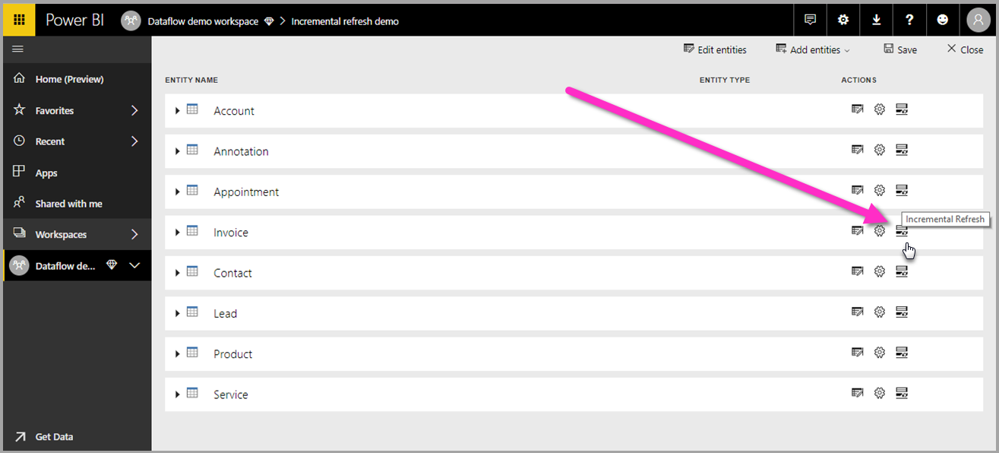
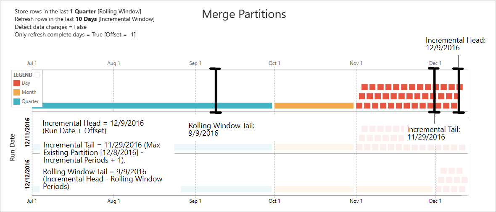

# Using incremental refresh with dataflows

With dataflows, you can bring large amounts of data into Power BI or your organization's provided storage. In some cases, however, it's not practical to update a full copy of source data in each refresh. A good alternative is **incremental refresh**, which provides the following benefits for dataflows:

* **Refresh occurs faster**: Only data that's changed needs to be refreshed. For example, refresh only the last five days of a 10-year dataflow.
* **Refresh is more reliable**: For example, it's not necessary to maintain long-running connections to volatile source systems.
* **Resource consumption is reduced**: Less data to refresh reduces overall consumption of memory and other resources.

Incremental refresh is available in dataflows created in Power BI and dataflows created in Power Apps. This article shows screens from Power BI, but these instructions apply to dataflows created in Power BI or in Power Apps.

> [!NOTE]
> When the schema for a table in an analytical dataflow changes, a full refresh takes place to ensure that all the resulting data matches the new schema. As a result, any data stored incrementally is refreshed and in some cases, if the source system doesn't retain historic data, is lost.

Using incremental refresh in dataflows created in Power BI requires that the dataflow reside in a workspace in [Premium capacity](/power-bi/service-premium-what-is). Incremental refresh in Power Apps requires Power Apps per-app or per-user plans, and is only available for dataflows with Azure Data Lake Storage as the destination. 

In either Power BI or Power Apps, using incremental refresh requires that source data ingested into the dataflow have a DateTime field on which incremental refresh can filter.

## Configuring incremental refresh for dataflows

A dataflow can contain many tables. Incremental refresh is set up at the table level, allowing one dataflow to hold both fully refreshed tables and incrementally refreshed tables.

To set up an incremental-refreshed table, start by configuring your table as you would any other table.

After the dataflow is created and saved, select **Incremental refresh** :::image type="content" source="media/incremental-refresh/dataflows-incremental-refresh-icon.png" alt-text="Incremental refresh."::: in the table view, as shown in the following image.

When you select the icon, the **Incremental refresh settings** window appears. Turn on incremental refresh.

The following list explains the settings in the **Incremental refresh settings** window.

* **Incremental refresh on/off toggle**: Turns the incremental refresh policy on or off for the table.
* **Filter field drop-down**: Selects the query field on which the table should be filtered for increments. This field only contains DateTime fields. You can't use incremental refresh if your table doesn't contain a DateTime field.
* **Store/refresh rows from the past**: The example in the previous image illustrates these next few settings.

   In this example, we define a refresh policy to store five years of data in total and incrementally refresh 10 days of data. Assuming that the table is refreshed daily, the following actions are carried out for each refresh operation:

  * Add a new day of data.

  * Refresh 10 days, up to the current date.

  * Remove calendar years that are older than five years before the current date. For example, if the current date is January 1, 2019, the year 2013 is removed.

   The first dataflow refresh might take a while to import all five years, but subsequent refreshes are likely to be completed much more quickly.

* **Detect data changes**: An incremental refresh of 10 days is much more efficient than a full refresh of five years, but you might be able to do even better. When you select the **Detect data changes** check box, you can select a date/time column to identify and refresh only the days where the data has changed. This assumes such a column exists in the source system, which is typically for auditing purposes. The maximum value of this column is evaluated for each of the periods in the incremental range. If that data hasn't changed since the last refresh, there's no need to refresh the period. In the example, this might further reduce the days incrementally refreshed from 10 to perhaps 2.

  > [!TIP]
  > The current design requires that the column used to detect data changes be persisted and cached into memory. You might want to consider one of the following techniques to reduce cardinality and memory consumption:
  >
  > * Persist only the maximum value of this column at time of refresh, perhaps by using a Power Query function.
  > * Reduce the precision to a level that's acceptable given your refresh-frequency requirements.

* **Only refresh complete periods**: Imagine that your refresh is scheduled to run at 4:00 AM every day. If data appears in the source system during those first four hours of that day, you might not want to account for it. Some business metrics, such as barrels per day in the oil and gas industry, aren't practical or sensible to account for based on partial days.

    Another example where only refreshing complete periods is appropriate is refreshing data from a financial system. Imagine a financial system where data for the previous month is approved on the 12th calendar day of the month. You can set the incremental range to one month and schedule the refresh to run on the 12th day of the month. With this option selected, the system will refresh January data (the most recent complete monthly period) on February 12.

> [!NOTE]
> Dataflow incremental refresh determines dates according to the following logic: if a refresh is scheduled, incremental refresh for dataflows uses the time zone defined in the refresh policy. If no schedule for refreshing exists, incremental refresh uses the time from the computer running the refresh.

After incremental refresh is configured, the dataflow automatically alters your query to include filtering by date. If the dataflow was created in Power BI, you can also edit the automatically generated query by using the advanced editor in Power Query to fine-tune or customize your refresh. Read more about incremental refresh and how it works in the following sections.

## Incremental refresh and linked tables vs. computed tables

For *linked* tables, incremental refresh updates the source table. Because linked tables are simply a pointer to the original table, incremental refresh has no impact on the linked table. When the source table is refreshed according to its defined refresh policy, any linked table should assume the data in the source is refreshed.

*Computed* tables are based on queries running over a data store, which can be another dataflow. As such, computed tables behave the same way as linked tables.

Because computed tables and linked tables behave similarly, the requirements and configuration steps are the same for both. One difference is that for computed tables, in certain configurations, incremental refresh can't run in an optimized fashion because of the way partitions are built.

## Changing between incremental and full refresh

Dataflows support changing the refresh policy between incremental and full refresh. When a change occurs in either direction (full to incremental or incremental to full), the change affects the dataflow after the next refresh.

When moving a dataflow from full refresh to incremental, the new refresh logic updates the dataflow by adhering to the refresh window and increment as defined in the incremental refresh settings.

When moving a dataflow from incremental to full refresh, all data accumulated in the incremental refresh is overwritten by the policy defined in the full refresh. You must approve this action.

## Time zone support in incremental refresh

Dataflow incremental refresh is dependent on the time at which it's run. The filtering of the query is dependent on the day on which it's run.

To accommodate those dependencies and to ensure data consistency, incremental refresh for dataflows implements the following heuristic for *refresh now* scenarios:

* In the case where a scheduled refresh is defined in the system, incremental refresh uses the time-zone settings from the scheduled refresh section. This ensures that whatever time zone the person refreshing the dataflow is in, it will always be consistent with the system's definition.

* If no scheduled refresh is defined, dataflows use the time zone from the computer of the user who's performing the refresh.

Incremental refresh can also be invoked by using APIs. In this case, the API call can hold a time-zone setting that's used in the refresh. Using APIs can be helpful for testing and validation purposes.

## Incremental refresh implementation details

Dataflows use partitioning for incremental refresh. Incremental refresh in dataflows keeps the minimum number of partitions to meet refresh policy requirements. Old partitions that go out of range are dropped, which maintains a rolling window. Partitions are opportunistically merged, reducing the total number of partitions required. This improves compression and, in some cases, can improve query performance.

The examples in this section share the following refresh policy:

* Store rows in the last 1 Quarter
* Refresh rows in the last 10 Days
* Detect data changes = False
* Only refresh complete days = True

### Merge partitions

In this example, day partitions are automatically merged to the month level after they go outside the incremental range. Partitions in the incremental range need to be maintained at daily granularity to allow only those days to be refreshed.
The refresh operation with *Run Date 12/11/2016* merges the days in November, because they fall outside the incremental range.

### Drop old partitions

Old partitions that fall outside the total range are removed. The refresh operation with *Run Date 1/2/2017* drops the partition for Q3 of 2016 because it falls outside the total range.

### Recovery from prolonged failure

This example simulates how the system recovers gracefully from prolonged failure. Let's say refresh doesn't run successfully because data source credentials expired, and the issue takes 13 days to resolve. The incremental range is only 10 days.

The next successful refresh operation, with *Run Date 1/15/2017*, needs to backfill the missing 13 days and refresh them. It also needs to refresh the previous nine days because they weren't refreshed on the normal schedule. In other words, the incremental range is increased from 10 to 22 days.

The next refresh operation, with *Run Date 1/16/2017*, takes the opportunity to merge the days in December and the months in Q4 of 2016.

## Dataflow incremental refresh and data sets

Dataflow incremental refresh and data set incremental refresh are designed to work in tandem. It's acceptable and supported to have an incrementally refreshing table in a dataflow, fully loaded into a data set, or a fully loaded table in a dataflow incrementally loaded to a data set.

Both approaches work according to your specified definitions in the refresh settings. More information: [Incremental refresh in Power BI Premium](/power-bi/service-premium-incremental-refresh)

### See also

This article described incremental refresh for dataflows. Here are some more articles that might be useful:

* [Self-service data prep in Power BI](create-use.md)
* [Creating computed tables in dataflows](computed-tables.md)
* [Connect to data sources for dataflows](data-sources.md)
* [Link tables between dataflows](linked-tables.md)
* [Create and use dataflows in Power BI](/power-bi/service-dataflows-create-use)
* [Using dataflows with on-premises data sources](/power-bi/service-dataflows-on-premises-gateways)
* [Developer resources for Power BI dataflows](/power-bi/service-dataflows-developer-resources)

For more information about Power Query and scheduled refresh, you can read these articles:

* [Query overview in Power BI Desktop](/power-bi/desktop-query-overview)
* [Configuring scheduled refresh](/power-bi/refresh-scheduled-refresh)

For more information about Common Data Model, you can read its overview article:

* [Common Data Model - overview](/common-data-model/)
