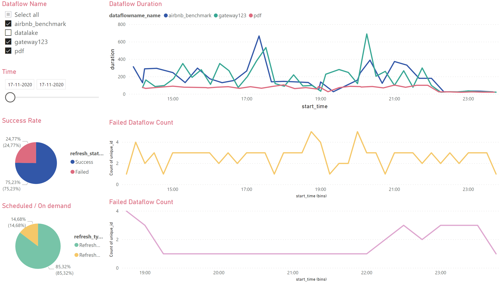
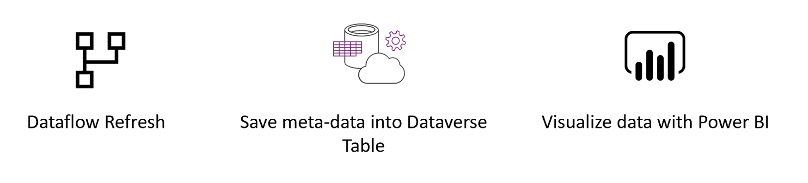
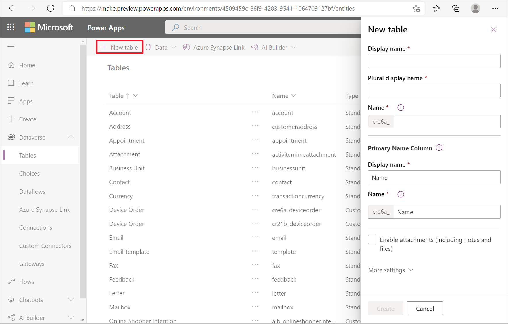
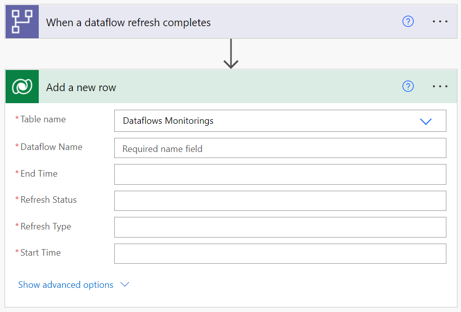
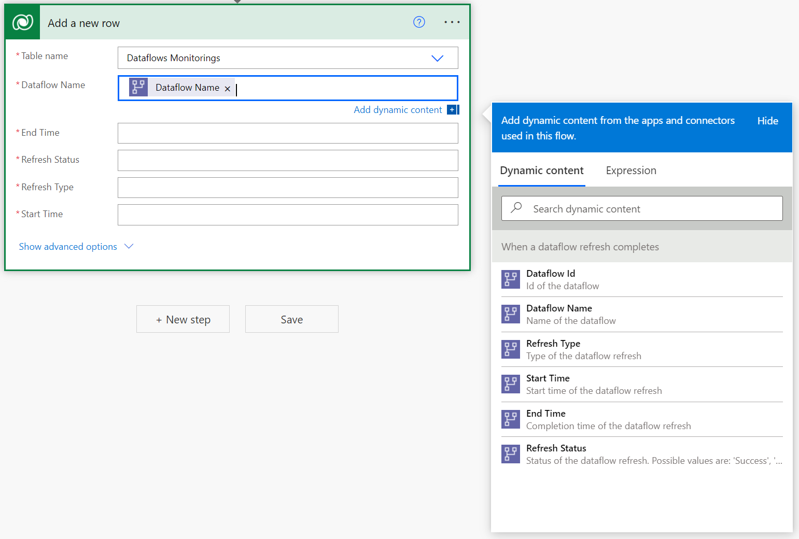
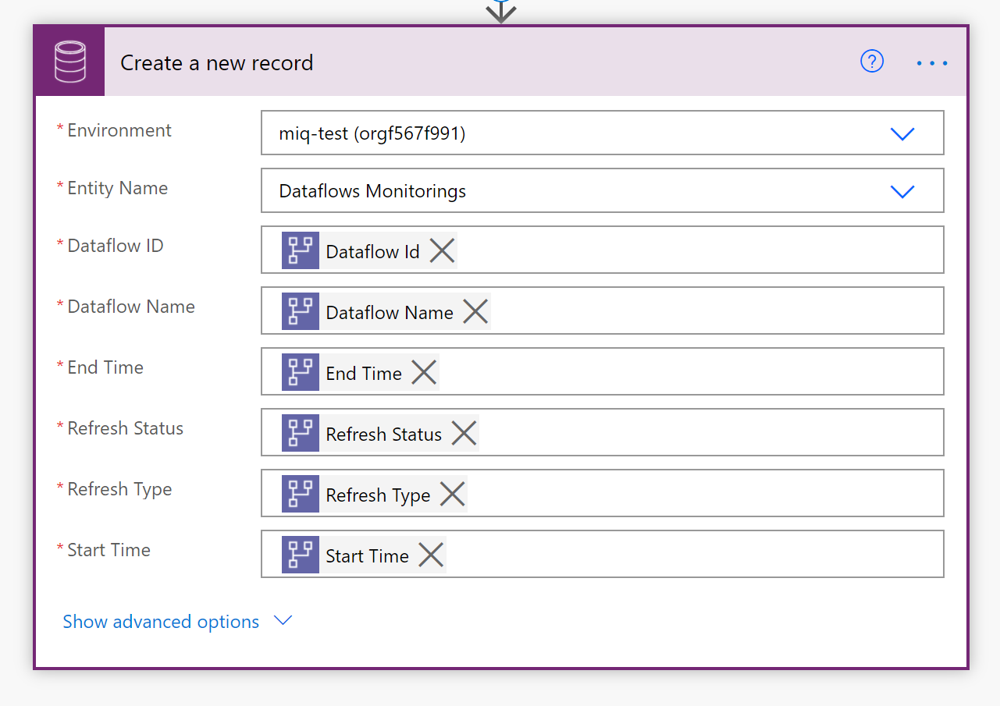

# Load data in a Dataverse table and build a dataflows monitoring report with Power BI

This tutorial demonstrates how to load data in a Dataverse table to create a dataflows monitoring report in Power BI.

You can use this dashboard to monitor your dataflows' refresh duration and failure count. With this dashboard, you can track any issues with your dataflows performance and share the data with others.

First, you'll create a new Dataverse table that stores all the metadata from the dataflow run. For every refresh of a dataflow, a record is added to this table. You can also store metadata for multiple dataflow runs in the same table. After the table is created, you'll connect the Power BI file to the Dataverse table.

## Prerequisites

* [Power BI Desktop](https://www.microsoft.com/download/details.aspx?id=58494).

* A [Dataverse environment](/powerapps/maker/common-data-service/data-platform-intro) with permissions to create new custom tables.

* A [Premium Power Automate License](/power-platform/admin/pricing-billing-skus).

* A [Power BI dataflow](/power-bi/transform-model/dataflows/dataflows-introduction-self-service) or [Power Platform dataflow](/powerapps/maker/common-data-service/create-and-use-dataflows).

## Download the .pbit file

First, download the Dataverse [.pbit file](https://download.microsoft.com/download/1/4/E/14EDED28-6C58-4055-A65C-23B4DA81C4DE/dataverse-template-v2.pbit).

## Create a new table in Dataverse

1. Navigate to the [Power Apps portal](https://powerapps.microsoft.com/).

2. On the left navigation pane expand **Data**, select **Tables**, and then select **New table**.

   

3. In the **New table** pane:
   1. Enter **Dataflows Monitoring** in **Display name**.
   1. Under **Primary Name Column**, enter **Dataflow name** in **Display name**.
   1. Select **Create**.

4. Select **Add column** to repeat adding columns for the following values:

   * **Display name**: "Dataflow Id", **Data type**: Text, **Required**: Required.
   * **Display name**: "Refresh Status", **Data type**: Text, **Required**: Required.
   * **Display name**: "Refresh Type", **Data type**: Text, **Required**: Required.
   * **Display name**: "Start Time", **Data type**: Date and Time, **Required**: Required.
   * **Display name**: "End Time", **Data type**: Date and Time, **Required**: Required.

   

## Create a dataflow

If you don't already have one, create a dataflow. You can create a dataflow in either [Power BI dataflows](/power-bi/transform-model/dataflows/dataflows-introduction-self-service) or [Power Apps dataflows](/powerapps/maker/common-data-service/create-and-use-dataflows).

## Create a Power Automate flow

1. Navigate to [Power Automate](https://flow.microsoft.com).
2. Select **Create** > **Automated cloud flow**.
3. Enter a flow name, and then search for the "When a dataflow refresh completes" connector. Select this connector from the list, and then select **Create**.
4. Customize the connector. Enter the following information on your dataflow:

   * **Group Type**: Select *Environment* when connecting to Power Apps and *Workspace* when connecting to Power BI.
   * **Group**: Select the Power Apps environment or the Power BI workspace your dataflow is in.
   * **Dataflow**: Select your dataflow by name.

5. Select **New step** to add an action to your flow.
6. Search for the "Add a new row" connector from Dataverse, and then select it.
7. In **Add a new row**, select **Choose a table** and then choose **Dataflows Monitoring** from the list.

   

8. For every required field, you need to add a dynamic value. This value is the output of the metadata of the dataflow that's run.
    1. Select the field next to **Dataflow Name** and then select **Dataflow Name** from the dynamic content.

       

    2. Repeat this process for all required fields.

         

9. Save the flow.

## Create a Power BI Report

1. Open the `.pbit` file.

2. Connect to your Dataverse entity **Dataflows Monitoring**.

In this dashboard, for every dataflow in your specified time interval, you can monitor:

* The dataflow duration
* The dataflow count
* The dataflow failure count

The unique ID for every dataflow is generated by a merge between the dataflow name and the dataflow start time.
