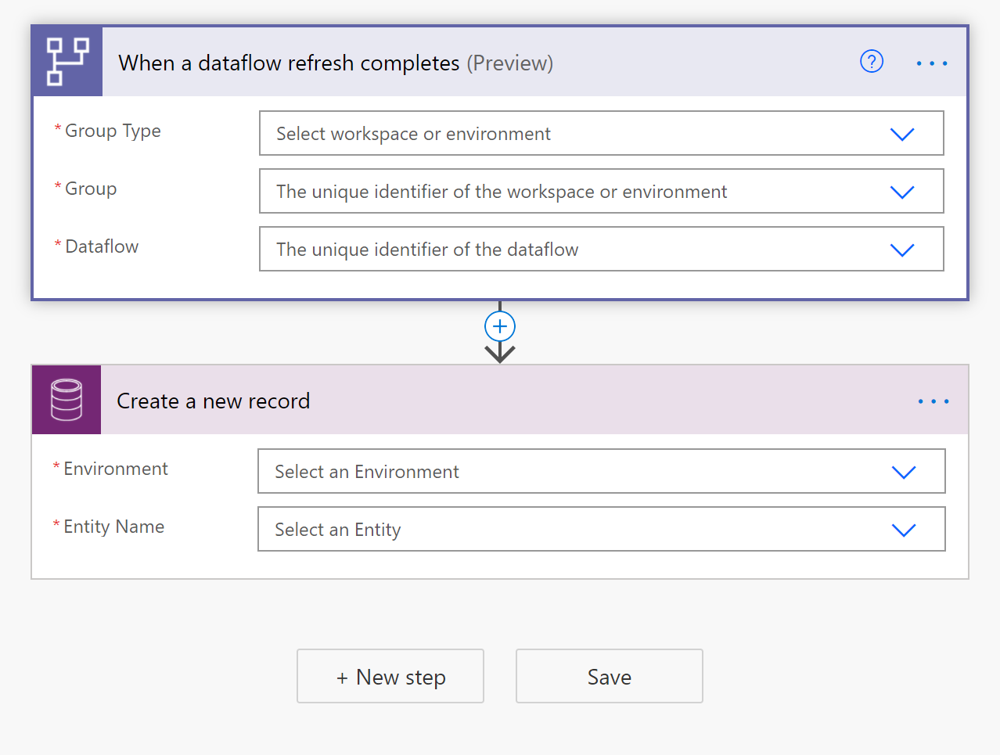

# Load Data into a Dataverse table and Build a Dataflows Monitoring Report with Power BI

## Introduction

In this step-by-step tutorial, we will show you how to set up your own monitoring dashboard for all of your dataflows:

You can use this dashboard to monitor your dataflows' refresh duration and failure count. With this dashboard, you can track any issues with your dataflows performance and share the data with others. 

First, you will create a new Dataverse table which stores all the metadata from the dataflow run. For every refresh of a dataflow, a record is added to this table. You can also store metadata for multiple dataflows runs in the same table. After the table is created, you will connect the Power BI file to the Dataverse table.

## Prerequisites
* [Power BI Desktop](https://www.microsoft.com/download/details.aspx?id=58494).

* A [Dataverse environment](https://docs.microsoft.com/powerapps/maker/common-data-service/data-platform-intro) with permissions to create new custom tables.

* A [Premium Power Automate Licence](https://docs.microsoft.com/power-platform/admin/pricing-billing-skus).

* A [Power BI dataflow](https://docs.microsoft.com/power-bi/transform-model/dataflows/dataflows-introduction-self-service) or [Power Platform dataflow](https://docs.microsoft.com/powerapps/maker/common-data-service/create-and-use-dataflows).

## Download the .pbit file

First, download the Dataverse [.pbit file](https://download.microsoft.com/download/1/4/E/14EDED28-6C58-4055-A65C-23B4DA81C4DE/dataverse-template.pbit).

## Create a new table in Dataverse

* Navigate to the [Power Apps portal](https://powerapps.microsoft.com/).

* Follow these [instructions](https://docs.microsoft.com/powerapps/maker/common-data-service/create-custom-entity) to create a new table.

* In the right pane, enter the following values, and then select `Create`
    * **Display name** *Dataflow Name*
    * **Data type** *text*
    *  *Required*

* Repeat adding column for the following values
    * **Display name**: *Refresh Status*, **Data type**: *Text*, **Required**: *Required*
    * **Display name**: *Refresh Type*, **Data type**: *Text*, **Required**: *Required*
    * **Display name**: *Start Time*, **Data type**: *Date and Time*, **Required**: *Required*
    * **Display name**: *End Time*, **Data type**: *Date and Time*, **Required**: *Required*

## Create a dataflow

If you do not already have one, create a dataflow. This can be done in either [Power BI dataflows](https://docs.microsoft.com/power-bi/transform-model/dataflows/dataflows-introduction-self-service) or [Power Apps dataflows](https://docs.microsoft.com/powerapps/maker/common-data-service/create-and-use-dataflows).

## Create a Power Automate Flow
* Navigate to [Power Automate Portal](https://flow.microsoft.com)
* Search for the template **When a dataflow refresh completes, output status into CDS entity**, by following these [instructions](https://docs.microsoft.com/power-automate/get-started-logic-template)

* Customize the flow. Actions that require input from you will automatically be expanded.

   The **Dataflow Refresh** trigger is expanded because you need to enter information on your dataflow:
    * **Group Type**: Select *Environment* when connecting to Power Apps and *Workspace* when connecting to Power BI.
    * **Group**: Select the Power Apps environment or the Power BI workspace your dataflow is in.
    * **Dataflow**: Select your dataflow by name.

   The **Create a new record** action is expanded because you need to enter your Dataverse *Environment* and *Entity Name*:
    * **Environment**: Select your Dataverse environment.
    * **Entity Name**: Select the entity named "Dataflows Monitoring" which you previously created. 

* Add dynamic values to the required fields.

    For every required field, you need to add a dynamic value. This value is the output of the metadata of the dataflow run. 
    * Select the field next to **Dataflow ID** and then select the lightning button.
    
    

    * Repeat this process for all required fields.
    
      

* Save the flow.

## Create a Power BI Report

* Open the `.pbit` file.

* Connect to your Dataverse entity **Dataflow Monitoring**.

In this dashboard, you can monitor, for every dataflow in your specified time interval:
* the dataflow duration
* the dataflow count
* the dataflow failure count

The uniqueID for every dataflow is generated by a merge between the dataflow name and the dataflow start time.
