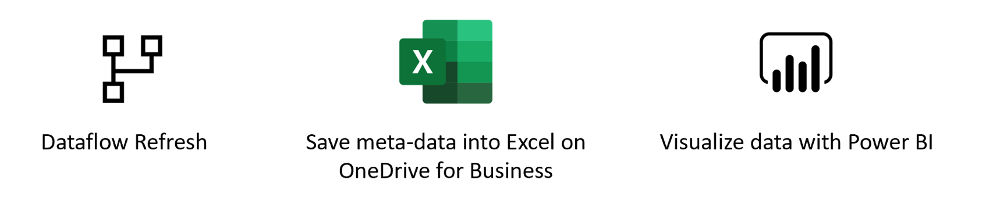
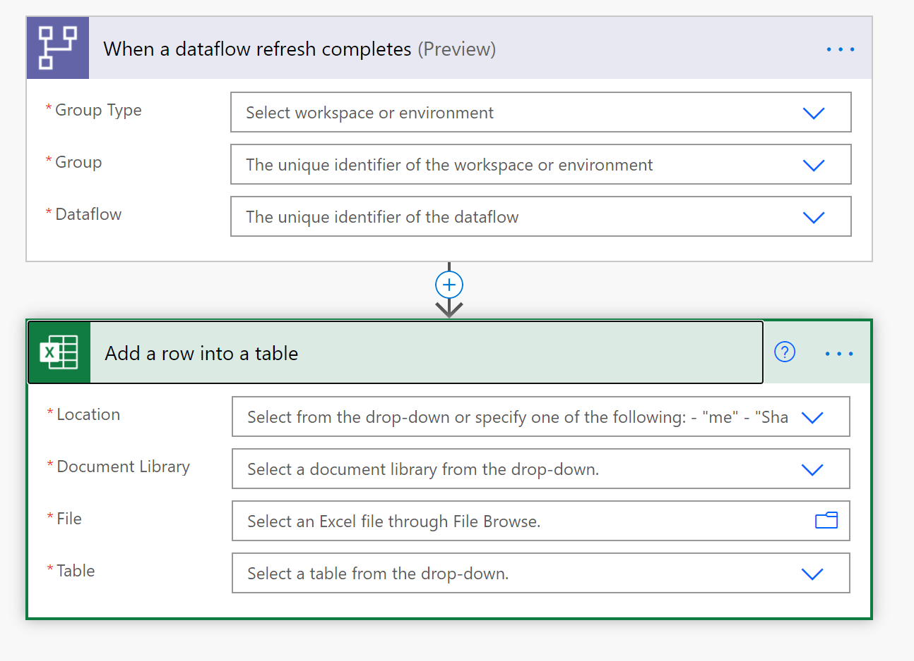
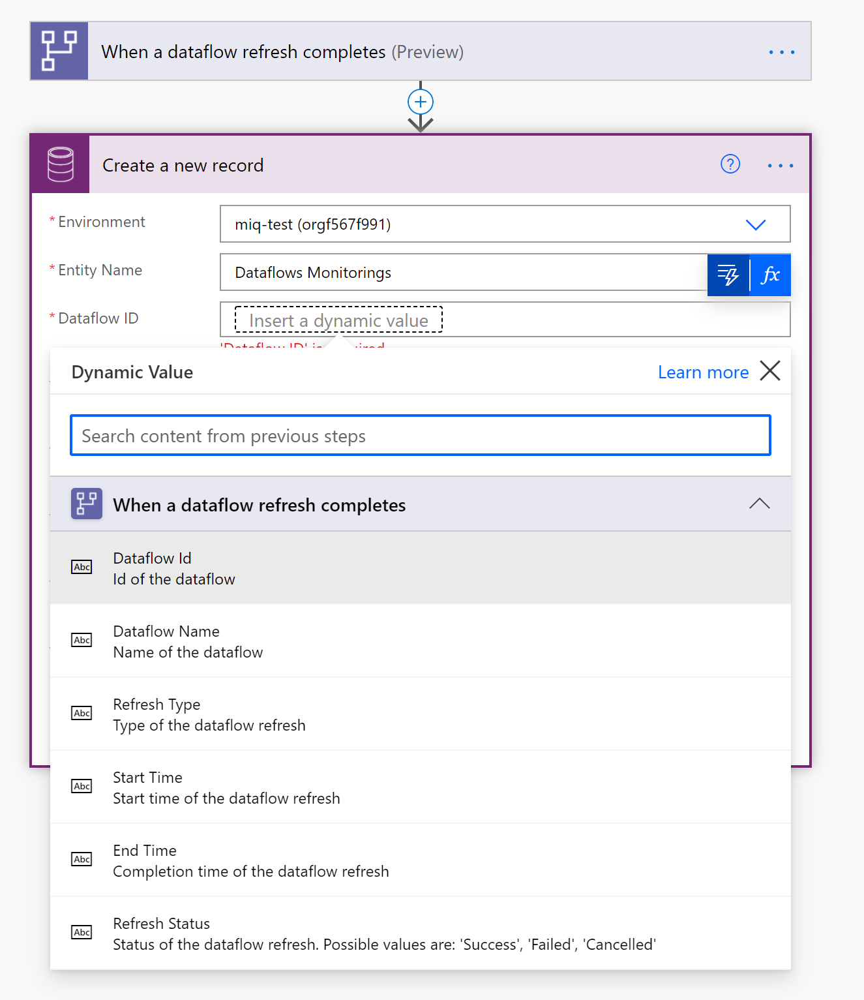

# Load Data into Excel Online and Build a Dataflows Monitoring Report with Power BI

## Introduction

In this step-by-step tutorial, we will show you how to set up your own monitoring dashboard for all of your dataflows:

First, we are going to download the `.xlsx` file from this repository and save it on our OneDrive for Business or SharePoint. Next, we are going to create a Power Automate connector that will load meta-data from Dataflows into the excel file on the OneDrive or Sharepoint. After that, we are going to connect the Power BI file to the Excel file, so we can visualize the meta-data and start monitoring our dataflows.

You can use this dashboard to monitor your dataflows' refresh duration and failure count. With this dashboard, you can track any issues with your dataflows performance and share the data with others. 

	

## Prerequisites
* Download and Install [Microsoft Excel](https://www.microsoft.com/en/microsoft-365/excel)

* [Power BI Desktop](https://www.microsoft.com/download/details.aspx?id=58494).

* [Power Automate Premium License](https://docs.microsoft.com/power-platform/admin/pricing-billing-skus)

* [Microsoft Excel](https://www.microsoft.com/en/microsoft-365/excel).

* [OneDrive for Business](https://www.microsoft.com/en/microsoft-365/onedrive/onedrive-for-business).

* A [Premium Power Automate Licence](https://docs.microsoft.com/power-platform/admin/pricing-billing-skus).

* A [Power BI dataflows](https://docs.microsoft.com/power-bi/transform-model/dataflows/dataflows-introduction-self-service) or [Power Platform dataflow](https://docs.microsoft.com/powerapps/maker/common-data-service/create-and-use-dataflows).

## Download the .pbit file

First, download the [.pbit file](https://download.microsoft.com/download/1/4/E/14EDED28-6C58-4055-A65C-23B4DA81C4DE/excel-template.pbit).

## Download the Excel file and Save to OneDrive

Next, download the [.xlsx file](https://download.microsoft.com/download/1/4/E/14EDED28-6C58-4055-A65C-23B4DA81C4DE/dataflow_monitoring.xlsx) and save the file to a location on OneDrive for Business or SharePoint

## Create a dataflow

If you do not already have one, create a dataflow. This can be done in either [Power BI dataflows](https://docs.microsoft.com/power-bi/transform-model/dataflows/dataflows-introduction-self-service) or [Power Apps dataflows](https://docs.microsoft.com/powerapps/maker/common-data-service/create-and-use-dataflows).

## Create a flow in Power Automate 

* Navigate to [Power Automate](https://flow.microsoft.com).

* Search for the template "When a dataflow refresh completes, output status into Excel". If you encounter difficulty, see these [instructions](https://docs.microsoft.com/power-automate/get-started-logic-template).

* Customize the flow. Actions that require input from you will automatically be expanded.

  The **Dataflow Refresh** trigger is expanded because you need to enter information on your dataflow:
    * **Group Type**: Select *Environment* when connecting to Power Apps and *Workspace* when connecting to Power BI.
    * **Group**: Select the Power Apps environment or the Power BI workspace your dataflow is in.
    * **Dataflow**: Select your dataflow by name.
  
  The **Add a row into a table** action is expanded because you need to enter the *Location* of the Excel file and the specific *Table* the data loads to.
    * **Location**: Select the location of the Excel file on OneDrive for Business or SharePoint.
    * **Document Library**: Select the library of the Excel file.
    * **File**: Select the file path to the Excel file.
    * **Table**: Select "Dataflow_monitoring".

* Add dynamic values to the required fields.

  For every required field, you need to add a dynamic value. This value is the output of the metadata of the dataflow run.
    * Select the field next to **Dataflow ID** and then select the lightning button.
    
    

    * Select the Dataflow ID as the dynamic content.

	

  The **Add a row into a table** action is expanded because you need to enter you *Location* of the excel file and the specific *Table* the data need to load to.
    * **Location**: The location of the Excel file. Either *OneDrive for Business* or a *SharePoint Site*
    * **Document Library**: The library of the excel file
    * **File**: The exact location of the `.xlsx` file
    * **Table**: The name of the Table to load the data into. The table is called *Datflow-monitoring*.

    * Repeat this process for all required fields.

  * Save the flow.

## Create a Power BI Report

  

* Open the `.pbit` file.

* Connect to your Excel file.

In this dashboard, you can monitor, for every dataflow in your specified time interval:
* the dataflow duration
* the dataflow count
* the dataflow failure count

The uniqueID for every dataflow is generated by a merge between the dataflow name and the dataflow start time.
