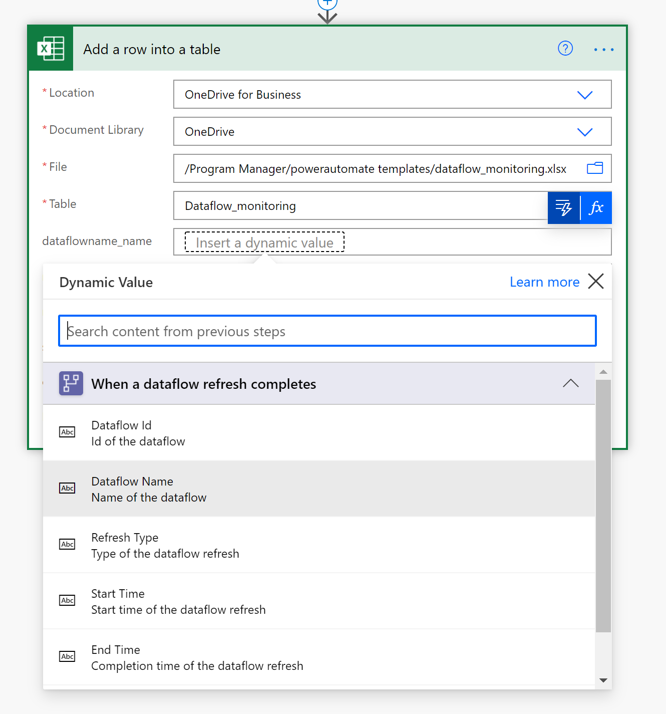

# Load Data into a Power BI Streaming Dataset and Build a Dataflows Monitoring Report with Power BI

## Introduction

In this step-by-step tutorial, we will show you how to set up your own monitoring dashboard for all of your dataflows:

First, you will create a new streaming dataset in Power BI. This dataset will collect all the metadata from the dataflow run, and for every refresh of a dataflow, a record is added to this dataset. You can run multiple dataflows all to the same dataset. Lastly, you can build a Power BI report on the data to visualize the metadata and start monitoring the dataflows.

You can use this dashboard to monitor your dataflows' refresh duration and failure count. With this dashboard, you can track any issues with your dataflows performance and share the data with others. 

## Prerequisites

* A [Power BI Pro License](/power-bi/admin/service-admin-purchasing-power-bi-pro).

* A [Premium Power Automate License](/power-platform/admin/pricing-billing-skus)

* A [Power BI dataflow](/power-bi/transform-model/dataflows/dataflows-introduction-self-service) or [Power Platform dataflow](/powerapps/maker/common-data-service/create-and-use-dataflows).

## Create a new streaming dataset in Power BI

* Navigate to [Power BI](https://powerbi.microsoft.com).

* Follow these [instructions](/power-bi/connect-data/service-real-time-streaming#set-up-your-real-time-streaming-dataset-in-power-bi) to create a new streaming dataset in Power BI. Ensure you create a streaming dataset based on the API and add the historical data opt in.

*   In the right pane, enter the following values, and then select Create.
       * **Dataset Name**: "Dataflow Monitoring".
       * **Value**: "Dataflow Name", **Data type**: Text.
       * **Value**: "Dataflow ID", **Data type**: Text.
       * **Value**: "Refresh Status", **Data type**: Text. 
       * **Value**: "Refresh Type", **Data type**: Text.
       * **Value**: "Start Time", **Data type**: Date and Time. 
       * **Value**: "End Time", **Data type**: Date and Time.

## Create a dataflow

If you do not already have one, create a dataflow. This can be done in either [Power BI dataflows](/power-bi/transform-model/dataflows/dataflows-introduction-self-service) or [Power Apps dataflows](/powerapps/maker/common-data-service/create-and-use-dataflows).

## Create a flow in Power Automate 

* Navigate to [Power Automate](https://flow.microsoft.com).

* Select **Create** > **Automated cloud flow**.

* Search for the connector "When a dataflow refresh completes (preview)". If you encounter difficulty, see these [instructions](/power-automate/get-started-logic-flow).
* Customize the connector. You need to enter information on your dataflow:
    * **Group Type**: Select *Environment* when connecting to Power Apps and *Workspace* when connecting to Power BI.
    * **Group**: Select the Power Apps environment or the Power BI workspace your dataflow is in.
    * **Dataflow**: Select your dataflow by name.

* Click on **new step** to add an action to your flow.
* Search for the connector "Add a row into a table" from Excel.
* Customize the connector. You need to enter information:
    * **Location**: Select the location of the Excel file on OneDrive for Business or SharePoint.
    * **Document Library**: Select the library of the Excel file.
    * **File**: Select the file path to the Excel file.
    * **Table**: Select "Dataflow_monitoring".

  
* Add dynamic values to the required fields.

  For every required field, you need to add a dynamic value. This value is the output of the metadata of the dataflow run.
    * Select the field next to **Dataflow ID** and then select the lightning button.
    
    

    * Select the Dataflow ID as the dynamic content.
    

    * Repeat this process for all required fields.

  * Save the flow.

## Create a Power BI Report

* Open the `.pbit` file.

* Connect to your Excel file.

In this dashboard, you can monitor, for every dataflow in your specified time interval:
* the dataflow duration
* the dataflow count
* the dataflow failure count

The uniqueID for every dataflow is generated by a merge between the dataflow name and the dataflow start time.
