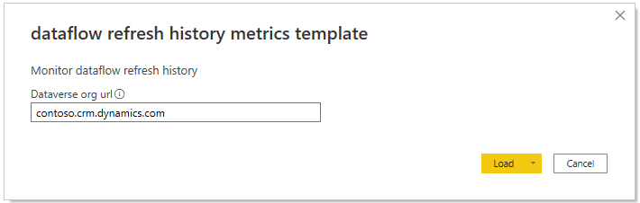
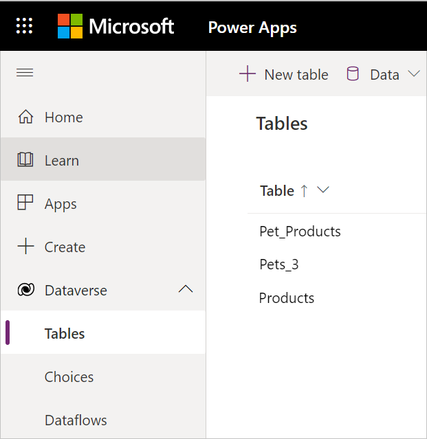
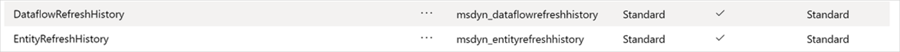

# Monitor your dataflow refreshes with Power BI

When working with any kind dataflows other than Power BI dataflows, you have the ability to monitor dataflow refreshes using Power BI. This article includes step by step instructions on how to set up your own dashboard to share with everyone on your team. This dashboard provides insights into the success rate of refreshes, duration, and much more.

## Set up your dashboard

To set up your monitoring dashboard for dataflow refresh history:

1. Navigate to [Power Apps](https://make.powerapps.com/).
1. Select the environment you want to monitor.
1. Open  **Settings** > **Session Details**.
1. Copy the **Instance url**, which should look something like `contoso.crm.dynamics.com`.
1. Download the [Power BI Template](https://download.microsoft.com/download/f/1/9/f195fb57-495a-4487-9317-fe00816afd88/dataflow%20refresh%20history%20metrics%20template.pbit).
1. Open the template file with Power BI Desktop and provide your instance URL.

    

1. Select **Load**.
1. If this is the first time you've used this dashboard, you might need to enter your credentials to sign in.
1. Inside the dashboard, you'll find two tabs with information about errors, duration, and the count of rows that were inserted, upserted, or failed:
    * Dataflow monitoring
    * Table monitoring
1. From this point on, you can change the dashboard however you like and publish it to a workspace of your choice.

## Where to find the Dataverse tables

The new tables are available in your environment right away. To find the tables in your environment, do the following steps:

1. Navigate to [Power Apps](https://make.powerapps.com/).
1. Open the Dataverse tables overview.

   

1. Navigate to the managed tables section.

   

1. Scroll down to the dataflow refresh history tables.

   

These tables will store history for at least the last 50 refreshes. Refresh history records older than 90 days may be removed by the system. To use these tables, we suggest that you use Power BI to get data through the Dataverse connector. We also suggest that you extract this data into a self-managed table if you would like to do analysis over a longer period of time.

## Power BI dataflows monitoring

When working with Power BI dataflows, you might want to check out the following pages for setting up your monitoring solution:

* [Use Dataverse to build a dataflows monitoring report](./load-dataflow-metadata-into-dataverse-table.md)
* [Use a Power BI semantic model to build a dataflows monitoring report](./load-dataflow-metadata-into-power-bi-dataset.md)
* [Use Excel to build a dataflows monitoring report](./load-dataflow-metadata-into-excel-online.md)

## Known issues

In some cases when you try to connect to the Dataverse tables manually through Power BI, the tables might appear to be empty. To solve this issue, just refresh the preview and you should be good to go.
