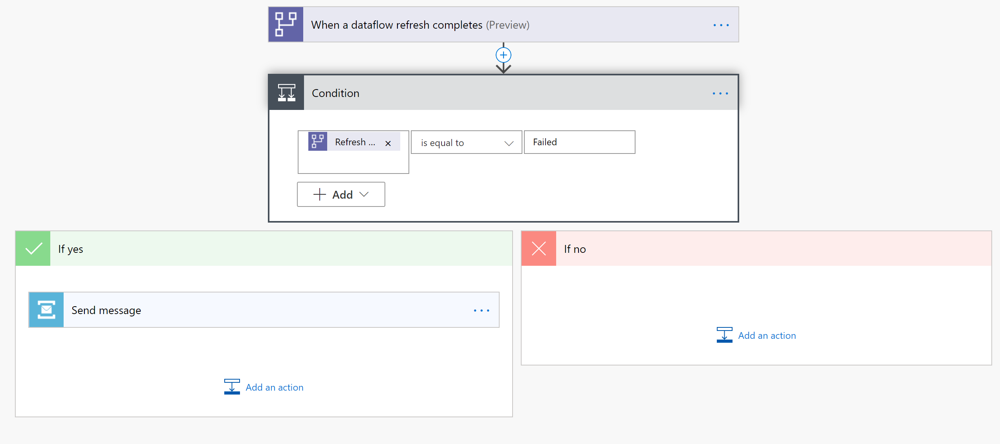
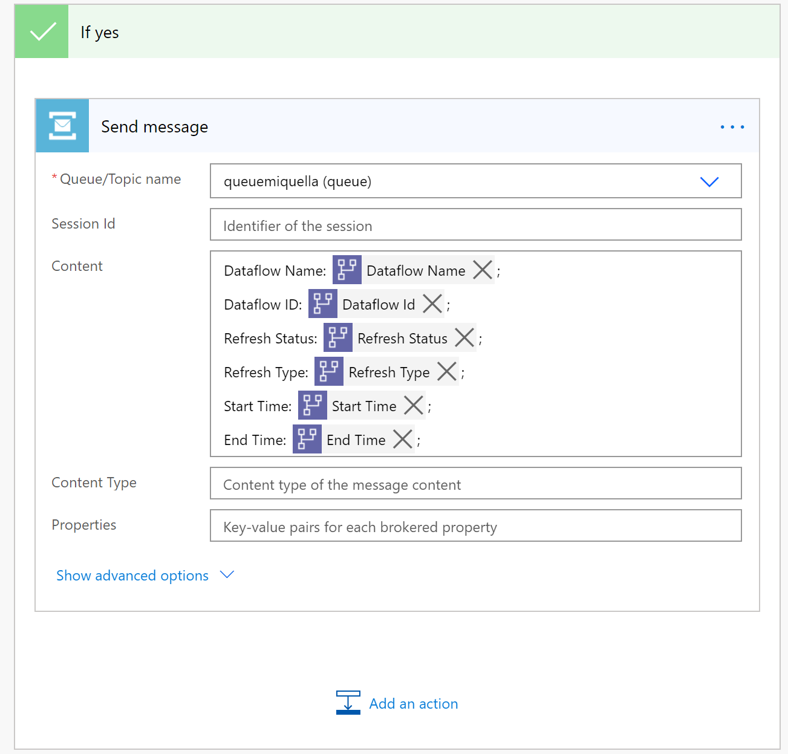

# Open a ticket when dataflow refresh failed

### Use Cases
When your dataflow refresh completes, or has been taking longer than expected, you might want to open a support ticket/create a message in a queue or service bus or add an item to Azure DevOps, so your support team can take a look at the issue.

### Using the Templates

Let's look at the template where we want to add a message to the queue, when a dataflow refresh failed. In this template, we make use of Azure Service Bus. To create an Azure Service bus and create a Queue follow these [instructions](https://docs.microsoft.com/en-us/azure/service-bus-messaging/service-bus-quickstart-portal#create-a-namespace-in-the-azure-portal).

* Navigate to [Power Automate Portal](https://flow.microsoft.com)
* Search for the template **when a dataflow refresh fails, add a new message to the queue**, by following these [instructions](https://docs.microsoft.com/en-us/power-automate/get-started-logic-template)

* Customize the flow.
Actions that require input from you will automatically be expanded.

   The **Dataflow Refresh** trigger is expanded because you need to enter *Dataflow*. You need to enter the following information:
    * **Group Type**: Choose *Environment* when connecting to Power Apps and *Workspace* when connecting to Power BI
    * **Group**: Select the Power Apps environment or the Power BI workspace your dataflow is in
    * **Dataflow**: Select your dataflow by name

After the condition, you can specify what happens after success or failure of the dataflow. In this template in both cases, we send you an email with the status of the dataflow refresh.

Note: you can modify the message content or flow.
