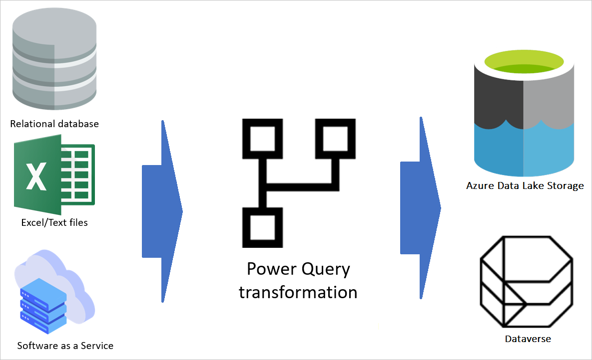
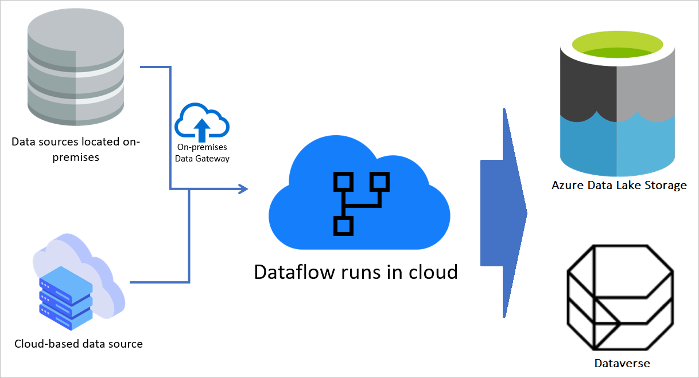
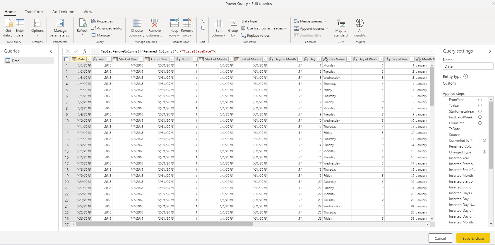
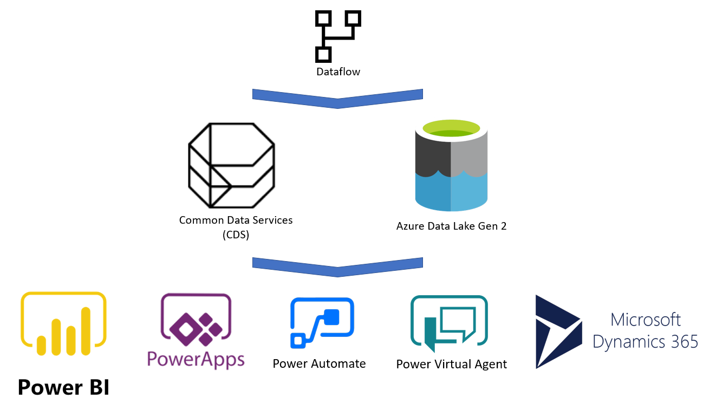
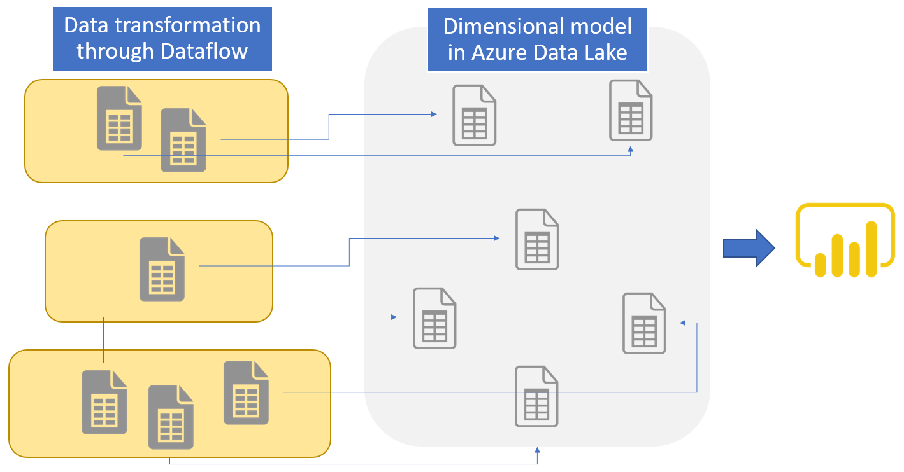
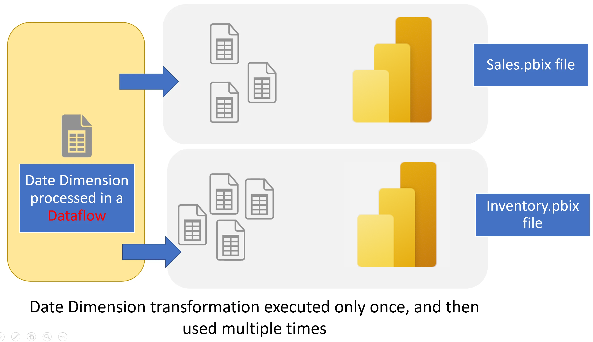

---

title: what are dataflows
description: An overview of dataflows across Power Platform and Dynamics 365 products
author: radacad 
ms.service: powerquery 
ms.topic: conceptual 
ms.date: 07/27/2020 
ms.author: gepopell  

---

 

# What are dataflows?  

[!INCLUDE [CDS note](../includes/cc-data-platform-banner.md)]

Dataflows are a self-service, cloud-based, data preparation technology. Dataflows enable customers to ingest, transform, and load data into Microsoft Dataverse environments, Power BI workspaces, or your organization’s Azure Data Lake Storage account. Dataflows are authored using Power Query experience, a unified Data Connectivity and Preparation experience already featured in many Microsoft products, including Excel and Power BI. Customers can trigger dataflows to run either on demand or automatically on a schedule; data is always kept up to date. 

 

## Dataflows can be created in multiple Microsoft products 

 

Dataflows are featured in multiple Microsoft products and don't require a dataflow-specific license to be created or run. Dataflows are available in Power Apps, Power BI, and Dynamics 365 customer insights portals. The ability to create and run dataflows is bundled with those products licenses. Dataflow features are mostly common across all products they're featured in, but some product-specific features may exist in dataflows created in one product versus another. 

 

 

### How does the dataflow function? 

 

 

 

The diagram above shows an overall view of how a dataflow is defined. A dataflow gets data from different data sources (there are more than 80 data sources supported already). Then, based on the transformations configured using the Power Query authoring experience, transforms the data using the dataflow engine. Finally, the data is loaded to the output destination, which can be a Power Platform environment, a Power BI workspace, or the organization’s Azure Data Lake Storage account.  

 

 

### Dataflows run in the cloud 

 

Dataflows are cloud-based. When a dataflow is authored and saved, its definition is stored in the cloud. A dataflow also runs in the cloud. However, if a data source is on-premises, an on-premises data gateway can be used to extract the data to the cloud. When a dataflow run is triggered, the data transformation and computation happens in the cloud, and the destination is always in the cloud. 

 

 

 

 

### Dataflow uses a powerful transformation engine 

 

Power Query is the data transformation engine used in the dataflow. This engine is capable enough to support many advanced transformations. It also leverages a straightforward, yet powerful graphical user interface called Power Query Editor. Using dataflows enables customers to use this editor to develop their data integration solutions faster and more easily. 

 

 

 

### Dataflow integration with Power Platform and Dynamics 365 

 

Because a dataflow stores the resulting entities in cloud-based storage, other services can interact with the data produced by dataflows. 

 

 

 

For example, Power BI, Power Apps, Power Automate, Power Virtual Agent, and Dynamics 365 applications can get the data produced by the dataflow by connecting to Dataverse, Power Platform Dataflow connector, or directly through the lake, depending on the destination configured at dataflow creation time. 

 

## Benefits of dataflows 

 

The scenarios you have read above are good examples of how a dataflow can be beneficial in real-world use-cases. The following list highlights some of the benefits of using dataflows: 

 

- A dataflow decouples the data transformation layer from the modeling and visualization layer in a Power BI solution. 

- The data transformation code can reside in a central location, a dataflow, rather than spread about in multiple artifacts. 

- A dataflow creator only needs Power Query skills. In a multi-creator environment, the dataflow creator can be part of a team that together builds the entire BI solution or an operational application. 

- A dataflow is product-agnostic. It's not a component of Power BI only. You can get its data in other tools and services. 

- Dataflows leverage Power Query, a powerful, graphical, self-service data transformation experience. 

- Dataflows run entirely in the cloud. No additional infrastructure is required. 

- There are multiple options to start working with dataflows, using licenses for Power Apps, Power BI, and Dynamics 365 Customer Insights. 

- Although dataflows are capable of advanced transformations, they're designed for self-service scenarios and require no IT or developer background. 

 

## Use-case scenarios for dataflows 

 

You can use dataflows for many purposes. The following scenarios provide a few examples of common use-cases for dataflows. 

 

### Data migration from legacy systems 

 

In this scenario, the decision has been made by an organization to use Power Apps for the new user interface experience rather than the legacy on-premises system. Power Apps, Power Automate, and AI Builder all leverage Dataverse as the primary data storage system. The current data in the existing on-premises system can be migrated into Dataverse using a dataflow, and then leverage by the above products. 

 

### Using dataflows to build a dimensional model 

 

You can use dataflows as a replacement for other ETL tools to build a dimensional model. For example, the data engineers of a company decide to use dataflows to build the star-schema designed dimensional model, including fact and dimension tables in Azure Data Lake Storage Gen2. Then Power BI is used to generate reports and dashboards by getting data from the dataflows. 

 

 

 

### Centralize data preparation and reuse of datasets across multiple Power BI solutions 

 

If multiple Power BI solutions are using the same transformed version of a table, the process to create the table will be repeated multiple times. This increases the load on the source system, consumes more resources, and creates duplicate data with multiple points of failure. Instead, a single dataflow can be created to compute the data for all solutions. Power BI can then reuse the result of the transformation in all solutions. The dataflow, if used in such a way, can be part of a robust Power BI implementation architecture that avoids the Power Query code duplicates and reduces the maintenance costs of the data integration layer. 

 

 

 

## Next steps 

 

The following articles provide further study materials for dataflows. 

 

- [Create and use dataflows in the Power Platform](https://docs.microsoft.com/data-integration/dataflows/dataflows-integration-overview) 

- [Creating and using dataflows in Power BI](https://docs.microsoft.com/power-bi/service-dataflows-create-use) 

 
