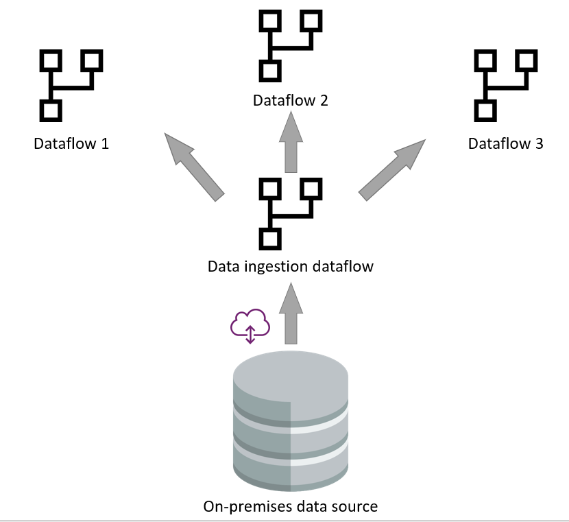

# Improve performance and reusability by separating data ingestion from data transformation dataflows

One of the best practices of dataflow implementation is separating responsibilities of dataflows into two layers: data ingestion and data transformation. This pattern is specifically helpful with multiple queries of the slower data sources in one dataflow, or multiple dataflows querying the same data sources. Instead of getting data from a slow data source again and again for each query, the data ingestion process can be done once, and the transformation can be done on top of that. This article explains the process.

## On-premises data source

In many scenarios, the on-premises data source is a slow data source. Especially considering that the gateway exists as the middle layer between the dataflow and the data source.

Using analytical dataflows for data ingestion minimizes the get data process from the source and focuses on loading data to Azure Data Lake Storage. Once in storage, other dataflows can be created that leverage the ingestion dataflow's output. The dataflow engine can read the data and perform the transformations directly from the data lake, without contacting the original data source or gateway.

## Slow data source

The same process is valid when a data source is slow. Some of the software as a service data sources perform slow because of the limitations of their API calls.

## Separation of the data ingestion and data transformation dataflows

The separation of the two layers of data ingestion and transformation is helpful in the scenarios that the data source is slow. It helps to minimize the interaction with the data source.

This separation is not only useful because of the performance, it is also helpful for the scenarios that an old legacy data source system been migrated to a new system, in those cases, only the data ingestion dataflows need to be changed. The data transformation dataflows will be intact for this type of change.

## Reuse in other tools and services

The separation of the data ingestion dataflow from the data transformation dataflows is helpful in many scenarios. Another use case scenario for this pattern is when you want to use this data in other tools and services. For this purpose, it's better to use analytical dataflows and bring your own Azure Data Lake Storage Gen2 as the storage engine. To learn more, go to [Analytical dataflows](https://docs.microsoft.com/power-query/dataflows/understanding-differences-between-analytical-standard-dataflows#analytical-dataflow).

## Optimize the data ingestion dataflow

Consider optimizing the data ingestion dataflow whenever possible. As an example, if all the data from the source isn't needed, and the data source supports query folding, then filtering data and getting only a required subset is a good approach. To learn more about query folding, go to [Power Query query folding](https://docs.microsoft.com/power-query/power-query-folding).

## Create the data ingestion dataflows as analytical dataflows

Consider creating your data ingestion dataflows as analytical dataflows. This especially helps other services and applications to use this data. This also makes it easier for the data transformation dataflows to get data from the analytical ingestion dataflow. To learn more, go to [Analytical dataflows](https://docs.microsoft.com/power-query/dataflows/understanding-differences-between-analytical-standard-dataflows#analytical-dataflow).
