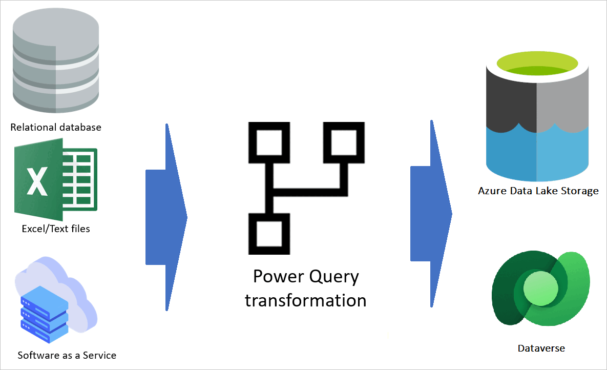

# How Microsoft Power Platform dataflows and Azure Data Factory wrangling dataflows relate to each other

Microsoft Power Platform dataflows and Azure Data Factory dataflows are often considered to be doing the same thing: extracting data from source systems, transforming the data, and loading the transformed data into a destination. However, there are differences in these two types of dataflows, and you can have a solution implemented that works with a combination of these technologies. This article describes this relationship in more detail.

## Power Platform dataflows

Power Platform dataflows are data transformation services empowered by the Power Query engine and hosted in the cloud. These dataflows get data from different data sources and, after applying transformations, store it either in Dataverse or in Azure Data Lake Storage.

## Data Factory wrangling dataflows

Data Factory is a cloud-based extract, transform, load (ETL) service that supports many different sources and destinations. There are two types of dataflows under this technology: mapping dataflows and wrangling dataflows. Wrangling dataflows are empowered by the Power Query engine for data transformation.

## What do they have in common?

Power Platform dataflows and Data Factory wrangling dataflows are both useful for getting data from one or more sources, applying transformations on the data by using Power Query, and loading the transformed data into destinations. In addition:

- Both are empowered by using Power Query data transformation.
- Both are cloud-based technologies.

## What's the difference?

The main point is knowing their differences, because then you can think about scenarios where you'd want to use one or the other.

| Features                   | Power Platform dataflows                                     | Data Factory wrangling dataflows                       |
| -------------------------- | ------------------------------------------------------------ | ------------------------------------------------------------ |
| Destinations               | Dataverse or Azure Data Lake Storage        | Many destinations ([go to the list here](https://azure.microsoft.com/blog/new-connectors-available-in-azure-data-factory-v2/)) |
| Power Query transformation | All Power Query functions are supported                      | A limited set of functions are supported ([go to the list here](/azure/data-factory/wrangling-functions)) |
| Sources                    | Many sources are supported                                  | Only a few sources ([go to the list here](/azure/data-factory/wrangling-overview#supported-sources)) |
| Scalability                | Depends on the Premium capacity and the use of the enhanced compute engine | Highly scalable |

## Which user persona is suited to which type of dataflow?

If you're a citizen application developer or citizen data analyst with small-scale to medium-scale data to be integrated and transformed, you'll find the Power Platform dataflows more convenient. The large number of transformations available, the ability to work with them without having developer knowledge, and the fact that dataflows can be authored, monitored, and edited in Power BI or Power Platform&mdash;all are reasons that make Power Platform dataflows a great data integration solution for this type of developer.

If you're a data developer who's dealing with big data and huge data sets, with a large number of rows to be ingested every time, you'll find the Data Factory wrangling dataflows a better tool for the job. Wrangling data flow translates M generated by the Power Query Online Mashup Editor into spark code for cloud scale execution. Working with the Azure portal to author, monitor, and edit wrangling dataflows requires a higher developer learning curve than the experience in Power Platform dataflows. Wrangling dataflows are best suited for this type of audience.
