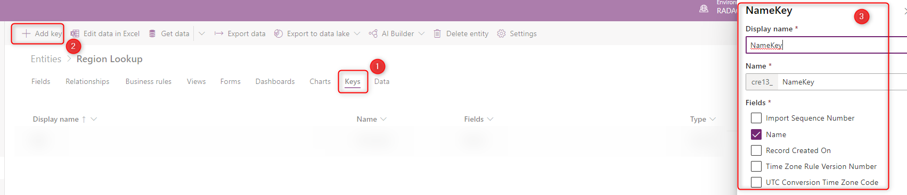

# Mapping fields with relationships in standard dataflows

In the standard dataflow, you can easily map fields from the dataflow query into the Common Data Services entities. However, if the common data service entity has lookup or relationship fields, additional consideration is required to make sure this process works.

## What is the relationship and why do you need that?

If you are coming from a database development background, you are familiar with the concept of relationship between tables. However, it is happening often that many users of Power Platform services, are not coming from that background. You might wonder what the relationship is, or why you should create relationship between tables.

The tables and their relationship are fundamental concepts of designing a database. And you might need to read books to understand it in details. However, we can go through it in a very generic example here. 

Consider you want to store the data of the customers and their details including region in the common data service. You can keep everything in one table. Your table can be called Customers, and it can have fields such as CustomerID, Name, Birthdate, Region, and etc. Now imagine that you have another table also that has the stores information. This table can have fields such as Store ID, Name, Region, and etc. As you can see the Region is repeated in both tables. There is no single place that you can get all regions from it, some of the region's data is in the Customers table, and some of that is in the Stores table. If you ever build an application or a report from it, you always have to consolidate the two region's information into one.

What we do in the database design practice is creating a table for Region in scenarios like above. This Region table would have Region ID, Name, and other information about the region. The other two tables (Customers and Stores) will have links to this table using a field (which can be Region ID if we have ID in both tables, or Name if it is unique to determine a region). This means having a relationship from the Stores and Customers table to the Region table.

In common data services, there are a number of ways to create a relationship. You can create an entity, and then create a field in one entity that is relationship (or Lookup) to another entity. like what it is mentioned below.

## What are Lookup or Relationship fields?

In the Common Data Services, you can have a field defined as a lookup field, which points to another entity. 

In the image above, the Region field in a lookup field to another entity named "Region Lookup". You can learn more about different types of relationships by studying [this article](https://docs.microsoft.com/powerapps/maker/common-data-service/data-platform-entity-lookup).

## When the field mapping doesn't show the relationship fields

If you have created a lookup field in one entity that points to another entity, that field in the mapping of the dataflow, might not appear. The reason is that each entity requires a Key field. This best practice would then makes sure that the field is mappable in the entity mappings of the dataflow.

## Setting the Key field in the entity

To set the key field in the entity, you simply need to go to the Keys tab, and add a Key to a field which has unique values.

After setting the key field, you can see the field in the mapping of the dataflow

## Run the dataflow for the referenced (lookup) entity first

Another important best practice is to load the data into the referenced or lookup entity first. The reason for this is to load all possible values in the lookup entity, so that when you load data into an entity that is using a lookup field, it performs without any problems.

## Known limitations

- Mapping to polymorphic lookup fields is currently not supported 

