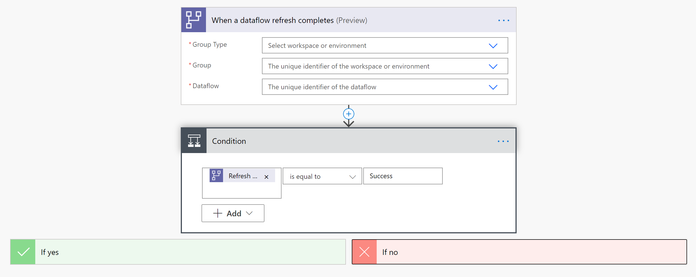
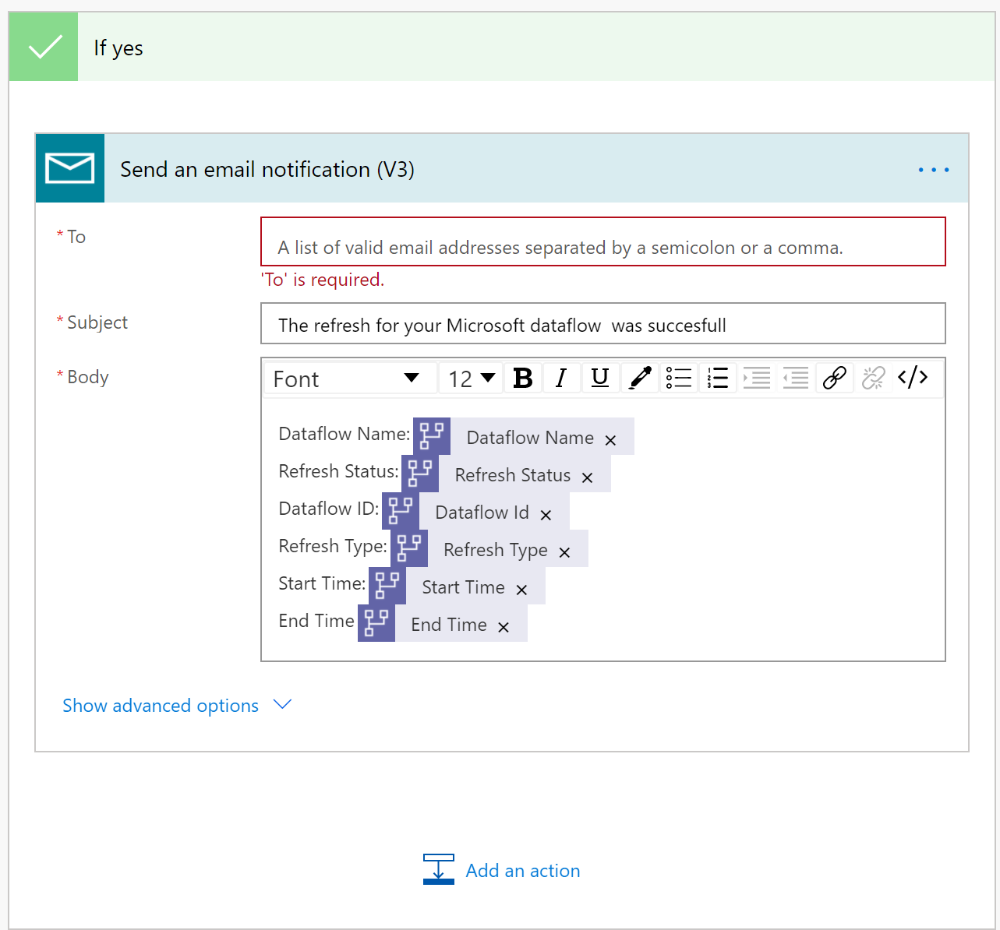

# Send a Notification when a Dataflow Refresh Completes

## Introduction

When your dataflow refresh completes, you or others who manage or depend on the dataflow may want to receive a notification to alert you of the dataflow refresh status. This way, you know your data is up to date and you can start getting new insights. Another common scenario addressed by this tutorial is notification after a dataflow fails. A notification allows you to start investigating the problem and alert people that depend on the data being successfully refreshed.

## Sending a Notification Using Power Automate

For sending notifications, you can use three templates:
* When a dataflow refresh status changes, send an email notification.
* When a dataflow succeeds or fails, send an email notification.
* When a dataflow refresh status changes, send a Teams notification.

This tutorial will use the second template.
* Navigate to [Power Automate](https://flow.microsoft.com).
* Search for the template "Send email notification on success or failure of a data flow refresh". If you encounter difficulty, see these [instructions](https://docs.microsoft.com/power-automate/get-started-logic-template).

* Customize the flow. Actions that require your input will automatically be expanded.
   The **Dataflow Refresh** trigger is expanded because you need to enter information on your dataflow:
    * **Group Type**: Select *Environment* when connecting to Power Apps and *Workspace* when connecting to Power BI.
    * **Group**: Select the Power Apps environment or the Power BI workspace your dataflow is in.
    * **Dataflow**: Select your dataflow by name.

* After the conditions, you can specify what happens after success or failure of the dataflow. In this template, in both cases an email is sent with the status of the dataflow refresh. You can also modify the flow or message content.

