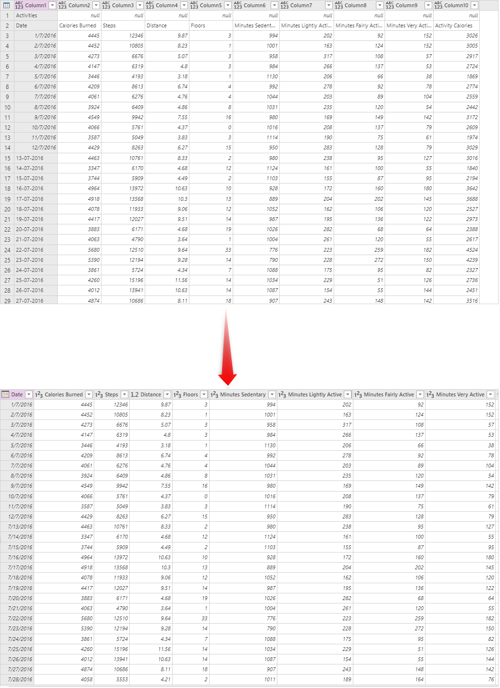
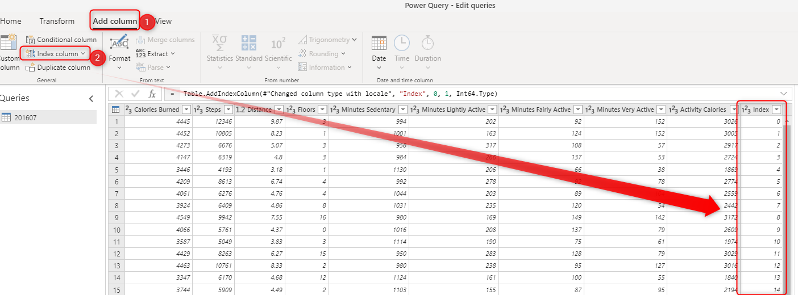
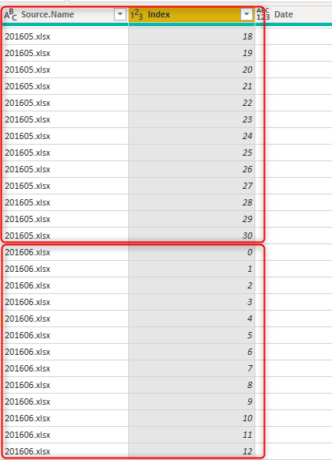

# Sync your Excel data source with Common Data Services using dataflow

One of the common scenarios that happens when you integrate data into the Common Data Services, is to keep it synchronized with the source. Using the standard dataflow, you can load data into the Common Data Services. This article explains how you can keep the data synchronized with the source system.

## The importance of the key column

If you are using a relational data base system as a source, normally you have key columns in the tables, and the data is in a proper format to be loaded into the Common Data Services. However, the data from the Excel files are not always that clean. You often have an Excel file with sheets of data without having any key column. In [this article](get-best-of-standard-dataflows.md), you can see that if there is a key column in the source, it can be easily used as the Alternate Key in the field mapping of the dataflow.

Having a key column is important for the entity in the Common Data Services. The key column is the row identifier, this is a column with unique values in each row. Having a key column helps in avoiding duplicate rows, and it also helps in synchronizing the data with the source system. If a row has removed from the source system, having a key column is helpful to find it and remove it from the Common Data Services too.

## Creating a key column

If you don't have a key column in your data source (Excel, Text file, or any other sources), then you can generate one using the method explained below.

1. Clean your data. 

The very first step to create the key column is to remove all unnecessary rows, clean the data, remove empty rows, and remove any possible duplicates.

2. Add an index column

After the data is cleaned, the next step is to assign a key column to it. You can use Add Index Column from the Add Column tab for this purpose.

When you add the index column, you have some options to customize it. Customizations on the starting number or the number of values to jump each time. The default start value is zero, and it increment one value each time.

## Use the key column as the alternate key

Now that you have the key column(s), you can assign the at the dataflow's field mapping to the Alternate Key.

The setting is simple, you just need to set the alternate key. However, if you have multiple files or tables, it needs one other step to consider.

### If you have multiple files

If you have just one Excel file (or sheet or table), then the above steps are enough setting the alternate key. However, if you have multiple files (or sheets or tables) with the same structure (but with different data), then you to either append them together.

If you are getting data from multiple Excel files, then the Combine Files option of Power Query will automatically append all the data together, and your output will look like this:

As you can see, the Power Query brings the "Source.Name" column besides the append result, which includes the file name. The Index value in each file might be unique, but it is not unique across multiple files. The combination of the Index column and the "Source.Name" column is a unique combination. You need to choose a composite alternate key for this scenario.

## Delete rows that no longer exists in the query output

The last step is to check the box for "delete rows that no longer exists in the query output". This option will compare the data in the Common Data Service's entity with the data coming from the source based on the alternate key (which might be a composite key), and remove the rows that no longer exists. As a result, your data in the Common Data Service will be always synchronized with your data source.

