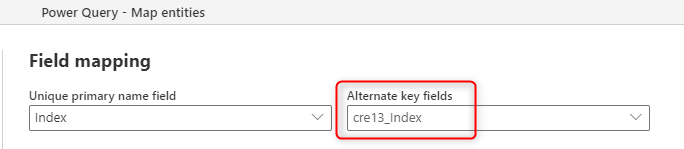
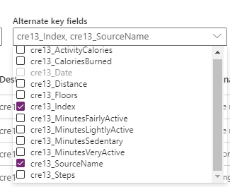

# Sync your Excel data source with Dataverse using a dataflow

One of the common scenarios that happens when you integrate data into Dataverse is keeping it synchronized with the source. Using the standard dataflow, you can load data into Dataverse. This article explains how you can keep the data synchronized with the source system.

## The importance of the key column

If you're using a relational data base system as a source, normally you have key columns in the tables, and the data is in a proper format to be loaded into Dataverse. However, the data from the Excel files aren't always that clean. You often have an Excel file with sheets of data without having any key column. In [Field mapping considerations for standard dataflows](get-best-of-standard-dataflows.md), you can see that if there's a key column in the source, it can be easily used as the alternate key in the field mapping of the dataflow.

Having a key column is important for the table in Dataverse. The key column is the row identifier; this column contains unique values in each row. Having a key column helps in avoiding duplicate rows, and it also helps in synchronizing the data with the source system. If a row is removed from the source system, having a key column is helpful to find it and remove it from Dataverse as well.

## Creating a key column

If you don't have a key column in your data source (Excel, text file, or any other sources), then you can generate one using the following method:

1. Clean your data.

   The first step to create the key column is to remove all unnecessary rows, clean the data, remove empty rows, and remove any possible duplicates.

   

2. Add an index column.

   After the data is cleaned, the next step is to assign a key column to it. You can use **Add Index Column** from the **Add Column** tab for this purpose.

   

When you add the index column, you have some options to customize it, for example, customizations on the starting number or the number of values to jump each time. The default start value is zero, and it increments one value each time.

## Use the key column as the alternate key

Now that you have the key column(s), you can assign the dataflow's field mapping to the Alternate Key.

The setting is simple, you just need to set the alternate key. However, if you have multiple files or tables, it has one other step to consider.

### If you have multiple files

If you have just one Excel file (or sheet or table), then the steps in the previous procedure are enough to set the alternate key. However, if you have multiple files (or sheets or tables) with the same structure (but with different data), then you to append them together.

If you're getting data from multiple Excel files, then the **Combine Files** option of Power Query will automatically append all the data together, and your output will look like the following image.

As shown in the preceding image, besides the append result, Power Query also brings in the Source.Name column, which contains the file name. The Index value in each file might be unique, but it's not unique across multiple files. However, the combination of the Index column and the Source.Name column is a unique combination. Choose a composite alternate key for this scenario.

## Delete rows that no longer exists in the query output

The last step is to select the **Delete rows that no longer exist in the query output**. This option compares the data in the Dataverse table with the data coming from the source based on the alternate key (which might be a composite key), and remove the rows that no longer exist. As a result, your data in Dataverse will be always synchronized with your data source.

