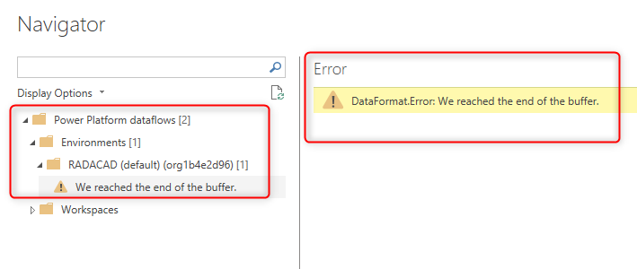
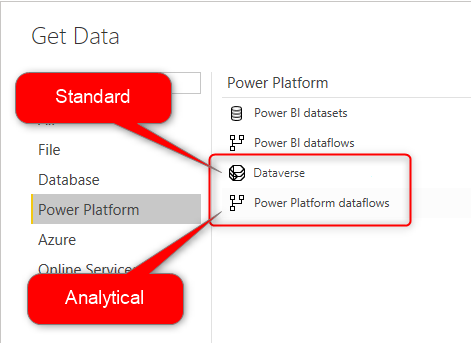

# Troubleshooting dataflow issue: get data from dataflow

[!INCLUDE [CDS note](../includes/cc-data-platform-banner.md)]

You might have created a dataflow, but then have difficulty in getting data from it (either using Power Query in Power BI Desktop or from other dataflows). This article explains some of the most common issues that happen when you get data from a dataflow.

## Problem: This table is empty

Let's assume that you're getting data from a dataflow (either in the Power BI Desktop or in another dataflow), and you have access to that dataflow. Sometimes, however, when you get data from a dataflow with the above situation, you get a message in the Navigator saying "This table is empty".

**Reason:**

This table is empty means the data isn't loaded into the table.

**Resolution:**

In the desktop tools such as Power Query in Excel and Power Query in the Power BI Desktop, the loading of data into tables happens automatically (unless you disable it). This behavior is a bit different in Power Query in dataflows. In dataflow entities, the data won't be loaded unless you refresh the data.

You have to set up a scheduled refresh for a dataflow, or if you want to just have a single refresh, use the manual refresh option. 

Once a dataflow is refreshed, the data in entities will be visible in the Navigator window of other tools and services.

## Problem: Can't see my Power Platform dataflow listed

Sometimes, you have a Power Platform dataflow created, and also refreshed. However, you still can't access it from a get data experience. This might be because the account is trying to access the dataflow. However, if the account does have access to the dataflow, another reason can be the type of dataflow.

The error message you receive might be "We reached the end of the buffer", or "DataFormat.Error: We reached the end of the buffer".

**Reason:** 

Only analytical dataflows can be used in Get Data from a dataflow experience.

**Resolution:**

If you've created a dataflow that stores the data into Common Data Service, you can't see it using Get Data from dataflow experience. You can use [Get data from Common Data Service](https://docs.microsoft.com/powerapps/maker/common-data-service/data-platform-powerbi-connector#finding-your-common-data-service-environment-url) instead, to get data from standard dataflows. Or you can create an [analytical dataflow](understanding-differences-between-analytical-standard-dataflows.md) instead, and then access it through Get data from a dataflow.

## Problem: Can't have a DirectQuery Connection to the dataflow

If you intend to use the dataflow as a DirectQuery source, then you might need to enable it first.

**Reason:**

The enhanced compute engine settings are disabled.

**Resolution:**

[Enable the enhanced compute engine](https://docs.microsoft.com/power-bi/transform-model/service-dataflows-directquery), and then you'll have the option to connect to the dataflow using the DirectQuery option.

