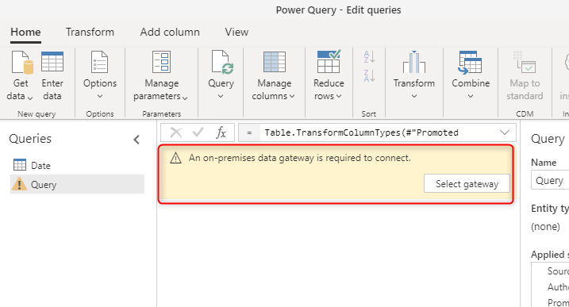
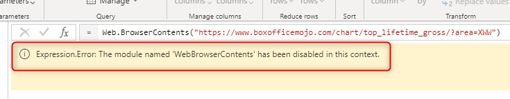
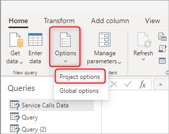
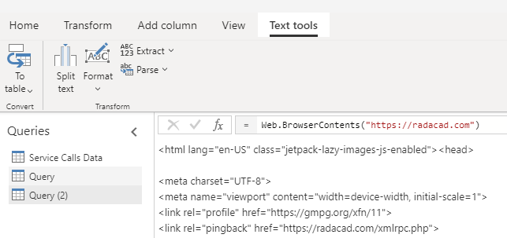

# Troubleshooting dataflow issues: Connection to the data source

When you create a dataflow, sometimes you get an issue connecting to the data source, this can be because of the gateway, the credentials or many other reasons. In this article, you will see the most common errors and issues in this category and their resolution.

## Problem: An on-premises data gateway is required to connect.

This can happen when you move a query from Power Query in desktop tools to the Power Query in the dataflow, and you get the error below.

Reason:

When your entity in the dataflow gets data from an on-premises data source, a gateway is needed for the connection. The gateway is not selected.

Resolution:

Select the gateway using the Select gateway option. Sometimes, however, you might not even have the gateway setup already. [This article](https://docs.microsoft.com/data-integration/gateway/service-gateway-install) guides you through the steps of installing and setting up a gateway.

## Problem: Please specify how to connect.

This happens when you are connected to a data source, but haven't set up the credential or connection details yet. It can happen when you migrate queries into dataflow.

Reason:

The connection details are not set up correctly.

Resolution:

Click on Configure connection. Set up the connection details and credentials.

## Problem: Expression.Error: The module named 'xyz' has been disabled in this context.

Sometimes, when you migrate your queries from the Power Query in desktop tools to the dataflow, you get an error saying that a module is disabled in this context. One example of these situation is when your query is using functions such as Web.Page or Web.BrowserContents, etc.

Reason:

Disabled modules are related to functions that their support requires an on-premises gateway connection to work. Even if the function is getting data from a web page, because of some security compliance, they need to go through a gateway connection.

Resolution:

At first, you have to [install and setup an on-premises gateway](https://docs.microsoft.com/data-integration/gateway/service-gateway-install), and then add a web data source for the web URL you are connecting to;

After adding the web data source, you can go and select the gateway in the dataflow from the Project Options

You might be asked to set up the credentials, and after the successful setup, you should see the queries working fine;

