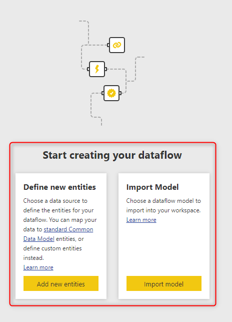
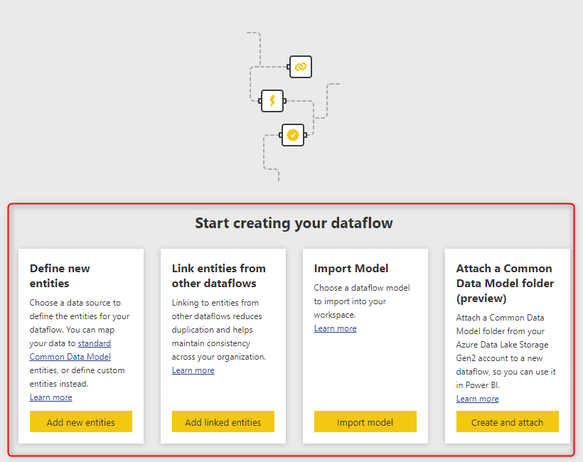

# Troubleshoot dataflow issues: Creating dataflows

This article explains some of the most common errors and issues you might get when you want to create a dataflow, and how to fix them.

## I can't create a dataflow in My workspace

This problem happens when you try to create a dataflow in **My workspace** in Power BI.

:::image type="content" source="media/troubleshooting-dataflows-issues-creating-dataflow/my-workspace.png" alt-text="My workspace.":::

**Reason:**

Creating dataflows in **My workspace** isn't supported.

**Resolution:**

Create your dataflows in [organizational workspaces](/power-bi/collaborate-share/service-create-the-new-workspaces). To learn how to create an organizational workspace, go to [Create the new workspaces in Power BI](/power-bi/collaborate-share/service-create-the-new-workspaces).

## I can't create a dataflow in an organizational workspace where I have read-only rights

If you're a member of an organization workspace and you still can't create a dataflow, it might be because of your access rights in that workspace.

**Reason:**

You don't have edit rights in the workspace.

**Resolution:**

Ask the workspace administrators or members to give you an Admin, Member, or Contributor [role](/power-bi/collaborate-share/service-new-workspaces#roles-in-the-new-workspaces).

:::image type="content" source="media/troubleshooting-dataflows-issues-creating-dataflow/workspace-access.png" alt-text="Workspace access settings.":::

## I can't create a dataflow in a workspace where I have edit rights

This problem happens when you're in an organizational workspace that you've created, or someone else has created and you have Admin, Member, or Contributor access. You want to create a dataflow in this scenario, but you can't.

**Reason:**

The access to dataflow creation was disabled by the Power BI administrator.

**Resolution:**

Ask the Power BI tenant administrator to enable access for you by following these steps:

1. On the **Settings** menu in the Power BI service, select **Admin portal**.

   :::image type="content" source="media/troubleshooting-dataflows-issues-creating-dataflow/power-bi-admin-portal.png" alt-text="Power BI admin portal.":::

2. On the left pane, select **Tenant settings**, and in the **Dataflow settings** section, turn on the toggle for **Enabled**. Then select **Apply**.

   :::image type="content" source="media/troubleshooting-dataflows-issues-creating-dataflow/enable-dataflow.png" alt-text="Enable dataflows in tenant settings.":::

## I only see limited options when I create a dataflow

When creating a dataflow, sometimes you don't see all the options that are available. For example, you might see only the options shown in the following image.

However, more options are actually available, as shown in the following image.

**Reason:**

You're creating the dataflow in an old version of the Power BI workspace, called V1.

**Resolution:**

Upgrade your Power BI workspace to the new version (v2). More information: [Upgrade classic workspaces to the new workspaces in Power BI](/power-bi/collaborate-share/service-upgrade-workspaces)

:::image type="content" source="media/troubleshooting-dataflows-issues-creating-dataflow/upgrade-workspace.png" alt-text="Upgrade the classic workspace.":::

## Dataflow name exists already, but I deleted the old one

This problem happens when you try to create a dataflow with a name that already exists or use the name of a recently deleted dataflow.

   :::image type="content" source="media/troubleshooting-dataflows-issues-creating-dataflow/dataflow-error-name-exists.png" alt-text="Screenshot showing Dataflow name exists already.":::

**Reason:**

It can take up to 48 hours for the backend systems to delete all the files and references to the deleted dataflow.

**Resolution:**

You can either wait 48 hours before publishing the dataflow or create it now under a different name and rename it later on.

## I can't publish a dataflow with Private Link enabled

This problem happens when you try to publish a dataflow in a workspace that has a capacity assigned to it that is not in the same region as the VNET Gateway that the connector depends on.

**Reason:**

The dataflow is unable to complete the publish process because it cannot connect to the data source.

**Resolution:**

Create your dataflows in a workspace that is assigned to a capacity in the same region as your VNET Gateway or [create a new virtual network data gateway](/data-integration/vnet/create-data-gateways) in the region you want to publish to.