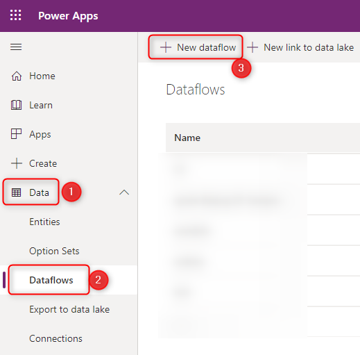
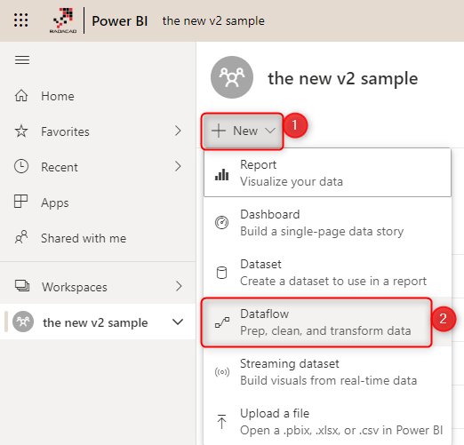
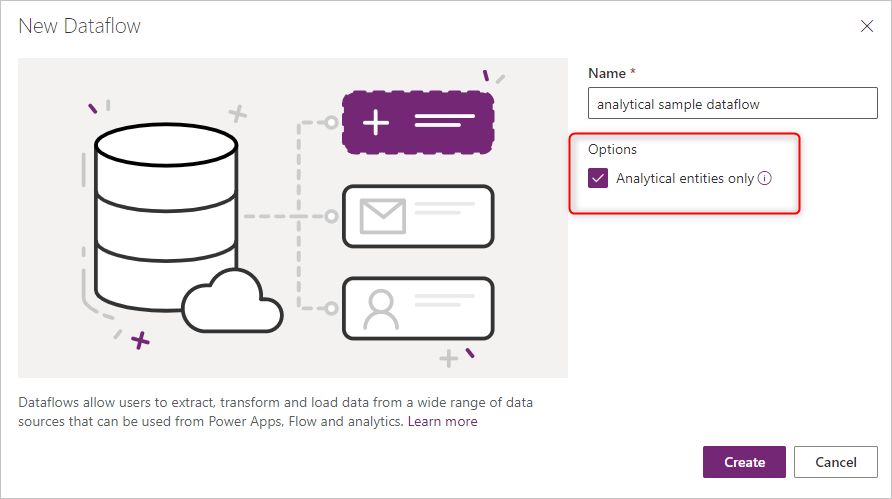
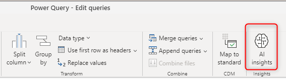
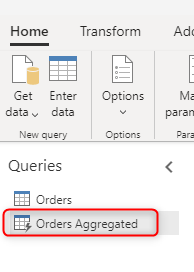

--- 
title: Understanding the differences between dataflow types
description: Understanding the differences between standard V1, V2 and analytical dataflows.
author: bensack
ms.topic: conceptual 
ms.date: 04/06/2021 
ms.author: bensack 
--- 

# Understanding the differences between dataflow types

Dataflows are used to extract, transform, and load data to a storage destination where it can be leveraged for different scenarios. Because not all storage destinations share the same characteristics, some dataflow features and behaviors differ depending on the storage destination the dataflow loads data into. Before you create a dataflow, it's important to understand how the data is going to be used, and choose the storage destination according to the requirements of your solution.

Selecting a storage destination of a dataflow determines the dataflow's type. A dataflow that loads data into Dataverse tables is categorized as a *standard dataflow*. Dataflows that load data to analytical entities is categorized as an *analytical dataflow*.

Dataflows created in Power BI are always analytical dataflows. Dataflows created in Power Apps can either be standard or analytical, depending on your selection when creating the dataflow.

## Standard dataflows 

A standard dataflow loads data to Dataverse tables. Standard dataflows can only be created in Power Apps. One benefit of creating this type of dataflow is that any application that depends on data in Dataverse can work with the data created by standard dataflows. Typical applications that leverage Dataverse tables are Power Apps, Power Automate, AI Builder and Power Virtual Agents.  

 

### Standard dataflows versions

We've been working on significant updates to standard dataflows to improve their performance and reliability. These improvements will eventually be available to all standard dataflows. But in the interim, we'll differentiate between existing standard dataflows (version 1) and new standard dataflows (version 2) by adding a version indicator in Power Apps.

> [!div class="mx-imgBorder"]
>  

### Standard dataflow versions feature comparison

The following table lists the major features differences between standard dataflows V1 and V2, and provides information about each feature's behavior in each version.

| **Feature** | **Standard V1** | **Standard V2** |
| --- | --- | --- |
| Maximum number of dataflows that can be saved with automatic schedule per customer tenant | 50 |  Unlimited |
| Maximum number of records ingested per query/table | 500,000 | Unbounded. The maximum number of records that can be ingested per query or table now depends on Dataverse service protection limits at the time of ingestion. |
| Ingestion speed into Dataverse | Baseline performance | Improved performance by a few factors. Actual results may vary and depend on characteristics of the data ingested, and load on Dataverse service at the time of ingestion. |
| Incremental Refresh policy | Not supported | Supported |
| Resiliency | When Dataverse service protection limits are encountered, a record will be retried up to 3 times. | When Dataverse service protection limits are encountered, a record will be retried up to 3 times.
| Power Automate integration | Not supported |  Supported |

## Analytical dataflows

An analytical dataflow loads data to storage types optimized for analytics&mdash;Azure Data Lake Storage. Microsoft Power Platform environments and Power BI workspaces provide customers with a managed analytical storage location that's bundled with those product licenses. In addition, customers can link their organization’s Azure Data Lake storage account as a destination for dataflows.

Analytical dataflows are capable additional analytical features. For example, integration with Power BI’s AI features or use of computed entities which will be discussed later.  

You can create analytical dataflows in Power BI. By default, they'll load data to Power BI’s managed storage. But you can also configure Power BI to store the data in the organization’s Azure Data Lake Storage. 

 

You can also create analytical dataflows in Power Apps and Dynamics 365 customer insights portals. When you're creating a dataflow in Power Apps portal, you can choose between Dataverse managed analytical storage or in your organization’s Azure Data Lake Storage account. 

 

### AI Integration 

Sometimes, depending on the requirement, you might need to apply some AI and machine learning functions on the data through the dataflow. These functionalities are available in Power BI dataflows and require a Premium workspace. 

 

The following articles discuss how to use AI functions in a dataflow: 

- [Azure Machine Learning integration in Power BI](/power-bi/service-machine-learning-integration) 
- [Cognitive Services in Power BI](/power-bi/service-cognitive-services) 
- [Automated Machine Learning in Power BI](/power-bi/service-machine-learning-automated) 

Note that the features listed above are Power BI specific and are not available when creating a dataflow in the Power Apps or Dynamics 365 customer insights portals.  

### Computed entities 

One of the reasons to use a computed entity is the ability to process large amounts of data. The computed entity helps in those scenarios. If you have an entity in a dataflow, and another entity in the same dataflow uses the first entity's output, this will create a computed entity. 

The computed entity helps with the performance of the data transformations. Instead of re-doing the transformations needed in the first entity multiple times, the transformation will be done only once in the computed entity. Then the result will be used multiple times in other entities. 

 

To learn more about computed entities, see [Using computed entities on Power BI Premium](/power-bi/service-dataflows-computed-entities-premium). 

Computed entities are available only in an analytical dataflow. 

## Standard vs. analytical dataflows 

The following table lists some differences between a standard entity and an analytical entity. 

| Operation               | Standard             | Analytical                    | 
| --------------------------------- | --- | ------------------------------------------------------------ | 
| How to create                     | Power Platform dataflows | Power BI dataflows Power Platform dataflows by selecting the **Analytical Entity** checkbox when creating the dataflow | 
| Storage options                   | Dataverse      |Power BI provided Azure Data Lake storage for Power BI dataflows, Dataverse provided Azure Data Lake storage for Power Platform dataflows, or customer provided Azure Data Lake storage| 
| Power Query transformations       | Yes             |Yes                                                          | 
| AI functions                      | No              | Yes                                                          | 
| Computed entity                   | No              | Yes                                                          | 
| Can be used in other applications | Yes, through Dataverse | Power BI dataflows: Only in Power BI Power Platform dataflows or Power BI external dataflows: Yes, through Azure Data Lake Storage | 
| Mapping to standard Entity        | Yes              | Yes                                                         | 
| Incremental load                  | Default incremental-load Possible to change using the **Delete rows that no longer exist in the query output** checkbox at the load settings | Default full-load  Possible to set up incremental refresh by setting up the incremental refresh in the dataflow settings | 
| Scheduled Refresh                 | Yes              | Yes, the possibility of notifying the dataflow owners upon the failure | 
| | | |

## Scenarios to use each dataflow type 

Here are some sample scenarios and best practice recommendations for each type of dataflow. 

### Cross-platform usage&mdash;standard dataflow 

If your plan for building dataflows is to use stored data in multiple platforms (not only Power BI, but also other Microsoft Power Platform services, Dynamics 365, and so on), a standard dataflow is a great choice. Standard dataflows store the data in Dataverse, which you can access through many other platforms and services. 

### Heavy data transformations on large data tables&mdash;analytical dataflow

Analytical dataflows are an excellent option for processing large amounts of data. Analytical dataflows also enhance the computing power behind the transformation. Having the data stored in Azure Data Lake Storage increases the writing speed to a destination. Compared to Dataverse (which might have many rules to check at the time of data storage), Azure Data Lake Storage is faster for read/write transactions on a large amount of data.

### AI features&mdash;analytical dataflow

If you're planning to use any AI functionality through the data transformation stage, you'll find it helpful to use an analytical dataflow because you can use all the supported AI features with this type of dataflow.
