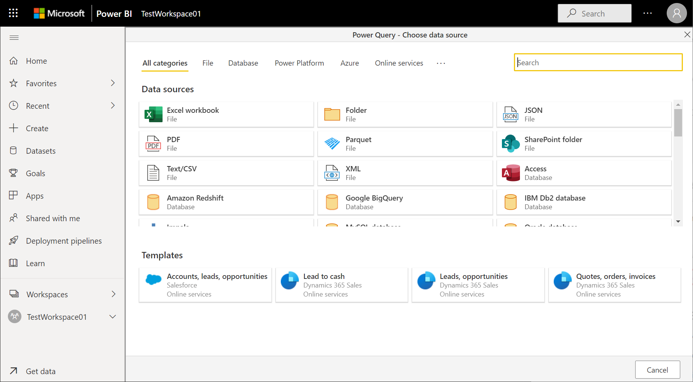
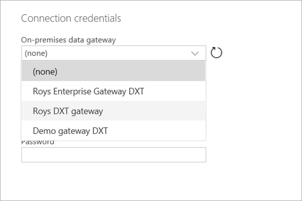
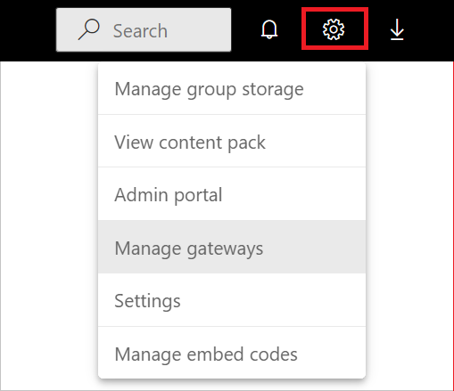

# Using an on-premises data gateway in Power Platform dataflows

Install an on-premises data gateway to transfer data quickly and securely between a Power Platform dataflow and a data source that isn't in the cloud, such as an on-premises SQL Server database or an on-premises SharePoint site. You can view all gateways for which you have administrative permissions and manage permissions and connections for those gateways.

With a gateway, you can connect to on-premises data through these connections:

- SharePoint
- SQL Server
- Oracle
- Informix
- Filesystem
- DB2

## Prerequisites

- A Power Apps account. Don't have one? [Sign up for 30 days free](/powerapps/maker/signup-for-powerapps).

- Administrative permissions on a gateway. These permissions are provided by default for gateways you install. Administrators can grant other people permissions for gateways.

- A license that supports accessing on-premises data using an on-premises gateway. More information: "Connect to your data" row of the "Explore Power Apps plans" table in the [Power Apps pricing](https://powerapps.microsoft.com/pricing/) page.

- Gateways and on-premises connections can only be created and used in the user's default environment. More information: [Working with environments and Microsoft Power Apps](/power-platform/admin/working-with-environments).

## Install a gateway

You can install an on-premises data gateway directly from the online service.

# [Power BI service](#tab/power-bi-service)

To install a gateway from Power BI service:

1. Select the downloads button in the upper right corner of Power BI service, and choose **Data Gateway**.

   

2. Install the gateway using the instructions provided in [Install an on-premises data gateway](/data-integration/gateway/service-gateway-install.md).

# [Power Apps](#tab/power-apps)

To install a gateway from Power Apps:

1. In the left navigation pane of [powerapps.com](https://make.powerapps.com/?utm_source=padocs&utm_medium=linkinadoc&utm_campaign=referralsfromdoc), select **Data** > **Gateways**.

   

2. Select [New gateway](https://go.microsoft.com/fwlink/?LinkID=820931).

   

3. In the **On-Premises Data Gateway** section, select **Download**.

4. Install the gateway using the instructions provided in [Install an on-premises data gateway](/data-integration/gateway/service-gateway-install.md).

---

## Use an on-premises data source in a dataflow

1. For instructions on how to create a new dataflow, go to [Create a dataflow from a data source](./data-sources.md).

2. Select an on-premises data source from the data sources list.

   

3. Provide the connection details for the enterprise gateway that will be used to access the on-premises data. You must select the gateway itself, and provide credentials for the selected gateway. Only gateways for which you are an administrator appear in the list.

    

You can change the enterprise gateway used for a given dataflow and change the gateway assigned to all of your queries using the dataflow authoring tool.

> [!NOTE]
> The dataflow will try to find or create the required data sources using the new gateway. If it can't do so, you won't be able to change the gateway until all needed dataflows are available from the selected gateway.

## View and manage gateway permissions

# [Power BI service](#tab/power-bi-service)

1. Select the setup button in the upper right corner of Power BI service, choose **Manage gateways**, and then select the gateway you want.

   

2. To add a user to the gateway, select the **Administrators** table and enter the email address of the user you would like to add as an administrator. Using gateways in dataflows requires Admin permission on the gateway. Admins have full control of the gateway, including adding users, setting permissions, creating connections to all available data sources, and deleting the gateway.

# [Power Apps](#tab/power-apps)

1. In the left navigation pane of [powerapps.com](https://make.powerapps.com/?utm_source=padocs&utm_medium=linkinadoc&utm_campaign=referralsfromdoc), select **Gateways** and then select the gateway you want.

2. To add a user to a gateway, select **Users**, specify a user or group, and then specify a permission level. Using gateways in dataflows requires Admin permission on the gateway. Admins have full control of the gateway, including adding users, setting permissions, creating connections to all available data sources, and deleting the gateway.

---

## View and manage gateway connections

# [Power BI service](#tab/power-bi-service)

1. Select the setup button in the upper right corner of Power BI service, choose **Manage gateways**, and then select the gateway you want.

2. Perform the action that you want:
   - To view details and edit the settings, select **Gateway Cluster Settings**.
   - To add users as administrators of the gateway, select **Administrators**.
   - To add a data source to the gateway, select **Add Data Source**, enter a data source name and choose the data source type under **Data Source Settings**, and then enter the email address of the person who will use the data source.
   - To delete a gateway, select the ellipsis to the right of the gateway name and then select **Remove**.

# [Power Apps](#tab/power-apps)

1. In the left navigation bar of *powerapps.com*, select **Gateways**, and then choose the gateway you want.

2. Perform the action that you want:
    - To view details, edit the settings, or delete a gateway, select **Connections** and then select a connection.
    - To share a connection, select **Share** and then add or remove users.

      > [!NOTE]
      > You can only share some types of connections, such as a SQL Server connection. For more information, see [Share canvas-app resources in Power Apps](/powerapps/maker/canvas-apps/share-app-resources).  
      >
      > For more information about how to manage a connection, see [Manage canvas-app connections in Power Apps](/powerapps/maker/canvas-apps/add-manage-connections).

---

## Limitations

There are a few known limitations when using enterprise gateways and dataflows.

- Each dataflow can use only one gateway. As such, all queries should be configured using the same gateway.

- Changing the gateway impacts the entire dataflow.

- If several gateways are needed, the best practice is to build several dataflows (one for each gateway) and use the compute or table reference capabilities to unify the data.

- Dataflows are only supported using enterprise gateways. Personal gateways will not be available for selection in the drop-down lists and settings
    screens.

- Using gateways in dataflows is only supported for people with *Admins* permissions. *Can use* and *Can use + share* permissions levels are not currently supported.

For information about troubleshooting issues with gateways, or configuring the gateway service for your network, go to [On-premises data gateway documentation](/data-integration/gateway).

## Next steps

- [Create and use dataflows in Power Apps](/powerapps/maker/data-platform/create-and-use-dataflows)

- [Add data to a table in Microsoft Dataverse by using Power Query](add-data-power-query.md)

- [Connect Azure Data Lake Storage Gen2 for dataflow storage](/power-bi/service-dataflows-connect-azure-data-lake-storage-gen2)
