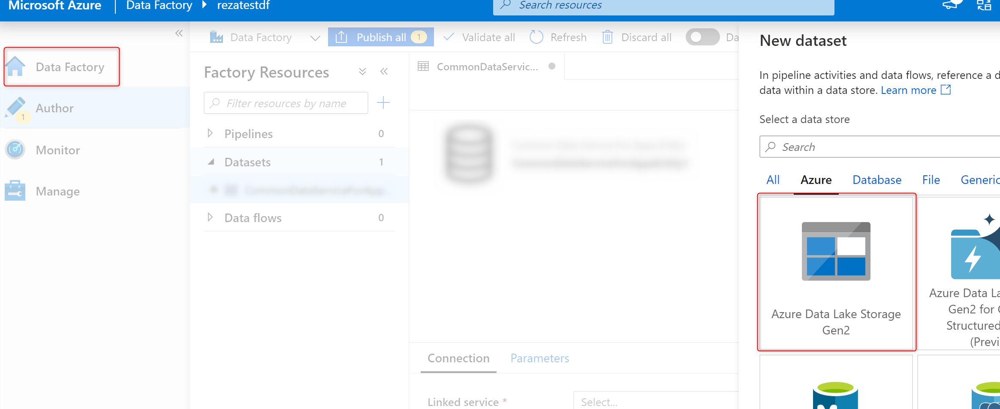
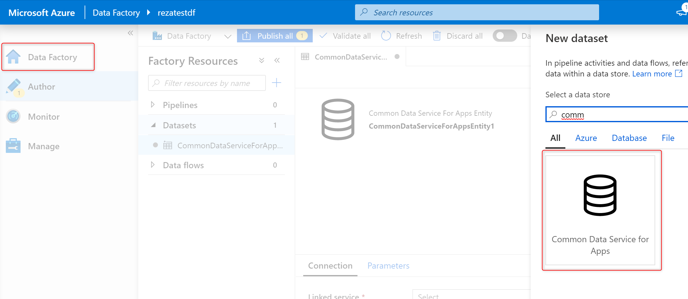

# Using the output of Power Platform dataflows from other Azure data workloads

Depending on the storage for the output of the Power Platform dataflows, you can use that output in other Azure services.

## The benefits of working with the output of Power Platform dataflows

Using Power Platform dataflows, you can reshape, clean, and prepare data for further analysis and consumption. There are many other Azure data services that work with data as an input and provide actions. 

- Azure Machine Learning can consume the output of dataflows and use it for machine learning scenarios (for example, predictive analysis).
- Azure Data Factory can get the output of dataflows on a much larger scale, combined with the data from big data sources, for advanced data integration solutions.
- Azure Databricks can consume the output of dataflows for applied data science algorithms and further AI with the big data scale in the Apache Spark back end.
- Other Azure data services can use the output of Power Platform dataflows to do further actions on that data.

## Dataflows with external Data Lake Storage 

If you've connected external Azure Data Lake Storage to the Power Platform dataflows, you can connect to it by using any Azure services that have Data Lake Storage as a source. These services can be Machine Learning, Data Factory, Azure Databricks, Azure Analysis Services, and so on.<!--Is it possible to make this a complete list, or "...as a source, such as Machine Learning, Data Factory, Azure Databricks, and Azure Analysis Services."? Writing Style Guide discourages "and so on."-->

In any of these services, use Data Lake Storage as the source. You'll be able to enter the details of your storage and connect to the data in it. The data is stored in CSV format, and is readable through any of these tools and services. The following image shows how Data Lake Storage is a source option in Data Factory.

## Dataflows with Common Data Service

If you're using standard dataflows that store data in Common Data Service, you can still connect to Common Data Service from many Azure services. The following image shows that in Data Factory, the output of a dataflow from Common Data Service can be used as a source.

## Dataflows with internal Data Lake Storage

When you use the internal Data Lake storage that's provided by Power Platform dataflows, that storage is exclusively limited to the Power Platform tools and isn't accessible from other Azure data workloads.
