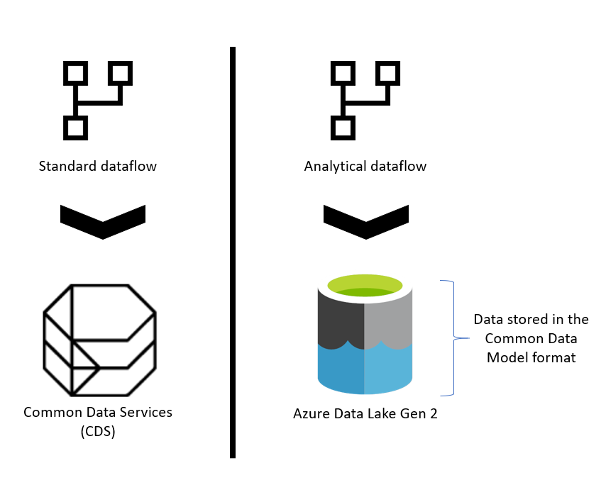
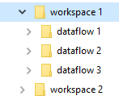
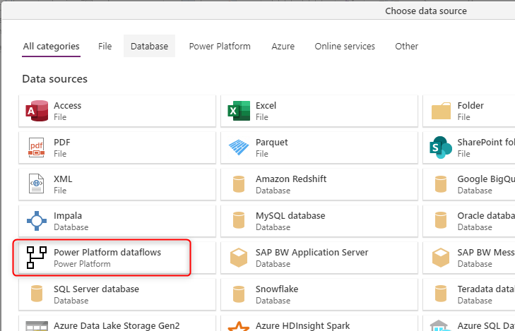

# What is the storage structure for analytical dataflows? 

 

Analytical dataflows store both data and metadata in Azure Data Lake Storage Gen2. Dataflows leverage a standard structure to store and describe data created in the lake, which is called Common Data Model folders. In this article, you'll learn more about the storage standard that dataflows leverage behind the scenes. 

 

## When the dataflow is analytical; storage needs a structure 

 

If the [dataflow is standard](understanding-differences-between-analytical-standard-dataflows.md#standard-dataflow), then the data is stored in Common Data Service. Common Data Service is like a database system; it has the concept of tables, views, and so on. Common Data Service is a structured data storage option used by standard dataflows. 

 

However, when the dataflow is [analytical](understanding-differences-between-analytical-standard-dataflows.md#analytical-dataflow), the data is stored in Azure Data Lake Storage Gen2. A dataflow’s data and metadata is stored in a Common Data Model folder. Since a storage account might have multiple dataflows stored in it, a hierarchy of folders and subfolders has been introduced to help organize the data. Depending on the product the dataflow was created in, the folders and subfolders may represent workspaces (or environments), and then the dataflow’s Common Data model folder. Inside the Common Data model folder, both schema and data of the dataflow entities are stored. This structure follows the standards defined for Common Data Model. 

 

 

 

## What is the Common Data Model storage structure 

 

[Common Data Model](https://docs.microsoft.com/common-data-model/) is a metadata structure defined to bring conformity and consistency for using data across multiple platforms. Common Data Model is not data storage. In fact, it's the way that the data is stored and defined. 

 

Common Data Model folders define how an entity’s schema and its data should be stored. Inside Azure Data Lake Storage Gen2, data is organized in folders. Folders may represent a workspace or environment. Under those folders, subfolders for each dataflow will be created. 

 

 

 

## What's inside a dataflow folder? 

 

Inside each dataflow folder, there are sub-folders for each entity and a metadata file named `model.json`.  

 

 

 

### The metadata file: model.json 

 

The `model.json` file is the metadata definition of the dataflow. This is the one file that contains all the dataflow’s metadata. It includes a list of entities, the columns, and their data types in each entity, the relationship between entities, and so on. This is the file that you can export from a dataflow easily, even if you don't have access to the Common Data Model folder structure. 

 

 

 

This JSON file is the file that you can use to migrate (or import) your dataflow into another workspace or environment.

 

 

 

To learn exactly what the model.json metadata file includes, see [The metadata file (model.json) for the Common Data Model](https://docs.microsoft.com/common-data-model/model-json). 

 

### Data files 

 

In addition to the metadata file, there are other subfolders inside the dataflow folder. A dataflow stores the data of each entity inside a subfolder with the entity's name on it. An entity’s data might be split into multiple data partitions stored in CSV format. 

 

## How can you see or access Common Data Model folders? 

 

If you're using dataflows with storage provided by the product it was created in, you won't have access to those folders directly. In such cases, getting data from the dataflows requires using the Power Platform Dataflow connector available in the Get Data experience in Power BI, Power Apps, and Dynamics 35 Customer Insights products, or in Power BI Desktop. 

 

 

 

 

 

To see how dataflows and the internal Azure Data Lake integration work, see [Dataflows and Azure Data Lake integration (Preview)](https://docs.microsoft.com/power-bi/transform-model/service-dataflows-azure-data-lake-integration). 

 

If your organization enabled dataflows to leverage its Azure Data Lake Storage Gen2 account and was selected as a dataflows load target, you can still get data from the dataflow using the Power Platform Dataflow connector as mentioned above. But you can also access the dataflow's Common Data Model folder directly through the lake, even outside of Power Platform tools and services. Access to the lake is possible through the Azure portal, Microsoft Azure Storage Explorer, or any other service or experience that supports Azure Data Lake Storage Gen2. 

 

 

 

To see how to connect the external Azure Data Lake storage account to dataflows in your environment, see [Connect Azure Data Lake Storage Gen2 for dataflow storage](https://docs.microsoft.com/power-bi/transform-model/service-dataflows-connect-azure-data-lake-storage-gen2). 

 

## Next Steps 

 

- [Use the Common Data Model to optimize Azure Data Lake Storage Gen2](https://docs.microsoft.com/common-data-model/data-lake) 

- [The metadata file (model.json) for the Common Data Model](https://docs.microsoft.com/common-data-model/model-json) 

- [Add a CDM folder to Power BI as a dataflow (Preview)](https://docs.microsoft.com/power-bi/service-dataflows-add-cdm-folder) 

- [Connect Azure Data Lake Storage Gen2 for dataflow storage](https://docs.microsoft.com/power-bi/service-dataflows-connect-azure-data-lake-storage-gen2) 

- [Dataflows and Azure Data Lake Integration (Preview)](https://docs.microsoft.com/power-bi/transform-model/service-dataflows-azure-data-lake-integration) 

- [Configure workspace dataflow settings (Preview)](https://docs.microsoft.com/power-bi/service-dataflows-configure-workspace-storage-settings) 
