# Diagram View 

Diagram View offers a visual way to prepare data within the Power Query editor. This interface allows you to easily create queries and visualize the data preparation process. The Diagram View simplifies the experience of getting started with data wrangling, allows you to speed up the data preparation process and helps quickly understand the dataflow, both the ‘big picture view’ of how queries are related and the ‘detailed view’ of the specific data preparation steps within a query. 

>[!IMPORTANT]
>This feature is currently only available within Power Query Online as a ‘Preview’ feature.

This article provides an overview of the capabilities provided within **Diagram View**. 

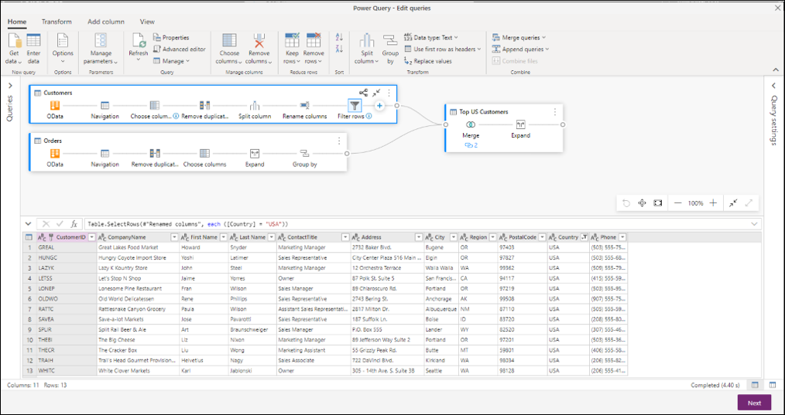 

This feature can be enabled by selecting **Diagram View** within the *View* tab in the ribbon. With the Diagram View enabled, the Steps pane and Queries pane will be collapsed.  

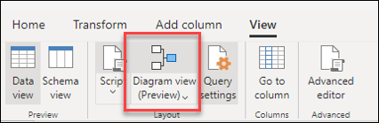 

## Authoring queries using Diagram View 

Diagram View provides you a visual interface to create, view, or modify your queries. Within Diagram View, you can connect to many different types of data sources as always, using the [‘Get Data’ experience](get-data-experience.md). 

The Diagram View is also connected to the Data Preview and the ribbon so that you can select columns in the Data Preview.

You can add a new step within a query, after the currently selected step, by just clicking the **+** button and searching for the transformation or choosing from the list. These are the same transforms that you will find within the ribbon. 

By searching and selecting the transform from the list, the step gets added to the query as shown below. 

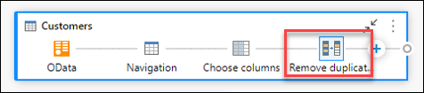

>[!NOTE]
> To learn more about how to author queries within the Query editor using the Ribbon or the Data Preview check the article on [Power Query Quickstart](power-query-quickstart-using-power-bi.md).

## Query level actions 

You can perform two quick actions on a Query – *expand/collapse* a query and *highlight related queries*. These quick actions will show up on an active selected query or on hovering on a query. The remaining query level actions can be performed by clicking the context menu. 

 

You can perform more query level actions such as duplicate, reference etc. by clicking the query level context menu (the three vertical dots). Alternatively, you can also right click within the query and get to the same context menu. 

 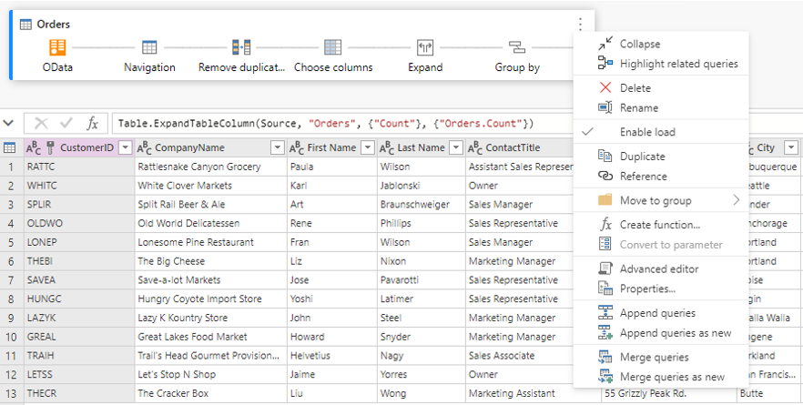

### Expand/Collapse query 

To expand/collapse a query, right click within the query and select **Expand/Collapse** from the Query’s context menu. Alternatively, double clicking within the Query can expand/collapse a query. 

 

### Highlight related queries 

To view all the related queries for a given query, you can right click within a query and select **Highlight related queries**. Alternatively, you can click the Highlight related queries button on the top right of a query. 

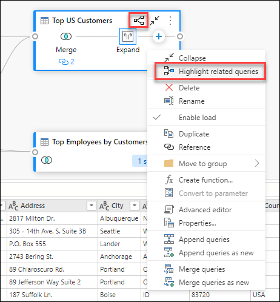 

For instance, you can see below that by clicking the button within the ‘Top US Customers’ query, we can see that ‘Customers’ and ‘Orders’ are highlighted.  

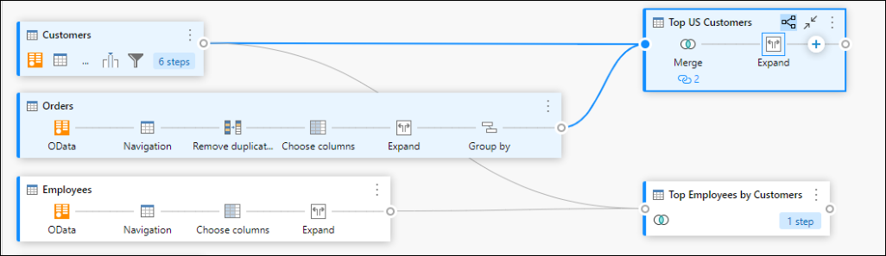 

### Delete query

To delete a query, you can right click within a query and select **Delete** from the context menu. There will be an additional pop-up to confirm the deletion. 

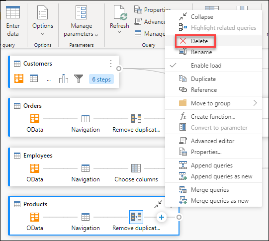 

### Rename query 

To rename a query, you can right click within a query and select **Rename** from the context menu.

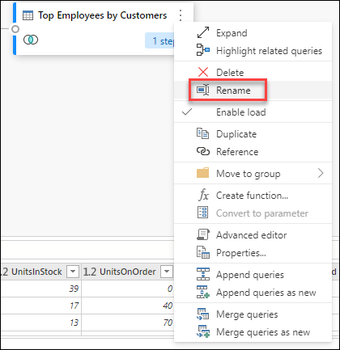 

### Enable load 

To ensure that the results provided by the query are available for downstream usage such as report building, by default **Enable load** is set to true. In case you need to disable load for a given query, right click within a Query, and select **Enable load**. The queries where **Enable load** is set to false, will be displayed with a grey outline. 

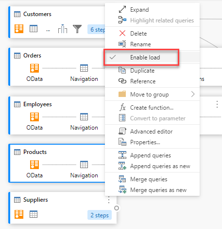 

### Duplicate

To create a copy of a given query, right click within the query and select **Duplicate**. A new duplicate query will appear within the Diagram View. 

 

### Reference 

Referencing a query will create a new query. The new query will use the steps of the previous query without having to duplicate the query. Additionally, any changes on the original query will transfer down to the referenced query. To reference a query, right click within the query and select **Reference**. 

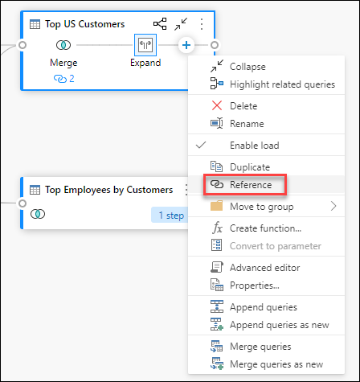 

### Move to group 

You can make folders and move the queries into these folders for organizational purposes. These folders are called *groups*. To move a given query to a Query group, right click within a query and select **Move to group**. You can choose to move the queries to an existing group or create a new Query group. 

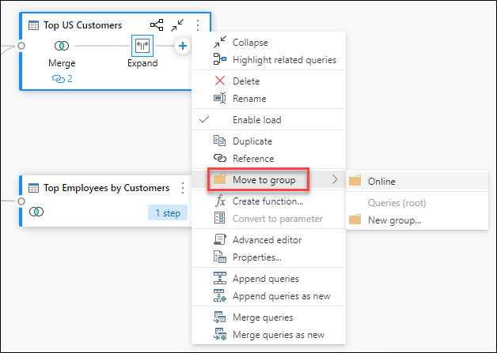 

Customers can view the Query groups above the query box within the Diagram View. 

 

### Create function 

When you need to apply the same set of transformations within different queries or values, creating Power query *functions* can be valuable. Click [here](https://docs.microsoft.com/power-query/custom-function) to learn more about functions. To convert a query into a reusable function, right click within a given query and select **Create function**. 

 

### Convert to parameter 

A parameter provides the flexibility to dynamically change the output of your queries depending on their value and promotes reusability. To convert a non-structured value such as date, text, number etc., right click within the query and select **Convert to Parameter**. 

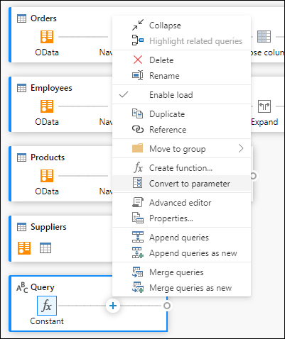 

>[!NOTE]
> To learn more about parameters, visit the article on [Power Query parameters](power-query-query-parameters.md). 

### Advanced editor 

The Advanced editor lets you see the code that Power Query editor is creating with each step. To view the code for a given query, right click within the query and select **Advanced editor**. 

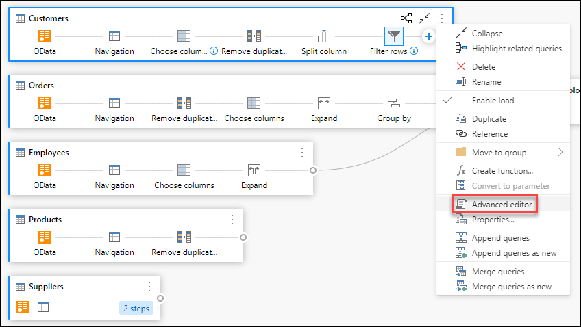 

>[!NOTE]
> To learn more about the code used shown in the advanced editor, visit the article on [Power Query M language specification](https://docs.microsoft.com/powerquery-m/power-query-m-language-specification). 

### Edit query name and description 

To edit the name of a query or add a description, right click within a query and select **Properties**. 

 

This will open a pop-up where you can edit the name of the query or add/modify the query description. 

 

Queries with query description will have an affordance (***i*** icon). You can view the query description by hovering near the query name. 

 

### Append queries / Append queries as new

To append or perform a UNION of queries, right click within a query, and select **Append queries**. This will display the Append dialog box to add additional tables to the current query. **Append** **queries as new** will also display the Append dialog box but will allow you to append multiple tables into a new query. 

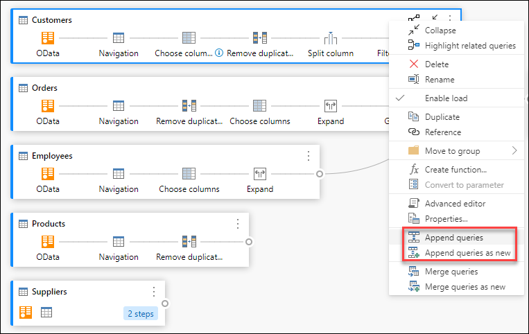

>[!NOTE]
> To learn more about how to append queries in Power Query, visit the article on [Append queries](append-queries.md). 

### Merge queries / Merge queries as new

To merge or JOIN queries, right click within a query, and select **Merge queries**. This will display the Merge dialog box, with the selected query as the left table of the merge operation. **Merge queries as new** will also display the Merge dialog box but will allow you to merge two tables into a new query. 

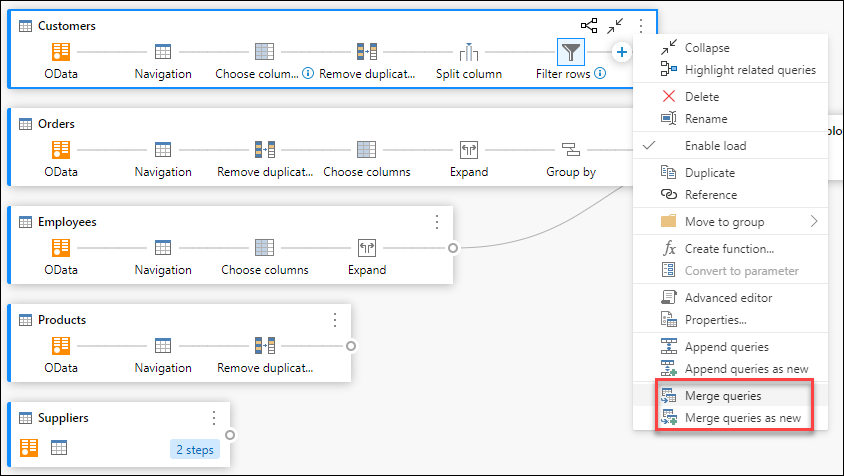

>[!NOTE]
> To learn more about how to merge queries in Power Query, visit the article on [Merge queries overview](merge-queries-overview). 

## Step level actions 

By right clicking a step, customers can perform step level actions such as “Edit settings”, “Rename” etc. 

 

Alternatively, customers can also perform step level actions by hovering over the step and clicking the ellipsis (three vertical dots). 

 

### Edit settings 

To edit the step level settings, right click the step and choose **Edit settings**. Alternatively, customers can double click the step (that has step settings) and directly get to the Settings dialog. The Settings dialog will be able to view or change the step level settings. For example, below is the Settings dialog for the ‘Split column’ step. 

 

### Rename step

To rename a step, right click the step and select **Rename**. This will open the **Step properties** dialog, where you can enter the name you want, and click OK. 

 

### Delete step 

To delete a step, right click the step and click **Delete**. To delete a series of steps until the end, right click the step and choose **Delete until end**. 

 

### Move before/after 

To move a step one position before, right click a step and select **Move before**. To move a step one position after, right click a step and select **Move after**. 

 

### Extract previous  

To extract all previous steps into a new query, right click the first step that you do *not* want to include in the query and select Extract previous. 

 

### Edit Step name and description 

You can add step descriptions by right clicking a step within a Query and choosing Properties. 

 

Alternatively, you can also get to the step level context menu by hovering over the step and clicking the ellipsis (three vertical dots). 

 

This will open a dialog where you can add the step description. This will come handy when you come back to the same query after a few days or when you share your queries or dataflows with other users. 

 

By hovering over each step, you can view a call out that shows the step label, step name and step descriptions (that were added). 

 

Clicking on each step would allow you to see the corresponding data preview for that step. 

## Tips to view your queries

### Expand and Collapse Queries 

To ensure that you can view your queries within the Diagram View, you can choose to collapse the ones that you are not actively working on and expand the ones that you care about. Expand/collapse queries by clicking on the **‘****Expand/****Collapse’** button on the top right of a Query. Alternatively, double clicking an expanded query will collapse the query and vice-versa. 

 

You can also expand/collapse a query by clicking selecting the query level actions from the Query’s context menu. 

 

**Expand all/collapse all** queries by clicking this button below next to the Layout options within the Diagram View pane. 

 

Alternatively, you can right click within the Diagram View pane and see a context menu to expand all/collapse all queries. 

 

In the collapsed mode, you can quickly look at the steps within the query by hovering over the number of steps in the query. You can click on these steps to navigate to that specific step within the query.  

 

## Layout Options 

There are four layout options available within the Diagram View: 

### Zoom out/in
This option allows you to adjust the zoom level and zoom out/zoom in to view all the queries within the Diagram View. 

 

### Full screen
This option allows you to view all the queries and their relationships through the ‘Full screen’ mode. The ‘Diagram View’ expands to full screen and the Data Preview, Queries pane and steps pane remain collapsed. 

 

### Fit to view
This option adjusts the zoom level so that all the queries and their relationships are fully viewed within the Diagram View. 

 

### Reset
This option allows you to reset the zoom level back to 100% and also resets the pan to the top-left corner. 

 

## View query relationships

To view all the related queries for a given query, click the **‘Highlight related queries’** button. For instance, you can see below that by clicking the button within the ‘Top US Customers’ query, we can see that ‘Customers’ and ‘Orders’ are highlighted.  

 

Alternatively, you can click on the dongle on the left of a given query to see the direct and indirect referenced queries. 

 

Similarly, you can click on the right dongle to view direct and indirect dependent queries. 

 

You can also hover on the link icon below a step to view a callout that shows the query relationships. 

 