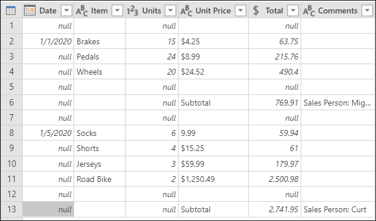
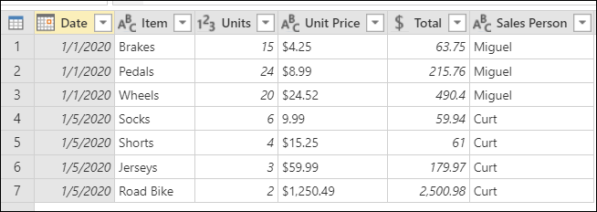
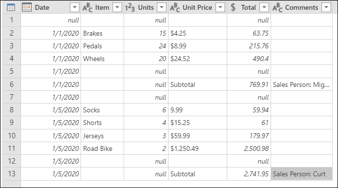
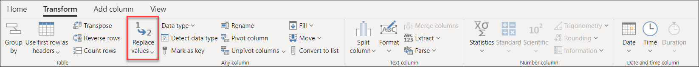
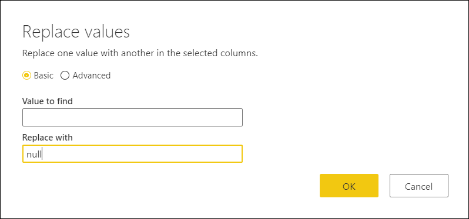
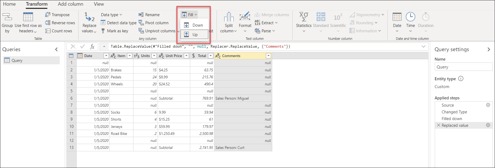
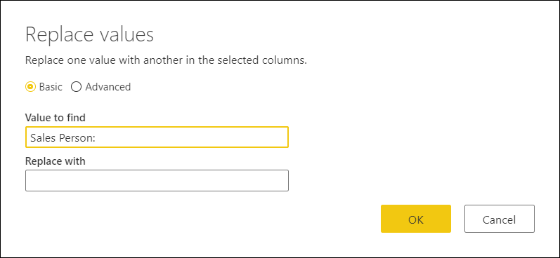

# Fill down or fill up

The operation to fill down or fill up is an operation that can happen from row to row in a single column. 

For example, imagine the following table where you'd like to fill down in the **Date** column and fill up in the **Comments** column.

The outcome that you'd expect is shown in the following image.

## To fill down

The fill down operation takes a column and traverses through the values in it to fill any null values in the next rows until it finds a new value. This process continues on a row by row basis until there are no more values in that column.

In the following example, you want to fill down on the **Date** column. To do that, you can right-click on the **Date** column and then select **Fill > Down**.

The result of that operation will look like this:

## To Fill Up

In the same way as the Fill down operation, the fill up works on a column. But fill up finds the last value of the column and fills any null values in the previous rows until it finds a new value. Then the same process occurs for that value. This process continues until there are no more values in that column.

In the following example, you want to fill up the **Comments** column. You'll notice that your **Comments** column doesn't have null values. I instead, it has what appears to be empty cells. Before you can do the fill up operation, you need to transform those empty spaces into null values. To make that happen,select the column, go to the **Transform** tab, and select **Replace values**. 

In the **Replace values** window, leave **Value to find** blank. In **Replace with**, enter **null**.

>[!NOTE] 
>To learn more about the replace values operation see [Replace values](replace-values.md).

Once all of your empty values are replaced with *null* values, select the **Comments** column, go to the **Transform** tab, and then select **Fill > Up**.

The result of that operation will look like this:

## Cleaning up your table

To finish your table, perform the following transformations:

1. Filter the **Units** column to only have rows that are not equal to *null*.

   

2. Rename the **Comments** column to be **Sales Person**.

   

3. Remove the **Sales Person:** values inside the **Sales Person** column so you only get the names of the sales persons.

   

Now you should have exactly the table you were looking for.

