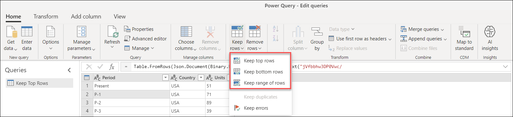
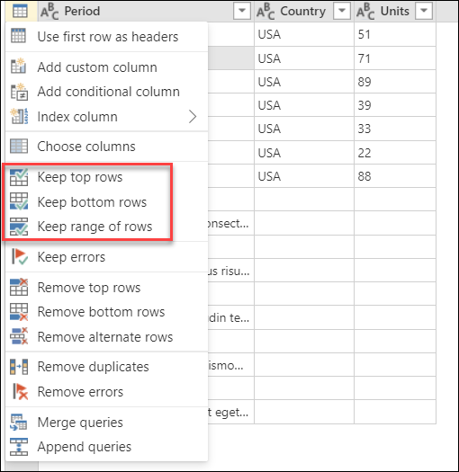
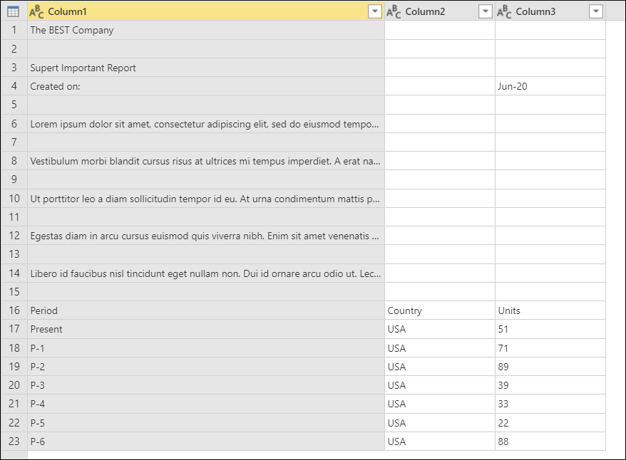
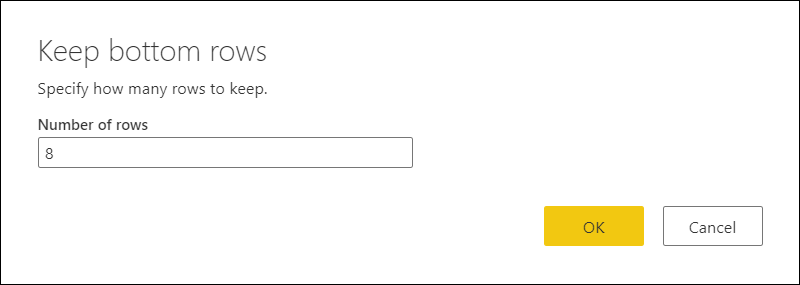
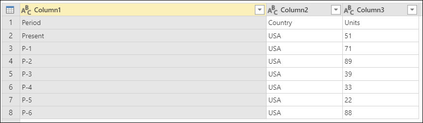

# Filter a table by row position

Power Query has multiple options to filter a table based on the positions of its rows, either by keeping or removing those rows. This article covers all of the methods available in Power Query to filter a table by row position.

## Keep rows

The *keep rows* set of functions will select a set of rows from the table and will remove any other rows that don't meet the criteria.

There are two places where you can find the keep rows buttons:

- **Home tab**&mdash;under the **Reduce Rows** group as the **Keep Rows** button.

   

- **Table contextual menu**&mdash;inside the data preview section. 

   

### Keep top rows

Imagine the following table that comes out of a system with a fixed layout:

This report will always contain seven rows of data, and after that it will have a section for comments with an unknown number of rows. In this example, you only want to keep the first seven rows of data. To do that, select **Keep top rows** from the table contextual menu. Inside the **Keep top rows** window, enter the number **7** in the **Number of rows** textbox.

The result of that change will give you the output table you're looking for. After you set the data types to your columns, your table will look like this:

### Keep bottom rows

Imagine the following table that comes out of a system with a fixed layout:

This report will always contain seven rows of data right at the end of the report page. Before that, the report holds a section for comments with an unknown number of rows. In this example, you only want to keep those last seven rows of data and the header row. 

To do that, select **Keep bottom rows** from the table contextual menu. Inside the **Keep bottom rows** window, enter the number **8** in the **Number of rows** textbox.

The result of that operation will give you eight rows, but our column header is part of the table. 

You need to promote the column headers from the first row of your table. To do this, select **Use first row as headers** from the table contextual menu. The result of that change will be that your table will contain the correct column headers. After you set the data types to your columns, your table will look like this:

> [!Note]
> To read more about the operations to promote and demote headers, see [article](url).

### Keep range of rows

Imagine the following table that comes out of a system with a fixed layout:

This report will always contain five rows for the header, one row of column headers after that, seven rows of data right after that, and then an unknown number of rows for its comments section. In this example, you want to get the eight rows after the header section of the report and only those eight rows. 

To do that, select **Keep range of rows** from the table contextual menu. Inside the **Keep range of rows** window, enter the number **6** in the **First row** textbox and the number **8** in the **Number of rows** textbox.

Similar to the previous example for "Keep bottom rows", the result of that operation will give you eight rows, but your column header is part of the table.

You can perform the same operation as in the previous section to promote the column headers from the first row of your table. After you set the data types to your columns, your table will look like the one in the following image.

## Remove rows

This set of functions will select a set of rows from the table, remove them, and only keep the rest of the rows in the table. 

There are two places where you can find the **Remove Rows** buttons:

- **Home tab**&mdash;under the **Reduce Rows** group as the **Keep Rows** button.

   

- **Table contextual menu**&mdash;inside the data preview section. 

   

### Remove top rows

Imagine the following table that comes out of a system with a fixed layout:

This report will always contain a fixed section or header that will go from row 1 until row 5 of the table. In this example, you want to remove the first five rows of the table and only keep the rest of the data.

To do that, select **Remove top rows** from the table contextual menu. Inside the **Remove top rows** window, enter the number **5** in the **Number of rows** textbox.

In the same way as the previous examples for "Keep bottom rows" and "Keep range of rows", the result of that operation will give you eight rows, but your column header is part of the table.

You can perform the same operation as in previous examples to promote the column headers from the first row of your table. After you set the data types to your columns, your table will look like the one in the following image.

### Remove bottom rows

Imagine the following table that comes out of a system with a fixed layout:

This report will always contain a fixed section or footer that will always be the last five rows of the table. In this example, you want to remove those last five rows of the table and only keep the rest of the data.

To do that, select **Remove bottom rows** from the table contextual menu. Inside the **Remove top rows** window, enter the number **5** in the **Number of rows** textbox.

The result of that change will give you the output table that you're looking for. After you set the data types to your columns, your table will look like this:

### Remove alternate rows

Imagine the following table that comes out of a system with a dynamic layout:

In this example, the way this report is structured is that you have elements in pairs. Every odd row (1,3,5...) contains the data that you need. Right underneath each of those rows, the even rows, there are comments for each of those records. You don't need the comments and you want to remove all of them.

To do that, select **Remove alternate rows** from the table contextual menu. Inside the **Remove alternate rows** window, enter the following values:

* **First row to remove:** 2
  * You want to start counting from the second row.
* **Number of rows to remove:** 1
  * You start defining the pattern to remove rows. After you find the second row, you only want to remove that specific row, so you say that you only need to remove one row.
* **Number of rows to keep:** 1
  * After you remove one row, you keep the next row. The process starts again for the next row.

The result of that selection will give you the output table that you're looking for. After you set the data types to your columns, your table will look like this:

