# Filter a table by row position

Power Query has multiple options to filter a table based on the positions of its rows, either by keeping or removing those rows. This article covers all the available methods.

## Keep rows

The keep rows set of functions will select a set of rows from the table and remove any other rows that don't meet the criteria.

There are two places where you can find the **Keep rows** buttons:

- On the **Home** tab, in the **Reduce Rows** group.

   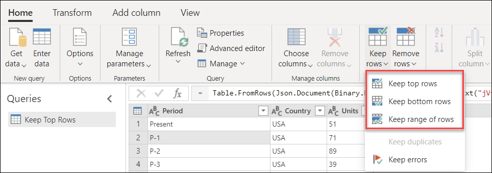

- On the table menu.

   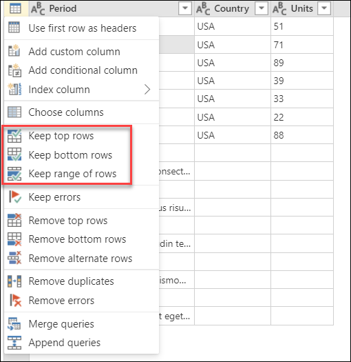

>[!NOTE]
>In the data preview section in the middle of the Power Query window, you can see the position of your rows on the left side of the table. Each row position is represented by a number. The top row starts with position 1.

### Keep top rows

Imagine the following table that comes out of a system with a fixed layout.

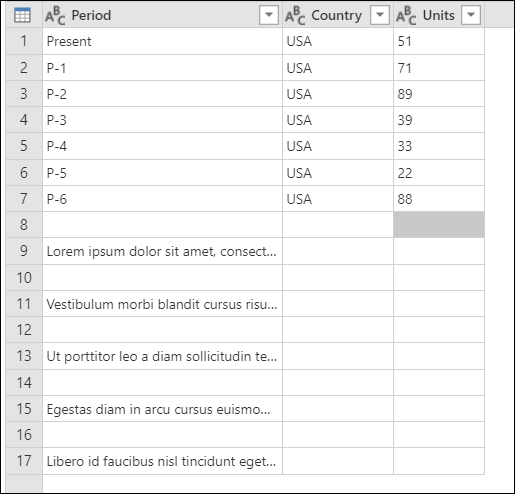

This report always contains seven rows of data, and below the data it has a section for comments with an unknown number of rows. In this example, you only want to keep the first seven rows of data. To do that, select **Keep top rows** from the table menu. In the **Keep top rows** dialog box, enter **7** in the **Number of rows** box.

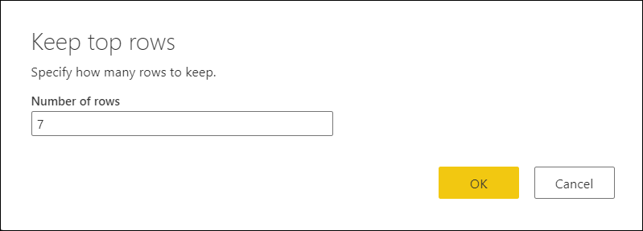

The result of that change will give you the output table you're looking for. After you set the data types for your columns, your table will look like the following image.

### Keep bottom rows

Imagine the following table that comes out of a system with a fixed layout.

:::image type="complex" source="media/filter-row-position/keep-bottom-rows-start.png" alt-text="Initial sample table for Keep bottom rows operation.":::
   Initial sample table with Column1, Column2, and Column3 as the column headers, all set to the Text data type, and the bottom seven rows containing data, and above that a column headers row and an unknown number of comments.
:::image-end:::

This report always contains seven rows of data at the end of the report page. Above the data, the report has a section for comments with an unknown number of rows. In this example, you only want to keep those last seven rows of data and the header row.

To do that, select **Keep bottom rows** from the table menu. In the **Keep bottom rows** dialog box, enter **8** in the **Number of rows** box.

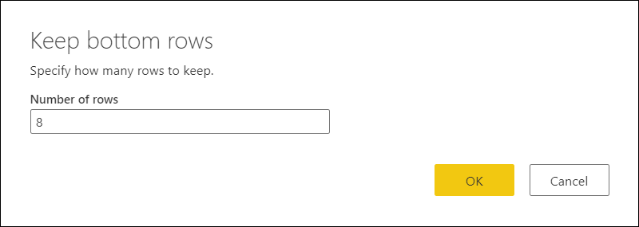

The result of that operation will give you eight rows, but now your header row is part of the table.

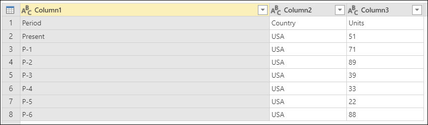

You need to promote the column headers from the first row of your table. To do this, select **Use first row as headers** from the table menu. After you define data types for your columns, you'll create a table that looks like the following image.

:::image type="complex" source="media/filter-row-position/keep-rows-final-2.png" alt-text="Final sample table for Keep bottom rows.":::
   Final sample table for Keep bottom rows after promoting the first row to column headers and retaining seven rows of data, and then setting the Units to the Number data type.
:::image-end:::

More information: [Promote or demote column headers](table-promote-demote-headers.md)

### Keep a range of rows

Imagine the following table that comes out of a system with a fixed layout.

:::image type="complex" source="media/filter-row-position/keep-range-rows-start.png" alt-text="Initial sample table for the Keep a range of rows operation.":::
   Initial sample table with the columns (Column1, Column2, and Column3) all set to the Text data type, and containing the column headers and seven rows of data in the middle of the table.
:::image-end:::

This report always contains five rows for the header, one row of column headers below the header, seven rows of data below the column headers, and then an unknown number of rows for its comments section. In this example, you want to get the eight rows after the header section of the report, and only those eight rows.

To do that, select **Keep range of rows** from the table menu. In the **Keep range of rows** dialog box, enter **6** in the **First row** box and **8** in the **Number of rows** box.

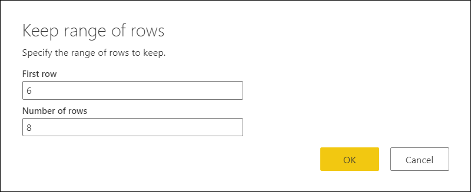

Similar to the previous example for keeping bottom rows, the result of this operation gives you eight rows with your column headers as part of the table. Any rows above the **First row** that you defined (row 6) are removed.

You can perform the same operation as described in [Keep bottom rows](#keep-bottom-rows) to promote the column headers from the first row of your table. After you set data types for your columns, your table will look like the following image.

:::image type="complex" source="media/filter-row-position/keep-rows-final-3.png" alt-text="Final sample table for Keep range of rows.":::
   Final sample table for Keep range of rows after promoting first row to column headers, setting the Units column to the Number data type, and keeping seven rows of data.
:::image-end:::

## Remove rows

This set of functions will select a set of rows from the table, remove them, and keep the rest of the rows in the table.

There are two places where you can find the **Remove rows** buttons:

- On the **Home** tab, in the **Reduce Rows** group.

   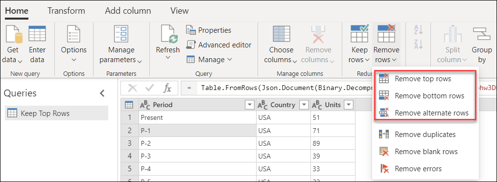

- On the table menu.

   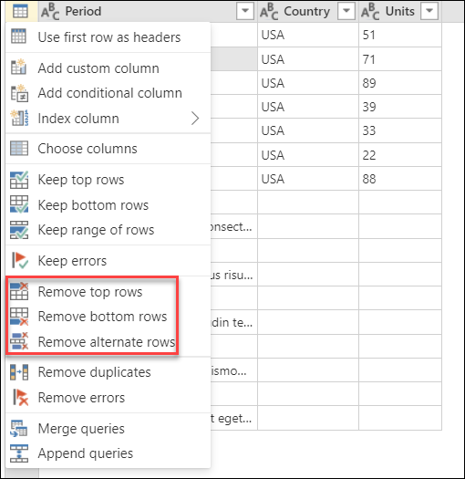

### Remove top rows

Imagine the following table that comes out of a system with a fixed layout.

:::image type="complex" source="media/filter-row-position/remove-top-rows-start.png" alt-text="Initial sample table for Remove top rows.":::
   Initial sample table for Remove top rows with the columns (Column1, Column2, and Column3) all set to the Text data type, a header at the top and a column header row and seven data rows at the bottom.
:::image-end:::

This report always contains a fixed header from row 1 to row 5 of the table. In this example, you want to remove these first five rows and keep the rest of the data.

To do that, select **Remove top rows** from the table menu. In the **Remove top rows** dialog box, enter **5** in the **Number of rows** box.

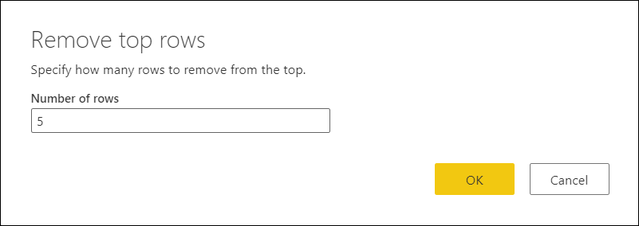

In the same way as the previous examples for "Keep bottom rows" and "Keep a range of rows," the result of this operation gives you eight rows with your column headers as part of the table.

You can perform the same operation as described in previous examples to promote the column headers from the first row of your table. After you set data types for your columns, your table will look like the following image.

:::image type="complex" source="media/filter-row-position/keep-rows-final-4.png" alt-text="Final sample table for Remove top rows.":::
   Final sample table for Remove top rows after promoting first row to column headers and setting the Units column to the Number data type, and retaining seven rows of data.
:::image-end:::

### Remove bottom rows

Imagine the following table that comes out of a system with a fixed layout.

:::image type="complex" source="media/filter-row-position/remove-bottom-rows-start.png" alt-text="Initial sample table for Remove bottom rows.":::
   Initial sample table for Remove bottom rows, with the header columns all set to the Text data type, seven rows of data, then a footer of fixed length at the bottom.
:::image-end:::

This report always contains a fixed section or footer that occupies the last five rows of the table. In this example, you want to remove those last five rows and keep the rest of the data.

To do that, select **Remove bottom rows** from the table menu. In the **Remove top rows** dialog box, enter **5** in the **Number of rows** box.

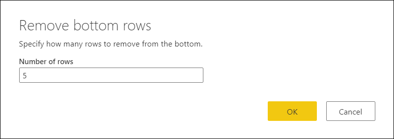

The result of that change will give you the output table that you're looking for. After you set data types for your columns, your table will look like the following image.

### Remove alternate rows

Imagine the following table that comes out of a system with a dynamic layout.

:::image type="complex" source="media/filter-row-position/remove-alternate-rows-start.png" alt-text="Initial sample table for the Remove alternate rows operation.":::
   Initial sample table with the column headers present and all set to the Text data type, and every other data row containing comments about the data row above it.
:::image-end:::

The way this report is structured is that you have elements in pairs of rows. Every odd row (1, 3, 5...) contains the data that you need. Every even row, directly underneath each odd row, contains comments about each of those records. You don't need the comments, and you want to remove all of them.

To do that, select **Remove alternate rows** from the table menu. In the **Remove alternate rows** dialog box, enter the following values:

- In the **First row to remove** box, enter **2**.

  You want to start counting from the second row. Any rows above this **First row to remove** will be kept.

- In the **Number of rows to remove** box, enter **1**.

  Here you start defining the pattern for removing rows. After you find the second row, you only want to remove that specific row, so you specify that you only need to remove one row.

- In the **Number of rows to keep** box, enter **1**.

  After you remove one row, you keep the next row. The process starts again for the next row.

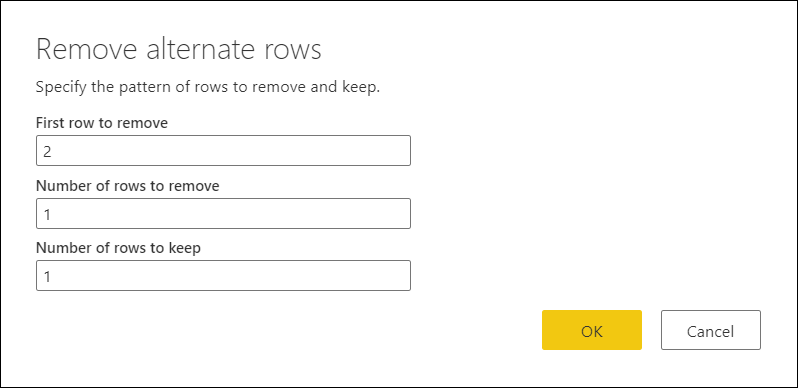

The result of that selection will give you the output table that you're looking for. After you set the data types to your columns, your table will look like the following image.

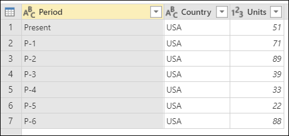
