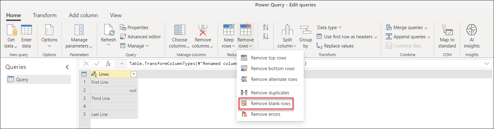

# Filter values

In Power Query, you can include or exclude rows according to a specific value in a column. Power Query's user interface provides two methods to filter the values in your column:
* [**Sort & Filer menu**](#sort--filter-menu)
* [**Right-click operation inside the cell of a column**](#right-click)

After a filter is applied, a small filter icon in the column header will appear.

## Sort & filter menu

In the column header, you'll see an icon with an inverse triangle. When you select this icon, the *sort and filter* menu will be displayed. With this menu, you can apply or remove any filters to your column.

> [!Note] 
> In this article we'll focus on the aspects related to filtering data. To learn more about the sort options and how to sort columns in Power Query, see [Sort Columns](sort-columns.md).  

### Remove empty

The remove empty option will apply two filter rules to your column. The first rule will get rid of any *null* values. The second rule will get rid of any blank values. For example, imagine a table with just one text column with five rows, where you have one *null* value and one blank cell.

> [!Note]
> A null value is a specific value in the Power Query language that represents no value.

You then select the option to remove empty, as shown in the next image.

You can also select this option from the **Home** tab in the **Reduce Rows** group in the **Remove Rows** drop-down options, as shown in the next image.

The result of the remove empty operation gives you the same table without the empty values.

### Clear filter

When a filter is applied to a column, the clear filter option will appear. The clear filter option inside the sort and filter menu helps you remove any filters from your column.

### Auto filter

The list inside the sort and filter menu is called *auto filter*. This is a list of unique values in your column. You can manually select or deselect which values to take into consideration or not. Any values selected will be taken into consideration; any other values without the selection will be filtered out.

This auto filter section also has a search bar to help you find any values from your list.

> [!Note] 
> When you load the auto filter window, only the top 1,000 distinct values in the column will load into the filter list. If there are 1,000 or more values in the column in **Query Editor** that you are filtering, a message will appear indicating that the list of values in the filter list may be incomplete, and the **Load more** link is shown. Select the **Load more** link to load another 1,000 distinct values.
>
> * If exactly 1,000 distinct values are found again, the list is displayed with a message stating that the list could still be incomplete.
> * If less than 1,000 distinct values are found, the full list of values is shown.

## Right-click

You can manually right-click on a cell of a particular column to enable the contextual menu for that value. From the small filter icon, you can then select the filter option you want to use.

> [!Note]
> Power Query will display the type-specific filter based on the data type of the column.

## Type-specific filters

Depending on the data type of your column, you'll see a different option inside the sort and filter menu to help you with some smart or contextual filters. The following images show examples for a date, text, or numeric column.

### The Filter rows window

When selecting any of the type-specific filters, you'll be presented with the **Filter rows** window. The main goal of this window is to provide a user interface for you to implement filter rules on your column. This window looks like the following image.

The **Filter rows** window has two modes: **Basic** and **Advanced**.

##### Basic

The basic mode provides you with a contextual way to implement up to two filter rules based on type-specific filters. You'll notice that the name of the column selected is displayed after the label **Keep rows where** to let you know which column these filter rules are being implemented on.

For example, imagine that in the following table you want to filter the **Account Code** by all values that start with either "PA" or "PTY".

To do that, you can go to the **Filter rows** window for the **Account Code** column and implement the next set of filter rules in basic mode.

The result of that operation will give you exactly the set of rows that you're looking for.

##### Advanced

Basic mode focuses on providing a unique perspective into adding filters to a single column. Advanced mode can implement as many type-specific filters as necessary from all the columns inside the table.

For example, imagine that instead of applying the previous filter in basic mode, you wanted to implement a filter to **Account Code** to keep all values that end with "4". Also, you would like to have values over $100 in the **Sales** column. The following image shows what those selections would look like in advanced mode.

The result of that operation will give you just one row that meets both criteria.

> [!Note]
> You can add as many clauses as you'd like by selecting the **Add clause** button. All clauses act at the same level, so you may want to consider creating multiple filter steps if you need to implement filters that rely in other filters.
