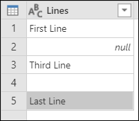
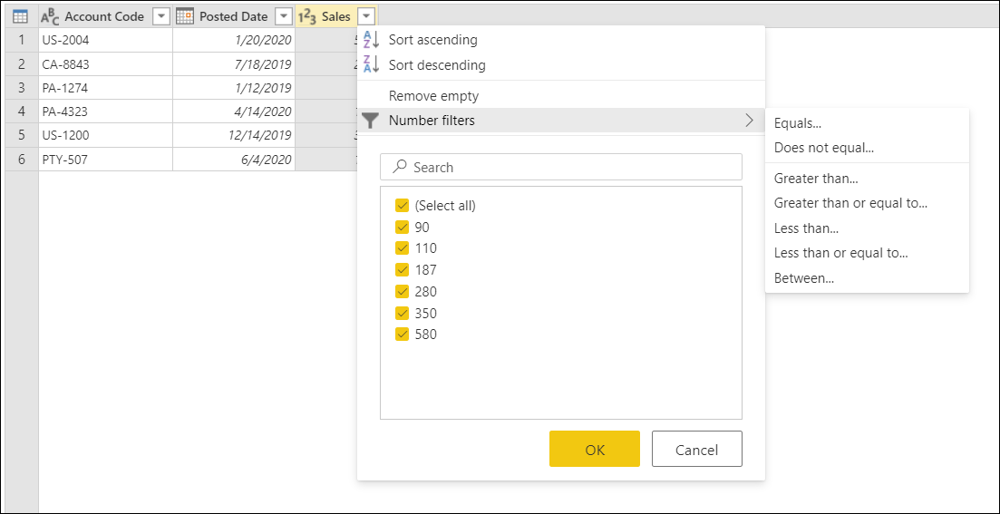
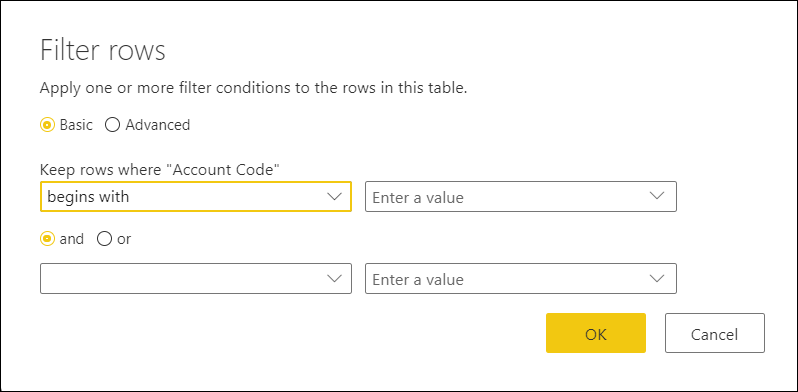

# Filter values

In Power Query, you can include or exclude rows according to a specific value in a column. 

## General Filter Interactions

Power Query's user interface provides two methods to filter the values in your column. After a filter is applied, a small filter icon in the column header will appear.

### Sort & Filter Menu

In the column header you will see an icon with a down arrow. When you click on it you'll be displayed with the Sort & Filter menu. With this menu you're able to apply or remove any filters to your column:

> Note 
>
> In this article we'll focus on the aspects related to filtering data, but you can read more about the sort options and how to sort columns in Power Query in this article (url)  

#### Remove Empty

The remove empty option will apply two filter rules to your column. The first one will get rid of any *null* values, and the second one will get rid of any blank values. For example, imagine a table with just one text column with 5 rows where we have one null value and one blank cell:

> Note
>
> null values are specific values in the Power Query language that represents no value.

We then select the option to Remove empty as shown in the next image:

And the result of that operation gives us the same table without those empty values:

#### Clear Filter

When a filter is applied to a column, this option will appear. The clear filter option inside the Sort & Filter menu helps you remove any filters from your column:

#### Auto filter

The list inside the Sort & Filter menu is called Auto Filter. This is a list of unique values in your column and you can manually select or deselect which values to take in consideration or not. Any values selected will be taken into consideration any other values without the selection will be filtered out.

This auto filter section also has a search bar to help you find any values from your list.

> Note 
>
> When you load the auto filter window, only the top 1,000 distinct values in the column will load into the filter list. If there are 1,000 or more values in the column in **Query Editor** that you are filtering, a message will appears indicating that the list of values in the filter list may be incomplete, and the **Load more** link is shown. Click the **Load more** link to load another 1,000 distinct values.
>
> * If exactly 1,000 distinct values are found again, the list is displayed with a message stating that the list could still be incomplete.
> * If less than 1,000 distinct values are found, the full list of values is shown

### Type-specific Filters

Depending on the data type of your column, you'll see a different option inside the Sort & Filter menu to help you with some smart or contextual filters. Here are examples for a date, text, and numeric columns:

#### The Filter Rows window

When selecting any of the type-specific filters, you will be presented with the Filter Rows window. The main objective of this window is to provide a user interface for you to implement filter rules on your column. This window looks like this:

The Filter Rows window has 2 modes, the Basic and the Advanced which will be covered in the next sections.

###### Basic

The basic mode provides you with a contextual way to implement up to two filter rules based on type specific filters. You will notice that the name of the column selected is displayed after the label "Keep rows where" to let you know which column these filter rules are being implemented on.

For example, imagine that in the following table we want to filter the "Account Code" by all values that start with either "PA" or "PTY":

To do that, we can go to the Filter rows window for the Account Code column and implement the next set of filter rules in the Basic mode:

The result of that operation will give us exactly the set of rows that we're looking for:

###### Advanced

While the basic mode focuses on providing a unique perspective into adding filters to a single column, the advanced mode can implement as many type-specific filters as necessary from all the columns inside the table.

For example, imagine that, instead of applying the previous filter in the Basic mode, we wanted to implement a filter to the "Account Code" to keep all values that end with "4" and that also have values over $100 in the Sales column. This is how it'll look like in the Advanced Mode:

And the result of that operation will give us just 1 row that meets both criteria as shown in the next image:

> Note
>
> You can add as many clauses as you'd like by clicking on the 'Add clause' button. All clauses act at the same level, so you may want to consider creating multiple Filter steps if you need to implement filters that rely in other filters.

### Right Click

You can manually right click on a cell of a particular column to enable the contextual menu for that value and select the option to filter which has the small filter icon like the following:

> Note
>
> Power Query will display the type-specific filter based on the data type of the column.
