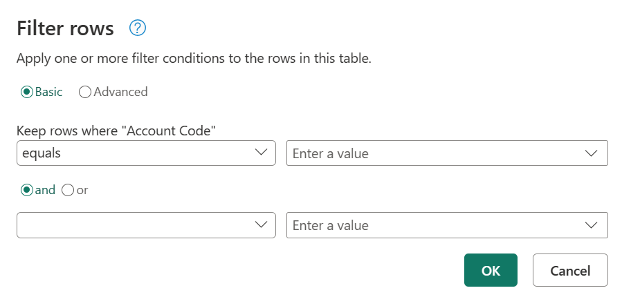
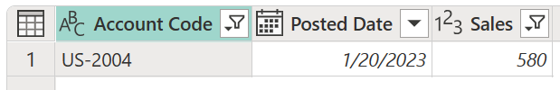

# Filter by values in a column

In Power Query, you can include or exclude rows according to a specific value in a column. You can choose from three methods to filter the values in your column:

* [Sort and filter menu](#sort-and-filter-menu)
* [Cell shortcut menu](#cell-shortcut-menu)
* [Type-specific filter](#type-specific-filters)

After you apply a filter to a column, a small filter icon appears in the column heading, as shown in the following illustration.

:::image type="content" source="media/filter-values/filter-icon.png" alt-text="Filter applied icon in a column header.":::

## Sort and filter menu

In the column header, you'll see an icon with an inverse triangle. When you select this icon, the sort and filter menu is displayed. With this menu, you can apply or remove any filters to or from your column.

:::image type="content" source="media/filter-values/sort-filter-menu.png" alt-text="Sort and filter menu.":::

> [!NOTE]
> In this article, we'll focus on aspects related to filtering data. To learn more about the sort options and how to sort columns in Power Query, go to [Sort columns](sort-columns.md).  

### Remove empty

The **Remove empty** command applies two filter rules to your column. The first rule gets rid of any null values. The second rule gets rid of any blank values. For example, imagine a table with just one text column with five rows, where you have one null value and one blank cell.

:::image type="content" source="media/filter-values/sample-for-empty-rows.png" alt-text="Sample table with the second row containing a null value and the fourth row a blank value.":::

> [!NOTE]
> A null value is a specific value in the Power Query language that represents no value.

You then select **Remove empty** from the sort and filter menu, as shown in the following image.

:::image type="content" source="media/filter-values/remove-empty.png" alt-text="Remove empty rows.":::

You can also select this option from the **Home** tab in the **Reduce Rows** group in the **Remove Rows** drop-down options, as shown in the next image.

:::image type="content" source="media/filter-values/remove-rows-empty.png" alt-text="Remove empty rows option in Home tab.":::

The result of the **Remove empty** operation gives you the same table without the empty values.

:::image type="content" source="media/filter-values/after-remove-empty.png" alt-text="Sample table after the null row and blank row were removed.":::

### Clear filter

When a filter is applied to a column, the **Clear filter** command appears on the sort and filter menu.

:::image type="content" source="media/filter-values/clear-filter.png" alt-text="Clear filter command.":::

### Auto filter

The list in the sort and filter menu is called the *auto filter* list, which shows the unique values in your column. You can manually select or deselect which values to include in the list. Any selected values will be taken into consideration by the filter; any values that aren't selected will be ignored.

This auto filter section also has a search bar to help you find any values from your list.

:::image type="content" source="media/filter-values/auto-filter-menu.png" alt-text="Auto filter list.":::

> [!NOTE]
> When you load the auto filter list, only the top 1,000 distinct values in the column are loaded. If there are more than 1,000 distinct values in the column in the that you're filtering, a message will appear indicating that the list of values in the filter list might be incomplete, and the **Load more** link appears. Select the **Load more** link to load another 1,000 distinct values.
>
> * If exactly 1,000 distinct values are found again, the list is displayed with a message stating that the list might still be incomplete.
> * If fewer than 1,000 distinct values are found, the full list of values is shown.

## Cell shortcut menu

You can right-click a particular cell in a column to open the shortcut menu for that value. Point to the small filter icon, and then select the filter option you want to use.

:::image type="content" source="media/filter-values/right-click.png" alt-text="Right-click to filter rows based on the contents of a cell.":::

> [!NOTE]
> Power Query displays a type-specific filter based on the data type of the column.

## Type-specific filters

Depending on the data type of your column, you'll see different commands in the sort and filter menu. The following images show examples for date, text, and numeric columns.

:::image type="content" source="media/filter-values/date-column.png" alt-text="Menu items containing commands and filters that are specific to columns that contain data with the Date data type.":::

:::image type="content" source="media/filter-values/text-column.png" alt-text="Menu items containing commands and filters that are specific to columns that contain the Text data type.":::

:::image type="content" source="media/filter-values/numeric-column.png" alt-text="Menu items containing commands and filters that are specific to columns that contain the Number data type.":::

### Filter rows

When selecting any of the type-specific filters, you'll use the **Filter rows** dialog box to specify filter rules for the column. This dialog box is shown in the following image.

The **Filter rows** dialog box has two modes: **Basic** and **Advanced**.

##### Basic

With basic mode, you can implement up to two filter rules based on type-specific filters. In the preceding image, notice that the name of the selected column is displayed after the label **Keep rows where**, to let you know which column these filter rules are being implemented on.

For example, imagine that in the following table, you want to filter the **Account Code** by all values that start with either **PA** or **PTY**.

:::image type="content" source="media/filter-values/sample-table.png" alt-text="Sample table containing account codes that begin with two or three different characters.":::

To do that, you can go to the **Filter rows** dialog box for the **Account Code** column and specify the set of filter rules you want.

In this example, first select the **Basic** button. Then under **Keep rows where "Account Code"**, select **begins with**, and then enter **PA**. Then select the **or** button. Under the **or** button, select **begins with**, and then enter **PTY**. The select **OK**.

:::image type="content" source="media/filter-values/filter-rows-window-basic-mode.png" alt-text="Basic filter rows operation with the example filter rules applied.":::

The result of that operation will give you the set of rows that you're looking for.

:::image type="content" source="media/filter-values/filter-rows-window-basic-mode-output.png" alt-text="Sample output table for basic filter rows operation that only contains account codes that begin with either PA or PTY.":::

##### Advanced

With advanced mode, you can implement as many type-specific filters as necessary from all the columns in the table.

For example, imagine that instead of applying the previous filter in basic mode, you wanted to implement a filter to **Account Code** to show all values that end with **4**. Also, you want to show values over $100 in the **Sales** column.

In this example, first select the **Advanced** button. In the first row, select **Account Code** under **Column name**, **ends with** under **Operator**, and select **4** for the Value. In the second row, select **and**, and then select **Sales** under **Column Name**, **is greater than** under **Operator**, and **100** under **Value**. Then select **OK**

:::image type="content" source="media/filter-values/filter-rows-window-advanced-mode.png" alt-text="Filter rows dialog box with advanced filter example settings.":::

The result of that operation will give you just one row that meets both criteria.

> [!NOTE]
> You can add as many clauses as you'd like by selecting **Add clause**. All clauses act at the same level, so you might want to consider creating multiple filter steps if you need to implement filters that rely on other filters.
