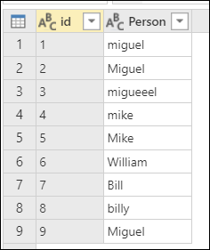
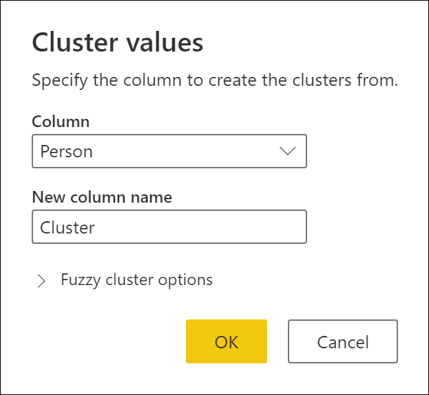
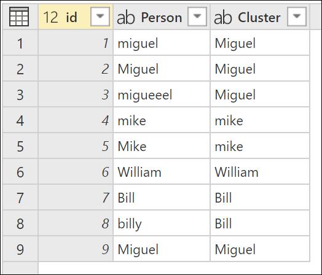
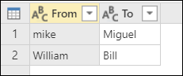
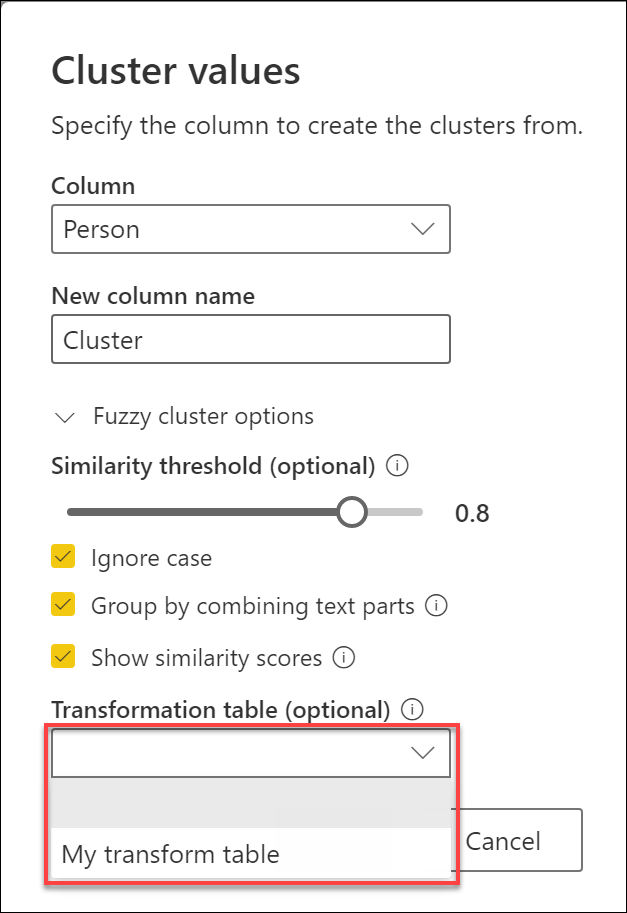

# Fuzzy cluster column

**[Missing definition from Miguel / Jorge]**

To demonstrate how to add a fuzzy cluster conlumn, consider the sample table shown in the following image.

The outcome that you're looking for is a table with a new column with the clusters using the values from the **Person** column.

## Create a Cluster column

To do the fuzzy cluster column, first select the column **Person** and then go to the **Add column** tab in the ribbon and select the option that reads *Cluster values*.

A new window will pop up with the name *Cluster values* where you can confirm the column that you wish to use create the clusters from and the new name of the column. For this case, name this new column simply *Cluster*.

The result of that operation will yield the result shown in the next image.

>[!NOTE]
>For each cluster of values, Power Query will pick the most frequent instance from the selected column as the "canonical" instance. If multiple instances occur with the same frequency, Power Query will pick the first one. 

## Using the fuzzy cluster options

The following options are available for creating a new fuzzy cluster column:

* **Similarity threshold (optional)**: This option indicates how similar two values must be to be grouped together. The minimum setting of 0 will cause all values to be grouped together. The maximum setting of 1 will only allow values that match exactly to be grouped together. The default is 0.8.
* **Ignore case**: When comparing text strings, case will be ignored. This option is enabled by default.
* **Group by combining text parts**: The algorithm will try to combine text parts (such as combining Micro and soft into Microsoft) to group values.
* **Show similarity scores**: Show similarity scores between the input values and computed representative values after fuzzy clustering.
* **Transformation table (optional)**: You can select a transformation table that will map values (such as mapping MSFT to Microsoft) to group them together.

For this example, a new transformation table will be used to demonstrate how values can be mapped. The transformation table has two columns:
* **From**: The text string to look for in your table.
* **To**: The text string to use to replace the text string in the From column.

Using the previously created query, double click the **Clustered values** step and in the *Cluster values* window expand the *Fuzzy cluster options*. In this new *Fuzzy cluster options section*, enable the **Show similarity scores** option and for the **Transformation table (optional)** select the query that has the transform table as shown in the next image.

After selecting your transformation table and enabling the **Show similarity scores** option, select OK. The result of that operation will give you the result shown in the following image.

