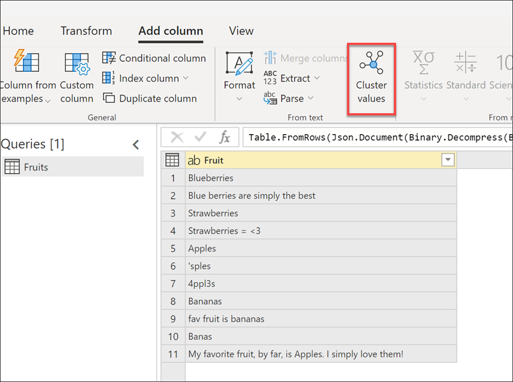
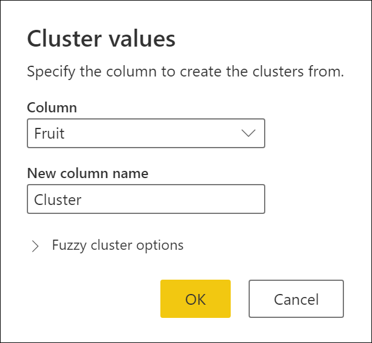
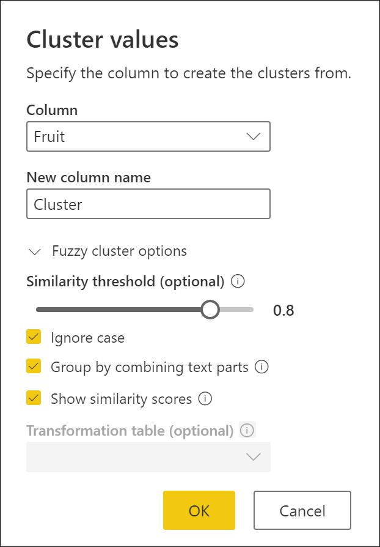
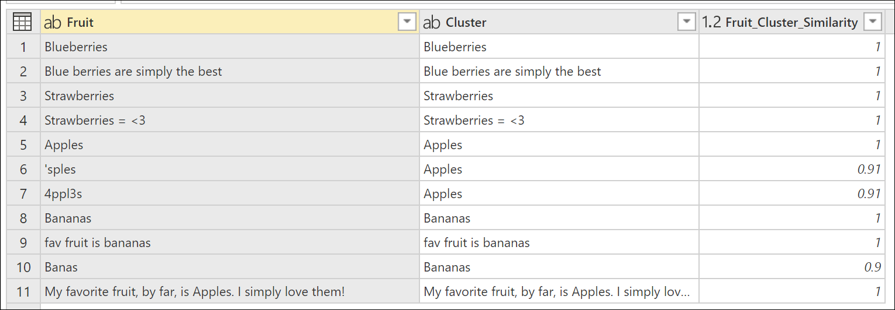
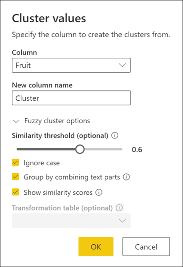
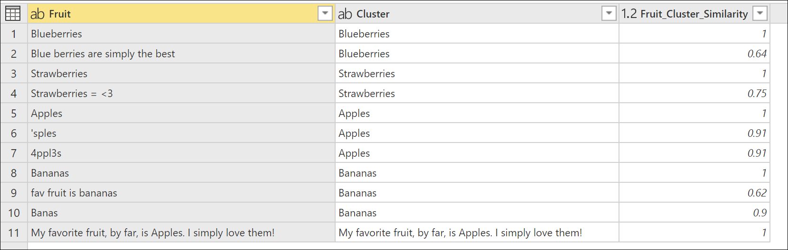

# How fuzzy matching works in Power Query?

Power Query features such as [fuzzy merge](merge-queries-fuzzy-match.md), [cluster values](cluster-values.md), and [fuzzy grouping](group-by.md#fuzzy-grouping) use the same mechanisms to work as fuzzy matching.

This article goes over many scenarios that will show you how to take advantage of the options that fuzzy matching has with the goal of making 'fuzzy' clear.

## Adjust the similarity threshold

The best scenario for applying the fuzzy match algorithm is when all text strings in a column contain only the strings that need to be compared and not extra components. For example, comparing `Apples` against `4ppl3s` yields higher similarity scores than comparing `Apples` to `My favorite fruit, by far, is Apples. I simply love them!`.

This is because the word `Apples` in the second string is only a small part of the whole text string that yields a lower similarity score.

Take a look at the following dataset that consists of responses from a survey that had only one question "What is your favorite fruit?" 

|Fruit|
|-----|
|Blueberries|
|Blue berries are simply the best|
|Strawberries|
|Strawberries = <3|
|Apples|
|'sples|
|4ppl3s|
|Bananas|
|fav fruit is bananas|
|Banas|
|My favorite fruit, by far, is Apples. I simply love them!|

The survey provided one single textbox to input the value and with no validation. 

Now you're tasked with clustering the values. To do that, you load the previous table of fruits into Power Query, select the column, and then select the option that reads *Cluster values* inside the **Add column** menu in the ribbon. 

The **Cluster values** dialog box appears where you can specify the name of the new column. Name this new column *Cluster* and select **Ok**.

By default, Power Query will use a similarity threshold of 0.8 (or 80%) and the result of the previous operation will yield the following table with a new *Cluster* column:

While the clustering has been done, it is not giving you the expected results for all the rows. Row number two (2) still has the value `Blue berries are simply the best`, but it should be clustered to `Blueberries`, and something similar happens to the text strings `Strawberries = <3`, `fav fruit is bananas`, and `My favorite fruit, by far, is Apples. I simply love them!`.

You wish to determine what's causing this clustering. To do this, you can double-click the *Clustered values* step to bring back the **Cluster values** window. Inside this window, expand the text that reads *Fuzzy cluster options* and enable the option that reads *Show similarity scores* as shown in the image below and hit the OK button:

Enabling the *Show similarity scores* option will bring a new column to your table that shows you exactly the similarity score between the defined cluster and the original value.

Upon closer inspection, you can see that Power Query couldn't find any other values within the similarity threshold for the text strings `Blue berries are simply the best`,`Strawberries = <3`, `fav fruit is bananas`, and `My favorite fruit, by far, is Apples. I simply love them!`.

You can go back to the **Cluster values** dialog box one more time by double-clicking the *Clustered values* step and changing the *Similarity threshold* from 0.8 to 0.6 as shown in the image below:

This change gets you closer to the result that you're looking for, except for the text string `My favorite fruit, by far, is Apples. I simply love them!`. This is because by changing the *Similarity threshold* value from 0.8 to 0.6 Power Query is now able to use the values with a similarity score that start from 0.6 all the way to 1. 

>[!NOTE]
>Power Query always uses the value closest to the threshold to define the clusters. The threshold defines the lower limit of similarity score that is acceptable to create assign the value to a cluster.

You can try again by changing the *Similarity score* from 0.6 to a lower number until you get the results that you're expecting. For this case, **change the *Similarity score* to 0.5**, which will yield the exact result that you're expecting with the text string `My favorite fruit, by far, is Apples. I simply love them!` now assigned to the cluster `Apples` as shown in the next image:

> [!NOTE]
> Currently only the [Cluster values](cluster-values.md) feature in Power Query Online will provide a new column with the similarity score.
