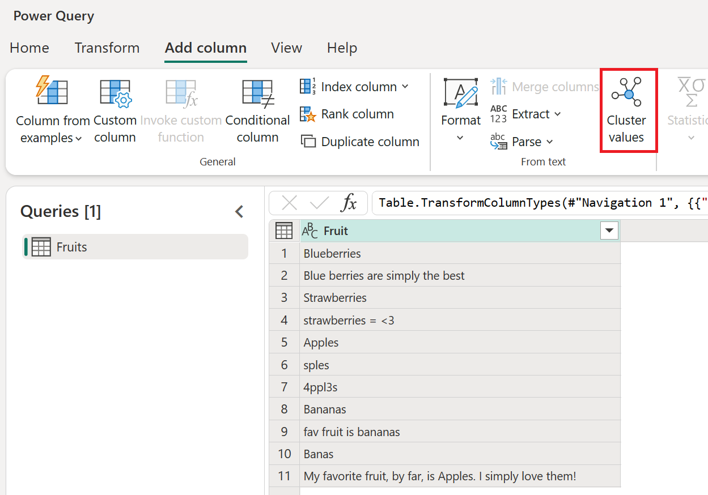
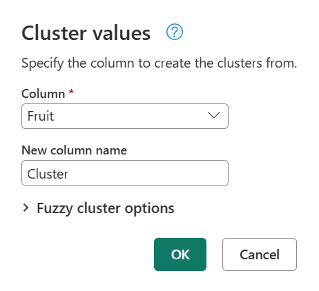
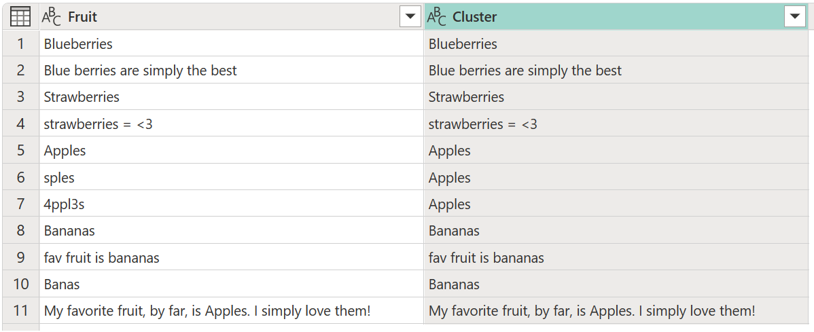
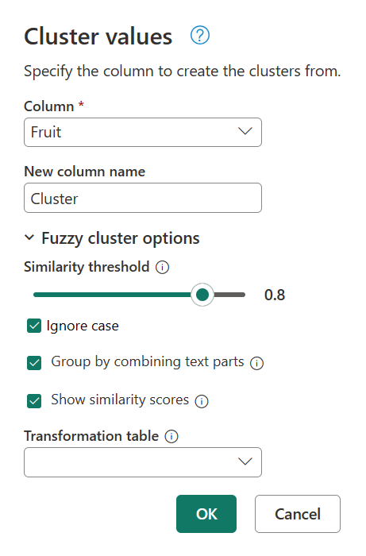
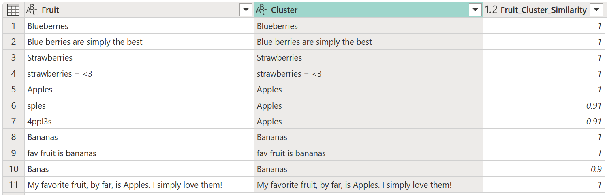
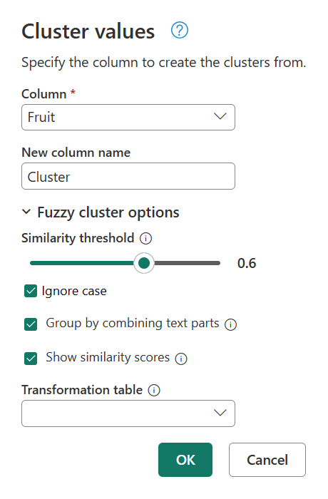
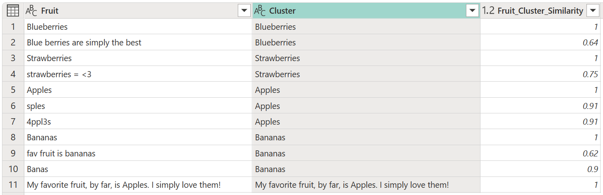

# How fuzzy matching works in Power Query

Power Query features such as [fuzzy merge](merge-queries-fuzzy-match.md), [cluster values](cluster-values.md), and [fuzzy grouping](group-by.md#fuzzy-grouping) use the same mechanisms to work as fuzzy matching.

This article goes over many scenarios that demonstrate how to take advantage of the options that fuzzy matching has, with the goal of making 'fuzzy' clear.

## Adjust the similarity threshold

The best scenario for applying the fuzzy match algorithm is when all text strings in a column contain only the strings that need to be compared and no extra components. For example, comparing `Apples` against `4ppl3s` yields higher similarity scores than comparing `Apples` to `My favorite fruit, by far, is Apples. I simply love them!`.

Because the word `Apples` in the second string is only a small part of the whole text string, that comparison yields a lower similarity score.

For example, the following dataset consists of responses from a survey that had only one question&mdash;"What is your favorite fruit?"

|Fruit|
|-----|
|Blueberries|
|Blue berries are simply the best|
|Strawberries|
|Strawberries = <3|
|Apples|
|'sples|
|4ppl3s|
|Bananas|
|fav fruit is bananas|
|Banas|
|My favorite fruit, by far, is Apples. I simply love them!|

The survey provided one single textbox to input the value and had no validation.

Now you're tasked with clustering the values. To do that task, load the previous table of fruits into Power Query, select the column, and then select the **Cluster values** option in the **Add column** tab in the ribbon.

The **Cluster values** dialog box appears, where you can specify the name of the new column. Name this new column **Cluster** and select **OK**.

By default, Power Query uses a similarity threshold of 0.8 (or 80%) and the result of the previous operation yields the following table with a new **Cluster** column.

While the clustering has been done, it's not giving you the expected results for all the rows. Row number two (2) still has the value `Blue berries are simply the best`, but it should be clustered to `Blueberries`, and something similar happens to the text strings `Strawberries = <3`, `fav fruit is bananas`, and `My favorite fruit, by far, is Apples. I simply love them!`.

To determine what's causing this clustering, double-click **Clustered values** in the **Applied steps** panel to bring back the **Cluster values** dialog box. Inside this dialog box, expand **Fuzzy cluster options**. Enable the **Show similarity scores** option, and then select **OK**.

Enabling the **Show similarity scores** option creates a new column in your table. This column shows you the exact similarity score between the defined cluster and the original value.

Upon closer inspection, Power Query couldn't find any other values in the similarity threshold for the text strings `Blue berries are simply the best`,`Strawberries = <3`, `fav fruit is bananas`, and `My favorite fruit, by far, is Apples. I simply love them!`.

Go back to the **Cluster values** dialog box one more time by double-clicking **Clustered values** in the **Applied steps** panel. Change the **Similarity threshold** from **0.8** to **0.6**, and then select **OK**.

This change gets you closer to the result that you're looking for, except for the text string `My favorite fruit, by far, is Apples. I simply love them!`. When you changed the **Similarity threshold** value from **0.8** to **0.6**, Power Query was now able to use the values with a similarity score that starts from 0.6 all the way up to 1.

>[!NOTE]
>Power Query always uses the value closest to the threshold to define the clusters. The threshold defines the lower limit of the similarity score that's acceptable to assign the value to a cluster.

You can try again by changing the **Similarity score** from 0.6 to a lower number until you get the results that you're looking for. In this case, change the **Similarity score** to **0.5**. This change yields the exact result that you're expecting with the text string `My favorite fruit, by far, is Apples. I simply love them!` now assigned to the cluster `Apples`.

> [!NOTE]
> Currently, only the [Cluster values](cluster-values.md) feature in Power Query Online provides a new column with the similarity score.

## Special considerations for transformation table

The transformation table helps you map values from your column to new values before performing the fuzzy matching algorithm.

Some examples of how the transformation table can be used:

* [Transformation table in fuzzy merge queries](merge-queries-fuzzy-match.md#transformation-table)
* [Transformation table in group by](group-by.md#fuzzy-grouping)
* [Transformation table in cluster values](cluster-values.md#using-the-fuzzy-cluster-options)

>[!IMPORTANT]
>When the transformation table is used, the maximum similarity score for the values from the transformation table is 0.95. This deliberate penalty of 0.05 is in place to distinguish that the original value from such column isn't equal to the values that it was compared to since a transformation occurred.
>
>For scenarios where you first want to map your values and then perform the fuzzy matching without the 0.05 penalty, we recommend that you replace the values from your column and then perform the fuzzy matching.
