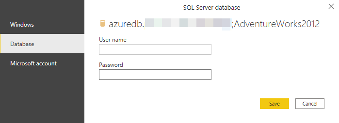

# Power Query's 'Get Data' experience

When connecting to a data source with Power Query, the process will follow a set of steps or stages before landing the data at a destination, whether the destination is a table or the Power Query Editor window. This article describes the set of steps or stages to better understand how things work with Power Query.

[!NOTE] In some cases, a connector might have all of these stages and in other cases a connector might have just a few of them. For more information about the experience of a specific connector, visit the documentation available for the connector.

The set of steps or stages are:

1.  Connector parameters

2.  Authentication

3.  Navigation table

4.  Output Query

## Connector Parameters

Most connectors initially require at least one parameter to initialize a connection to the data source. For example, the SQL Server connector requires at least the hostname to establish a connection to a SQL Server.

In comparison, when trying to connect to an Excel file, Power Query requires the user to find the file they want to connect to by using the file path.

The connector parameters are commonly used to establish a connection to a data source and they, in conjunction with the connector used, define what's called a Data Source Path.

[!NOTE] Some connectors don't require you to enter any parameters at all. These are called Singleton Connectors and will only have one data source path available per environment. Some examples are Adobe Analytics, MailChimp, and Google Analytics.

## Authentication 

Every single connection that is made in Power Query has to be authenticated. The authentication methods vary from connector to connector and some connectors might offer multiple methods of authentication.

The current available methods of authentication for Power Query are:
* **Anonymous** - Commonly used when connecting to a Web Page.
* **Basic** - Accepts a **username** and **password** to be sent in base64 encoding.
* **API Key** - Accepts a single API Key for authentication.
* **Organizational account / Microsoft Account** - Also known as **OAuth 2.0**.
* **Windows** - Can be implicit or explicit. Impersonation can also be an option.
* **Database** - Only available in some connectors specific to databases.

For example, for the Azure SQL Server connector the available authentication methods are Windows, Database and Microsoft account as shown in the following image:

## Navigation table (navigator)

The navigation table or navigator's window goal is to display, in a user-friendly way, the objects available from the data source to the end user.

The two main sections of this window are:
* **Object selection** - Displayed on the left-hand side of the window. The
    user can interact with these objects and select one or enable the
    multi-select to get multiple objects.
* **The data preview** - It displays a preview of the data from the selected
    object on the right-hand side of the window.

[!NOTE] Some connectors completely bypass this window and go straight to the
output query phase. One example of a connector that can do this is the 'Folder"
connector.

## Output query

This is the phase where the user defines where to load the query. The options vary from integration to integration. But one option that is always be available is the option to load data to the Power Query Editor to further transform and enrich the query.
