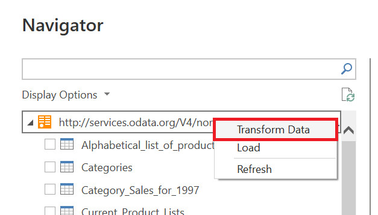
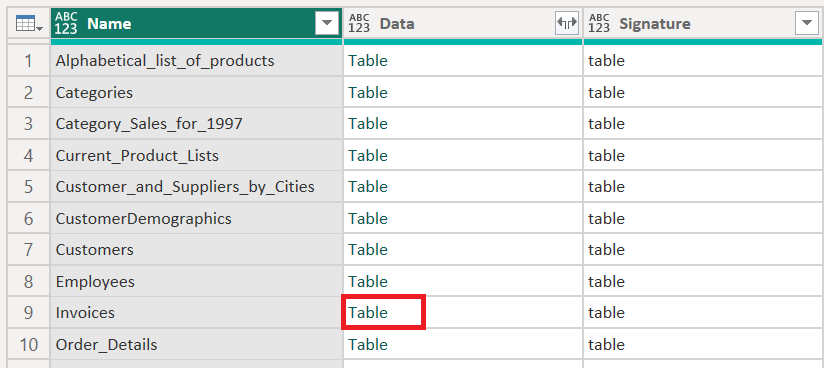
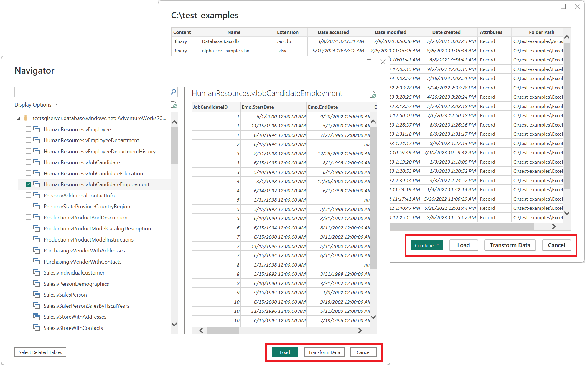
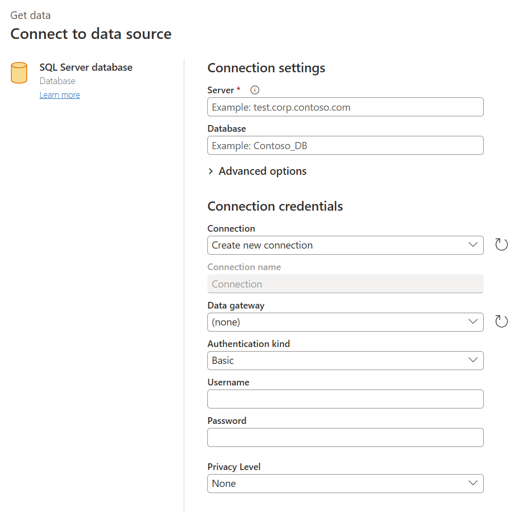
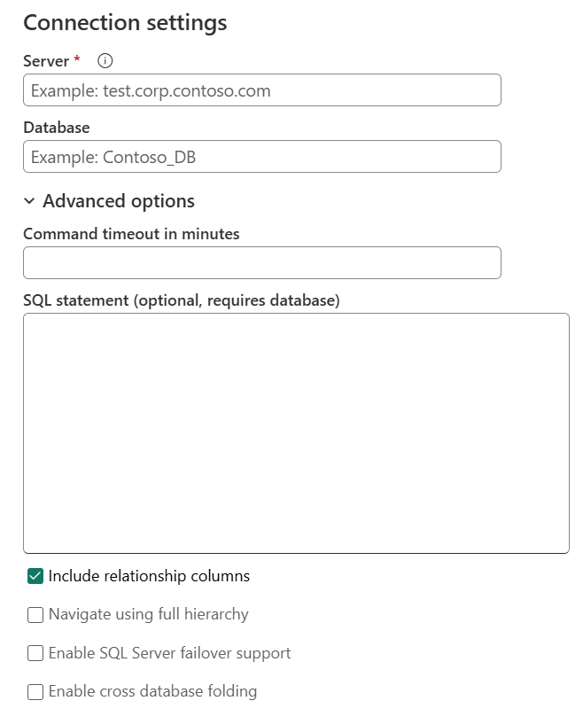
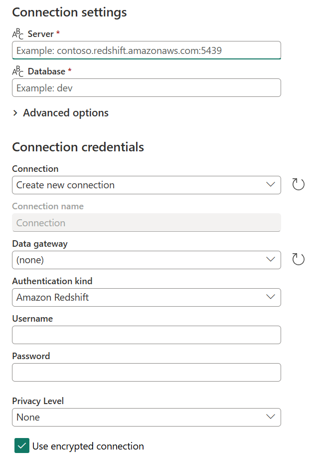
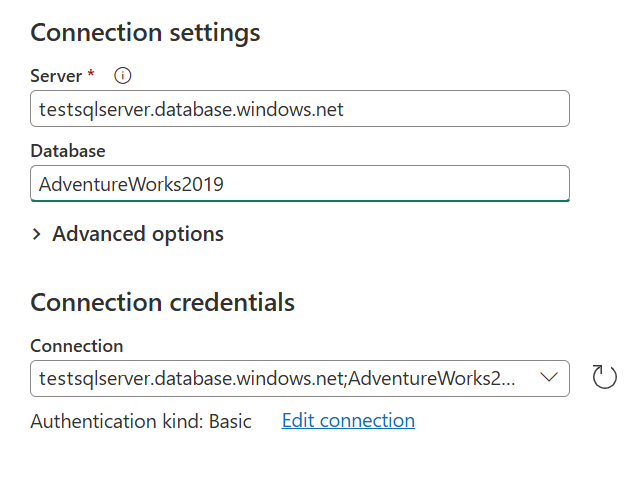
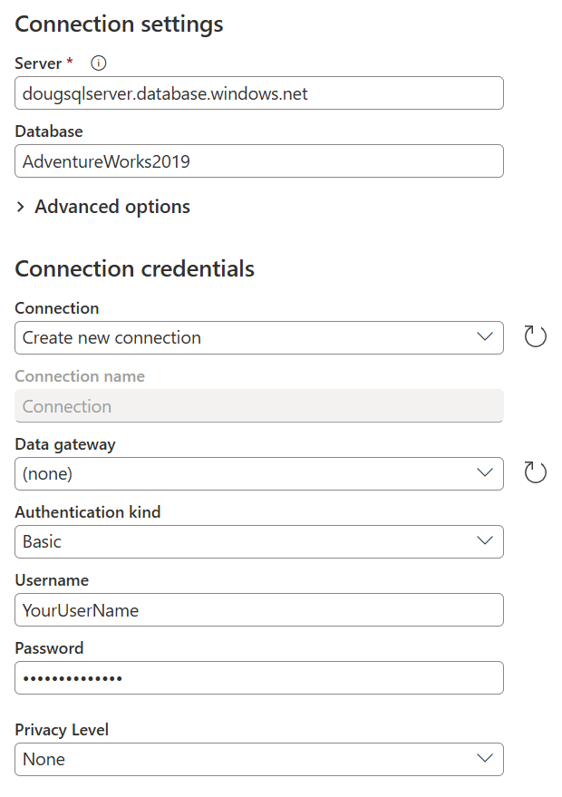

# Getting data overview

Power Query can connect to many different data sources so you can work with the data you need. This article walks you through the steps for bringing in data to Power Query either in Power Query Desktop or Power Query Online.

Connecting to a data source with Power Query follows a standard set of stages before landing the data at a destination. This article describes each of these stages.

>[!IMPORTANT]
>In some cases, a connector might have all stages of the get data experience, and in other cases a connector might have just a few of them. For more information about the experience of a specific connector, go to the documentation available for the specific connector by searching on the [Connectors in Power Query article](connectors/index.md).

## Power Query Desktop experience

The stages for getting data in the Power Query Desktop experiences are:

1. Connection settings

2. Authentication

3. Data preview

4. Query destination

:::image type="content" source="media/get-data-experience/getting-data-flow-diagram.png" alt-text="Flow diagram illustrating the four stages of getting data.":::

### 1. Connection settings

Most connectors initially require at least one parameter to initialize a connection to the data source. For example, the SQL Server connector requires at least the host name to establish a connection to the SQL Server database.

:::image type="content" source="media/get-data-experience/connector-parameters.png" alt-text="SQL Server connector parameters.":::

In comparison, when trying to connect to an Excel file, Power Query requires that you use the file path to find the file you want to connect to.

The connector parameters are commonly used to establish a connection to a data source, and they&mdash;in conjunction with the connector used&mdash;define what's called a *data source path*.

>[!Note]
>Some connectors don't require you to enter any parameters at all. These are called *singleton connectors* and will only have one data source path available per environment. Some examples are Adobe Analytics, MailChimp, and Google Analytics.

### 2. Authentication

Every single connection that's made in Power Query has to be authenticated. The authentication methods vary from connector to connector, and some connectors might offer multiple methods of authentication.

The currently available methods of authentication for Power Query are:

* **Anonymous**: Commonly used when connecting to a data source that doesn't require user authentication, such as a webpage or a file available over public HTTP.
* **Basic**: A **username** and **password** sent in base64 encoding are accepted for authentication.
* **API Key**: A single API key is accepted for authentication.
* **Organizational account** or **Microsoft account**: This method is also known as **OAuth 2.0**.
* **Windows**: Can be implicit or explicit.
* **Database**: This is only available in some database connectors.

For example, the available authentication methods for the SQL Server database connector are Windows, Database, and Microsoft account.

:::image type="content" source="media/get-data-experience/authentication.png" alt-text="SQL Server database connector authentication methods.":::

### 3. Data preview

The goal of the data preview stage is to provide you with a user-friendly way to preview and select your data.

Depending on the connector that you're using, you can preview data by using either:

* Navigator window
* Table preview dialog box

#### Navigator window (navigation table)

The **Navigator** window consists of two main sections:

* The object selection pane is displayed on the left side of the window. The user can interact with and select these objects.

    >[!NOTE]
    >For Power Query in Excel, select the **Select multiple items** option from the upper-left corner of the navigation window to select more than one object at a time in the object selection pane.

    >[!NOTE]
    >The list of objects in Power Query Desktop is limited to 10,000 items. This limit does not exist in Power Query Online. For a workaround in Power Query Desktop, see [Object limitation workaround](#object-limitation-workaround).

* The data preview pane on the right side of the window shows a preview of the data from the object you selected.

   :::image type="content" source="media/get-data-experience/navigator.png" alt-text="SQL Server connector navigator window in Power Query Desktop.":::

##### Object limitation workaround

There’s a fixed limit of 10,000 objects in the **Navigator** in Power Query Desktop. This limit doesn’t occur in Power Query Online. Eventually, the Power Query Online UI will replace the one in the desktop.

In the interim, you can use the following workaround:

1. Right-click on the root node of the **Navigator**, and then select **Transform Data**.

   

2. Power Query Editor then opens with the full navigation table in the table preview area. This view doesn't have a limit on the number of objects, and you can use filters or any other Power Query transforms to explore the list and find the rows you want (for example, based on the **Name** column).

3. Upon finding the item you want, you can get at the contents by selecting the data link (such as the **Table** link in the following image).

    

#### Table preview dialog box

The table preview dialog box consists of only one section for the data preview. An example of a connector that provides this experience and window is the [Folder](connectors/folder.md) connector.

:::image type="content" source="media/get-data-experience/combine-files.png" alt-text="Table preview dialog box.":::

### 4. Query destination

This is the stage in which you specify where to load the query. The options vary from integration to integration, but the one option that's always available is loading data to the Power Query editor to further transform and enrich the query.

## Power Query Online experience

The stages for getting data in Power Query Online are:

1. Connection settings and Authentication

2. Data preview

3. Query editor

:::image type="content" source="media/get-data-experience/getting-data-pqo-flow.png" alt-text="Flow diagram with the three stages of getting data in Power Query Online.":::

### 1. Connection settings and authentication

In the Power Query Online experience, you begin with the **Connect to data source** page where you enter values in two distinct sections:

* Connection settings

* Connection credentials

  

#### Connection settings

In the connection settings section, you define the information needed to establish a connection to your data source. Depending on your connector, that could be the name of the server, the name of a database, a folder path, a file path, or other information required by the connector to establish a connection to your data source. Some connectors also enable specific subsections or advanced options to give you more control and options when connecting to your data source.

#### Connection credentials

The first time that you use Power Query to connect to a specific data source, you're required to create a new connection associated with that data source. A connection is the full definition of the gateway, credentials, privacy levels, and other connector-specific fields that make up the connection credentials required to establish a connection to your data source.

>[!NOTE]
>Some connectors offer specific fields inside the connection credentials section to enable or define any sort of security related to the connection that needs to be established. For example, the SQL Server connector offers the **Use Encrypted Connection** field.

The primary information required by all connectors to define a connection are:

* **Connection name:** This is the name that you can define to uniquely identify your connections. Note that you can't duplicate the name of a connection in your environment.
* **Data gateway:** If your data source requires a data gateway, select the gateway using the dropdown list from this field.
* **Authentication kind & credentials:** Depending on the connector, you're presented with multiple authentication kind options that are available to establish a connection, as well as fields where you enter your credentials. For this example, the Windows authentication kind has been selected and you can see the **Username** and **Password** fields that need to be filled in to establish a connection.
* **Privacy level:** You can define the privacy level for your data source to be either **None**, **Private**, **Organizational**, or **Public**.

>[!NOTE]
>To learn more about what data gateways are and how to register a new gateway for your environment or tenant, go to [Using on-premises data gateway](dataflows/using-dataflows-with-on-premises-data.md).

>[!IMPORTANT]
>Some Power Query integrations don't currently enable a defined connection or a privacy level. But, all Power Query Online experiences do provide a way to define the data gateway, authentication kind, and the credentials needed to establish a connection with your data source.

Once you've defined a connection in Power Query Online, you can reuse the same connection later on without reentering all this information again. The **Connection** field offers a dropdown menu where you select your already defined connections. Once you've selected your already defined connection, you don't need to enter any other details before selecting **Next**.

After you select a connection from this menu, you can also make changes to the credentials, privacy level, and other connector-specific fields for your data source in your project. Select **Edit connection**, and then change any of the provided fields.

### 2. Data preview

The goal of the data preview stage is to provide you with a user-friendly way to preview and select your data.

Depending on the connector that you're using, you can preview data by using either:

* Navigator window
* Table preview dialog box

#### Navigator window (navigation table) in Power Query Online

The **Navigator** window consists of two main sections:

* The object selection pane is displayed on the left side of the window. The user can interact with and select these objects.

* The data preview pane on the right side of the window shows a preview of the data from the object you selected.

   

#### Table preview dialog box in Power Query Online

The table preview dialog box consists of only one section for the data preview. An example of a connector that provides this experience and window is the [Folder](connectors/folder.md) connector.

:::image type="content" source="media/get-data-experience/combine-files.png" alt-text="Table preview dialog box.":::

### 3. Query editor

For Power Query Online, you're required to load the data into the Power Query editor where you can further transform and enrich the query if you choose to do so.

:::image type="content" source="media/query-plan/alternative-approach.png" lightbox="media/query-plan/sample-query.png" alt-text="Sample query loaded into the query editor":::
## Additional information

To better understand how to get data using the different product integrations of Power Query, go to [Where to get data](where-to-get-data.md).
