# Grouping or summarizing rows

In Power Query, you can group values in various rows into a single value by grouping the rows according to the values in one or more columns. You can choose from two types of grouping operations:

* Column groupings.

* Row groupings.

For this tutorial, you'll be using the following sample table.

:::image type="complex" source="media/group-by/initial-table.png" alt-text="Sample initial table.":::
  Table with columns showing Year (2020), Country (USA, Panama, or Canada), Product (Shirt or Shorts), Sales channel (Online or Reseller), and Units (various values from 55 to 7500)
:::image-end:::

## Where to find the Group by button

You can find the **Group by** button in three places:

* On the **Home** tab, in the **Transform** group.

   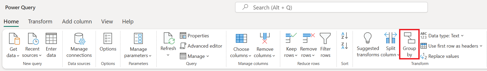

* On the **Transform** tab, in the **Table** group.

   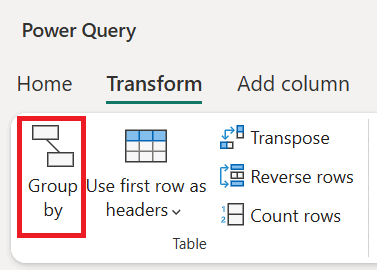

* On the shortcut menu when you right-click to select columns.

   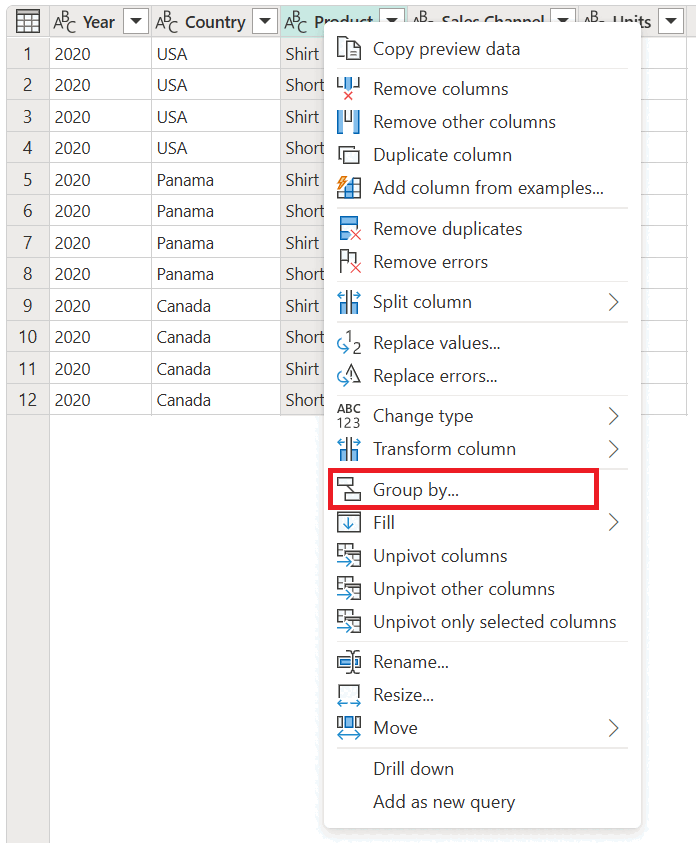

## Use an aggregate function to group by one or more columns

In this example, your goal is to summarize the total units sold at the country and sales channel level. You'll use the **Country** and **Sales Channel** columns to perform the group by operation.

1. Select **Group by** on the **Home** tab.
2. Select the **Advanced** option, so you can select multiple columns to group by.
3. Select the **Country** column.
4. Select **Add grouping**.
5. Select the **Sales Channel** column.
6. In **New column name**, enter **Total units**, in **Operation**, select **Sum**, and in **Column**, select **Units**.
7. Select **OK**

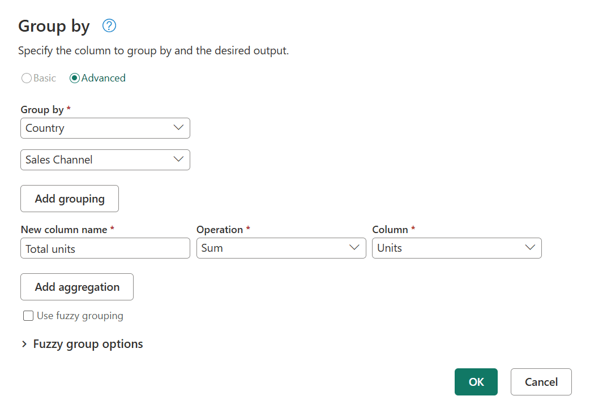

This operation gives you the following table.

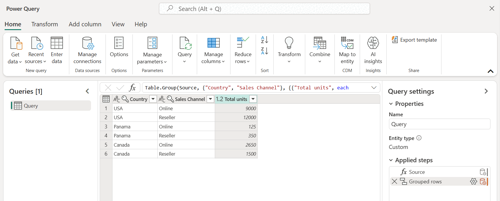

### Operations available

With the **Group by** feature, the available operations can be categorized in two ways:

* Row level operation
* Column level operation

The following table describes each of these operations.

|Operation Name|Category|Description|
|-----|------|------|
|**Sum**|Column operation|Sums up all values from a column|
|**Average**|Column operation|Calculates the average value from a column|
|**Median**|Column operation|Calculates the median from a column|
|**Min**|Column operation|Calculates the minimum value from a column|
|**Max**|Column operation|Calculates the maximum value from a column|
|**Percentile** |Column operation|Calculates the percentile, using an input value from 0 to 100, from a column|
|**Count distinct values**|Column operation|Calculates the number of distinct values from a column|
|**Count rows**|Row operation|Calculates the total number of rows from a given group|
|**Count distinct rows**|Row operation|Calculates the number of distinct rows from a given group|
|**All rows**|Row operation|Outputs all grouped rows in a table value with no aggregations|

>[!NOTE]
>The **Count distinct values** and **Percentile** operations are only available in Power Query Online.

## Perform an operation to group by one or more columns

Starting from the original sample, in this example you'll create a column containing the total units and two other columns that give you the name and units sold for the top-performing product, summarized at the country and sales channel level.

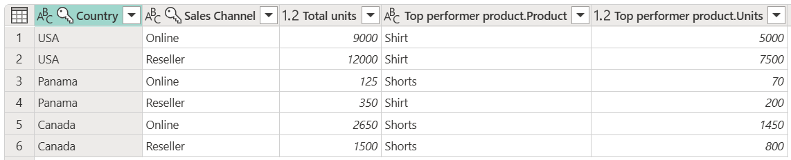

1. Use the following columns as **Group by** columns:
   * Country
   * Sales Channel

2. Create two new columns by following these steps:
   1. Aggregate the **Units** column by using the **Sum** operation. Name this column **Total units**.
   1. Add a new **Products** column by using the **All rows** operation.

   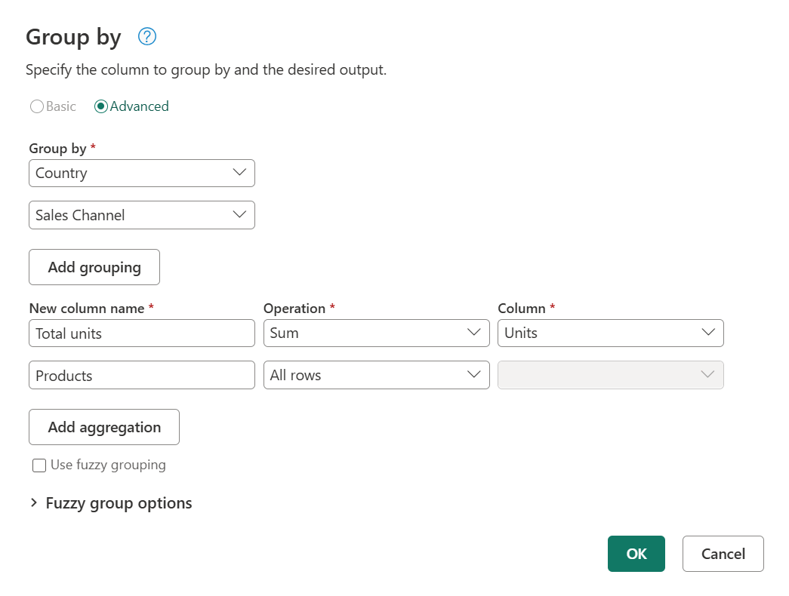

After that operation is complete, notice how the **Products** column has \[Table\] values inside each cell. Each \[Table\] value contains all the rows that were grouped by the **Country** and **Sales Channel** columns from your original table. You can select the white space inside the cell to see a preview of the contents of the table at the bottom of the dialog box.

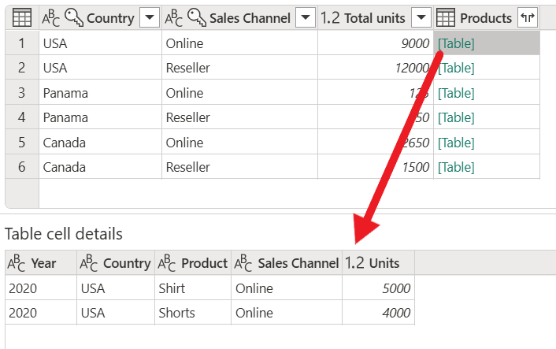

>[!NOTE]
>The details preview pane might not show all the rows that were used for the group-by operation. You can select the \[Table\] value to see all rows pertaining to the corresponding group-by operation.

Next, you need to extract the row that has the highest value in the **Units** column of the tables inside the new **Products** column, and call that new column **Top performer product**.

### Extract the top performer product information

With the new **Products** column with \[Table\] values, you create a new custom column by going to the **Add Column** tab on the ribbon and selecting **Custom column** from the **General** group.

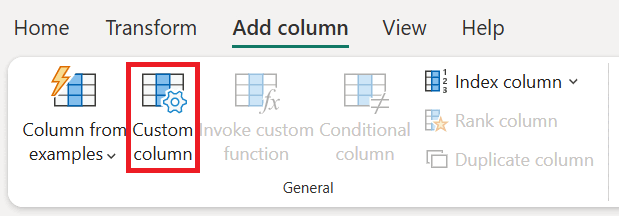

Name your new column **Top performer product**. Enter the formula `Table.Max([Products], "Units" )` under **Custom column formula**.

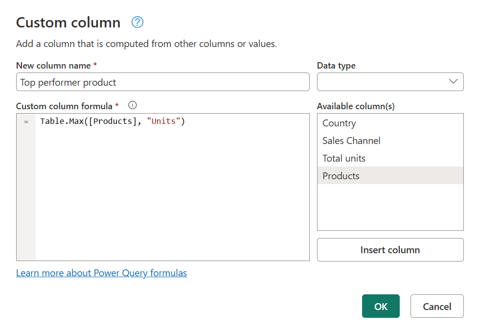

The result of that formula creates a new column with \[Record\] values. These record values are essentially a table with just one row. These records contain the row with the maximum value for the **Units** column of each \[Table\] value in the **Products** column.

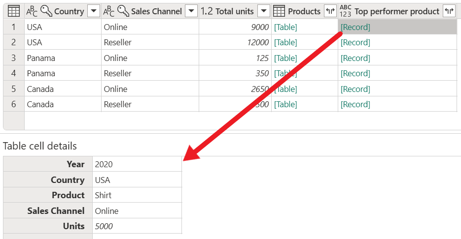

With this new **Top performer product** column that contains \[Record\] values, you can select the  expand icon, select the **Product** and **Units** fields, and then select **OK**.

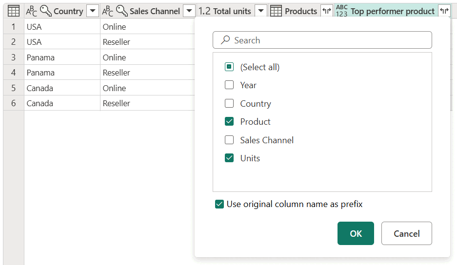

After removing your **Products** column and setting the data type for both newly expanded columns, your result will resemble the following image.

## Fuzzy grouping

>[!NOTE]
>The following feature is only available in Power Query Online.

To demonstrate how to do "fuzzy grouping," consider the sample table shown in the following image.

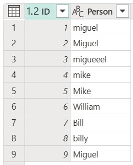

The goal of fuzzy grouping is to do a group-by operation that uses an approximate match algorithm for text strings. Power Query uses the Jaccard similarity algorithm to measure the similarity between pairs of instances. Then it applies agglomerative hierarchical clustering to group instances together. The following image shows the output that you expect, where the table will be grouped by the **Person** column.

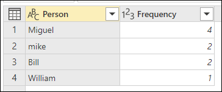

To do the fuzzy grouping, you perform the same steps previously described in this article. The only difference is that this time, in the **Group by** dialog box, you select the **Use fuzzy grouping** check box.

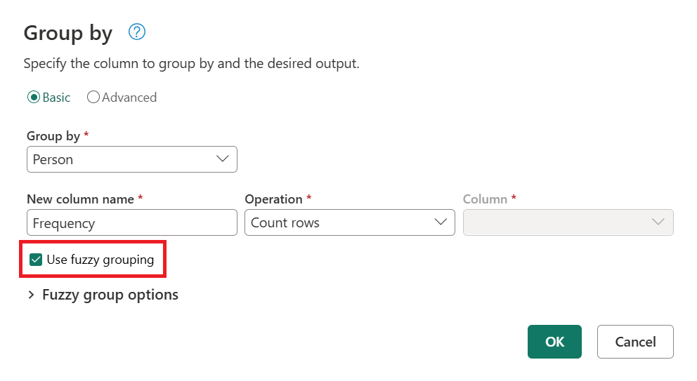

For each group of rows, Power Query will pick the most frequent instance as the "canonical" instance. If multiple instances occur with the same frequency, Power Query will pick the first one. After you select **OK** in the **Group by** dialog box, you'll get the result that you were expecting.

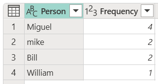

However, you have more control over the fuzzy grouping operation by expanding **Fuzzy group options**.

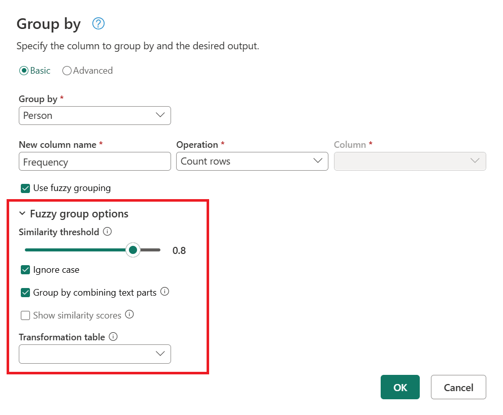

The following options are available for fuzzy grouping:

* **Similarity threshold (optional)**: This option indicates how similar two values must be to be grouped together. The minimum setting of 0 will cause all values to be grouped together. The maximum setting of 1 will only allow values that match exactly to be grouped together. The default is 0.8.
* **Ignore case**: When comparing text strings, case will be ignored. This option is enabled by default.
* **Group by combining text parts**: The algorithm will try to combine text parts (such as combining **Micro** and **soft** into **Microsoft**) to group values.
* **Show similarity scores**: Show similarity scores between the input values and the computed representative values after fuzzy grouping. Requires the addition of an operation such as **All rows** to showcase this information on a row-by-row level.
* **Transformation table (optional)**: You can select a transformation table that will map values (such as mapping **MSFT** to **Microsoft**) to group them together.

For this example, a transformation table will be used to demonstrate how values can be mapped. The transformation table has two columns:

* **From**: The text string to look for in your table.
* **To**: The text string to use to replace the text string in the **From** column.

The following image shows the transformation table used in this example.

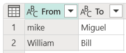

>[!IMPORTANT]
>It's important that the transformation table has a the same columns and column names as shown above (they have to be "From" and "To"), otherwise Power Query will not recognize these.

Return to the **Group by** dialog box, expand **Fuzzy group options**, change the operation from **Count rows** to **All rows**, enable the **Show similarity scores** option, and then select the **Transformation table** drop-down menu.

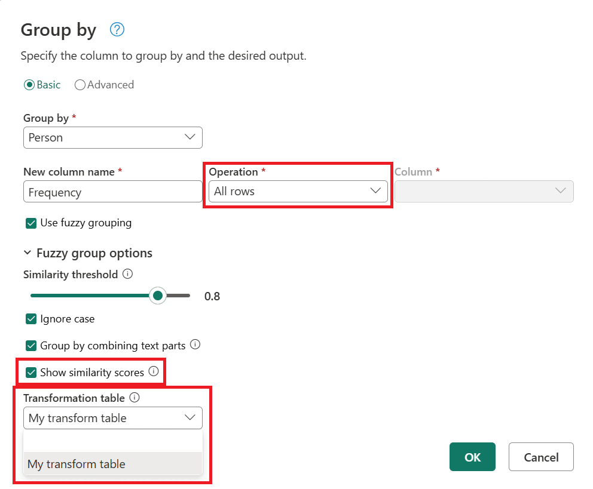

After you select the transformation table, select **OK**. The result of that operation gives you the following information:

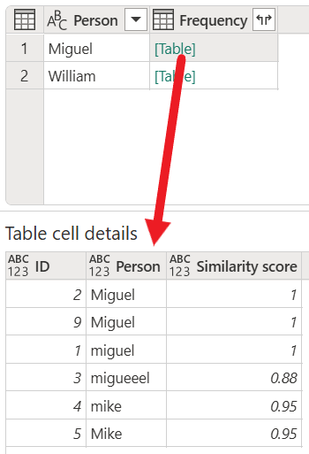

In this example, the **Ignore case** option was enabled, so the values in the **From** column of the **Transformation table** are used to look for the text string without considering the case of the string. This transformation operation occurs first, and then the fuzzy grouping operation is performed.

The similarity score is also shown in the table value next to the person column, which reflects exactly how the values were grouped and their respective similarity scores. You can expand this column if needed or use the values from the new Frequency columns for other sorts of transformations.

>[!NOTE]
>When grouping by multiple columns, the transformation table performs the replace operation in all columns if replacing the value increases the similarity score.

### See also

[Add a custom column](add-custom-column.md)  
[Remove duplicates](working-with-duplicates.md)
