# Grouping or Summarizing rows

In Power Query, you can group the values in various rows into a single value by grouping the rows according to the values in one or more columns. 

Power Query has two types of **Group By** operations:

* aggregate a column with an aggregate function,

* or perform a row operation.

For this demonstration, we'll be using the following sample table:

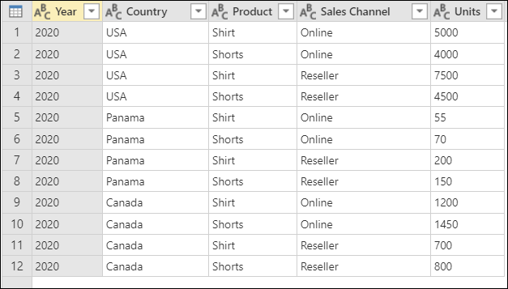

## Where to find the Group By button
You can find the 'Group By' button in 3 places:

* **Home tab** - inside the Transform group.


* **Transform tab** - inside the Table group. 

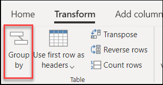

* **Right click column(s)** - when doing a right click on the selected column(s), it'll be listed under the contextual menu.

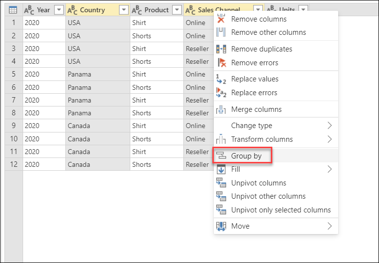

## To Group by one or more columns: add an aggregated column

Our goal is to reach the following table from our original sample table:

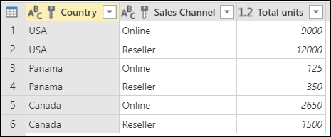

We want the total units sold summarized at the **Country** and **Sales Channel** level.

We can accomplish our goal by performing a group by operation using the following columns as 'Group by' columns:
* Country
* Sales Channel

To do this, we click the 'Group by' button from the Home tab, select the 'Advanced' option so we can select multiple columns to group by and then perform the Group by operation in this window by selecting the **Country**, **Sales Channel**, and creating a new column by aggregating the **Units** column using the Sum function and naming this new column **Total units** as showcased in the following image:

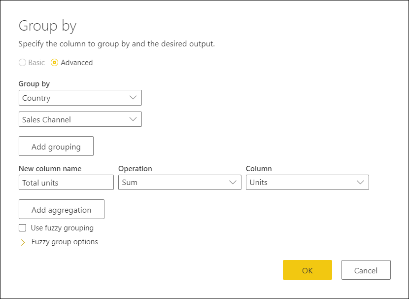

This operation gives us the table that we're looking for:

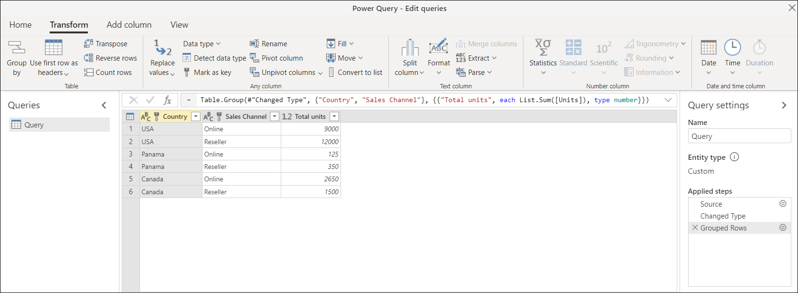

## To Group by one or more columns: perform a row operation

Our goal is to reach the following table from our original sample table:

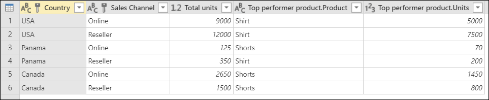

Where we want the total units sold as well as another 2 columns that gives us the name and units sold for the the top performer product summarized at the **Country** and **Sales Channel** level.
 
We can accomplish our goal by performing a group by operation using the following columns as 'Group by' columns:
* Country
* Sales Channel

And creating two new columns by:
* aggregating the **Units** column using the Sum function and naming this new column **Total units**. 
* adding a new **Products** column using the *All Rows* operation.

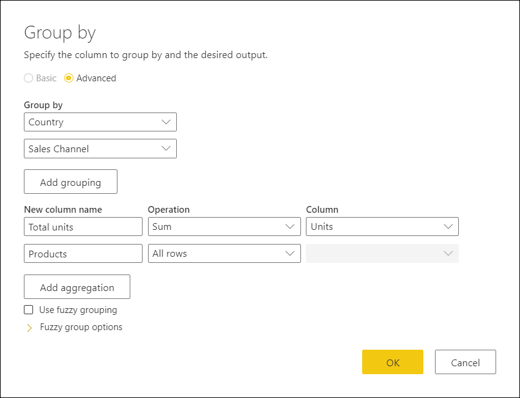

Notice how the **Products** column has *table* values inside each cell. Each *table* value contains all rows that were grouped by the **Country** and **Sales Channel** columns from our original table. You can click on the whitespace inside the cell so you can see a preview of the contents of the table in the 'Details preview pane' at the bottom as shown in the image below:   

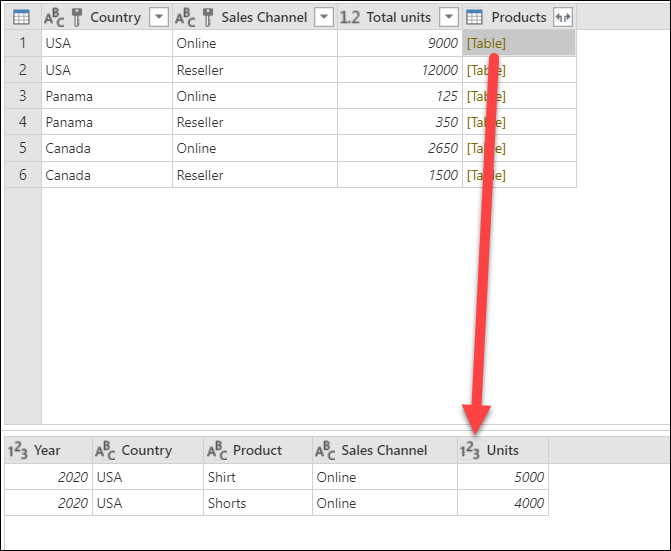

>[!Note]
>Power Query does not guarantee that the Details preview pane shows all rows that are used for the group by. You can click on the Table value to see al rows pertaining to the correspondent group by operation. 

What we need to do next is to extract the row with the highest value on the **Units** column of the tables inside the new **Products** columns and call that new column **Top performer product**.

### Extract the top performer product information

With the new **Products** column with table values, we create a new custom column by going to the 'Add Column' menu from the ribbon and selecting the 'Custom column' from the General group.


The name of our new column will be **Top performer product** and the formula to create this formula is ```Table.Max([Products], "Units" )```:

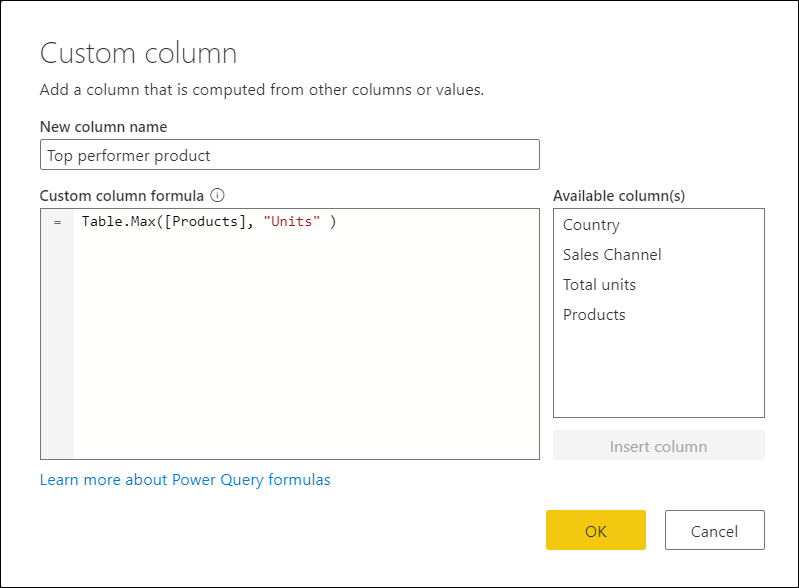

The result of that formula will create a new column with record values with the row with the maximum value on the **Units** column of each *table* value in the **Products** column.

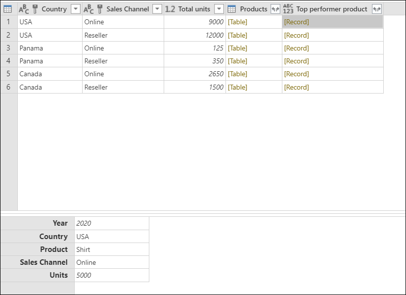

With this new **Top performer product** column with *record* values, we can click on the icon  with opposite rows in the column header to expand the contents of the column. We select the fields *Product* and *Units*, and then click the OK button.

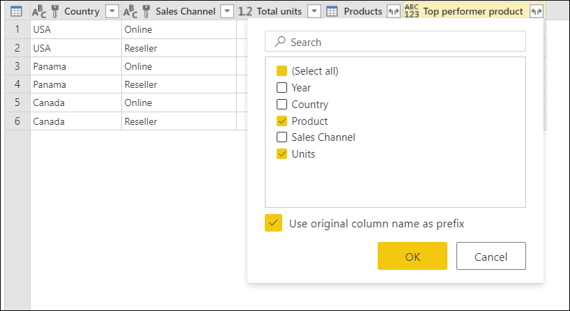

After removing our **Products** column and setting the data type for both newly expanded columns, our result looks like this:


## Fuzzy Grouping

(Placeholder)

## More resources

You can perform your own custom column formula to transform the table from the 'Group by' operation. You can read more about how to create your custom column in Power Query from the article [Add a Custom column](add-custom-column.md).

If your goal is to remove the duplicates from a table, you can also use the 'Remove duplicates' operation within Power Query. You can read more about this from [Remove duplicates](working-with-duplicates.md).
