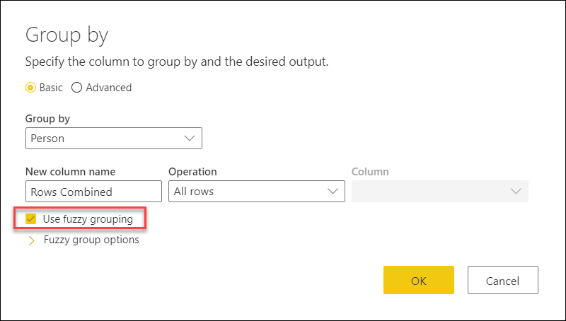
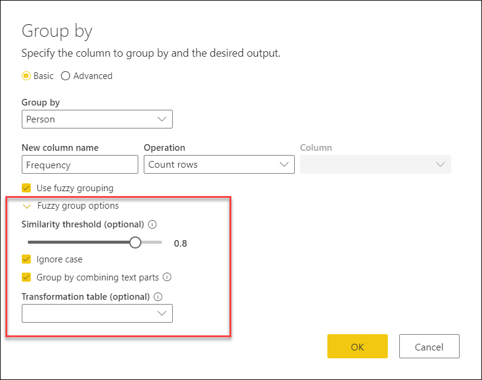
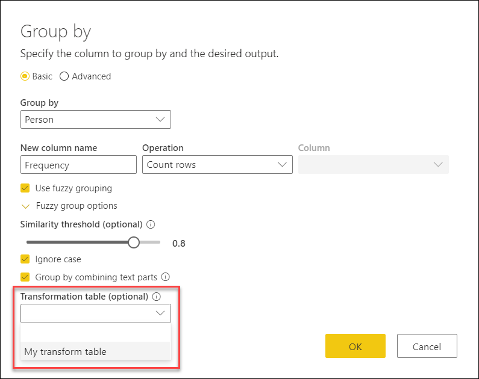
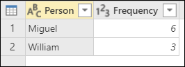

# Grouping or summarizing rows

In Power Query, you can group the values in various rows into a single value by grouping the rows according to the values in one or more columns. 

Power Query has two types of **Group By** operations:

* aggregate a column with an aggregate function

* perform a row operation

For this demonstration, you'll be using the following sample table:

## Where to find the Group By button

You can find the **Group By** button in three places:

* **Home tab**&mdash;inside the **Transform** group.

* **Transform tab**&mdash;inside the **Table** group. 

* **Right-click column(s)**&mdash;when doing a right-click on the selected column(s), it will be listed under the contextual menu.

## To Group by one or more columns

In this example, your goal is to get the total **Units** sold summarized at the **Country** and **Sales Channel** level.

You can accomplish your goal by performing a group by operation using the following columns as **Group by** columns:
* Country
* Sales Channel

To do this, first select the **Group by** button from the **Home** tab. Select the **Advanced** option so you can select multiple columns to group by. Then select the **Country** and **Sales Channel** column to perform the group by operation on. Create a new column by aggregating the **Units** column using the Sum function and naming this new column **Total units**.

This operation gives you the table that you're looking for.

## To Group by one or more columns: perform a row operation

In this example, your goal is to reach the following table from your original sample table.

You want the total units sold, as well as two other columns that give you the name and units sold for the top performing product summarized at the **Country** and **Sales Channel** level.
 
You can accomplish this change by performing a group by operation using the following columns as **Group by'**columns:
* Country
* Sales Channel

And creating two new columns by:
* Aggregating the **Units** column using the *Sum* operation and naming this new column **Total units**. 
* Adding a new **Products** column using the *All Rows* operation.

Once that operation is complete, notice how the **Products** column has **Table** values inside each cell. Each **Table** value contains all rows that were grouped by the **Country** and **Sales Channel** columns from your original table. You can select the whitespace inside the cell so you can see a preview of the contents of the table in the "details preview pane" at the bottom.

>[!Note]
>Power Query doesn't guarantee that the details preview pane shows all rows that are used for the group by. You can select the **Table** value to see all rows pertaining to the correspondent group by operation. 

What you need to do next is extract the row with the highest value in the **Units** column of the tables inside the new **Products** columns and call that new column **Top performer product**.

### Extract the top performer product information

With the new **Products** column with table values, you create a new custom column by going to the **Add Column** menu from the ribbon and selecting **Custom column** from the **General** group.

The name of your new column will be **Top performer product**. The formula to enter in **Custom column formula** is `Table.Max([Products], "Units" )`.

The result of that formula will create a new column with record values with the row with the maximum value on the **Units** column of each *table* value in the **Products** column.

With this new **Top performer product** column containing **Record** values, you can select the icon with opposite rows in the column header to expand the contents of the column. Select the **Product** and **Units** fields, and then select **OK**.

After removing your **Products** column and setting the data type for both newly expanded columns, your result looks like this:

## Fuzzy grouping

To demonstrate how to perform *Fuzzy grouping* in Power Query's *Group By* functionality, the following sample table will be used:

The goal of the *Fuzzy grouping* is to perform a *Group by* operation using an approximate match algorithm for text strings. Power Query uses the Jaccard Similarity algorithm to measure the similarity between pairs of instances. Then it applies Agglomerative Hierarchical Clustering to group instances together. Below is an image of the output that we expect where the table will be grouped by the *Person* column:

To perform the fuzzy grouping, you perform the same steps previously described in this article. The only difference is that this time, in the *Group by* window, you will click the *Use fuzzy grouping* radio button as shown in the next image:

For each group of rows, Power Query will pick the most frequent instance as the “canonical” instance. If multiple instances have the same frequency, Power Query will pick the first one. After we hit the OK button in the *Group by* window, we will get the result that we were expecting:

However, you have more control over the *Fuzzy grouping* operation by expanding the *Fuzzy group options* as shown in the next image:

Here's a list of the availble options for the *Fuzzy grouping*:
* **Similarity threshold (optional)** - This option indicates how similar two values need to be in order to be grouped together. The minimum value of 0 will cause all values to be grouped together, and the maximum value of 1 will only allow exact match of values to be grouped together. The default is 0.8.)
* **Ignore case** - Used to compare text Strings, ignoring case considerations. Enabled by default.
* **Group by combining text parts** - the algorithm will try to combine text parts (such as 'Micro' and 'soft' into 'Microsoft') in order to group values.
* **Transformation table (optional)** - select a transformation table that will be used to map values (such as "MSFT" to "Microsoft") to group them together. The table should contain a "From" column and a "To" column.

For this example, a transformation table will be used to demonstrate how values can be mapped. The transformation table needs to have only two columns:
* **From** - The text string to look for in our table.
* **To** - The text string used to replace the text string found.

The following image is the transformation table that will be used:

Going back to the *Group by* window and expanding the *Fuzzy group options*, you can select the **Transformation table** query from the dropdown as shown in the next image: 

After selecting the **Transformation table**, you can click the OK button to proceed. The result of that operation will give you the following result:

In this example, the *Ignore case* option is enabled so values in the **From** column of the **Transformation table** will be used ignoring the case and will look for the text string without considering casing. This transformation operation occurs first and subsequently the *Fuzzy grouping* operation is performed. 

>[!Note]
>When grouping by multiple columns, the transformation table will perform the replace operation in all columns if replacing the value increases the similarity score.

## More resources

You can create your own custom column formula to transform the table from the **Group by** operation. To learn more about how to create your custom column in Power Query, see [Add a Custom column](add-custom-column.md).

If your goal is to remove the duplicates from a table, you can also use the [Remove duplicates](working-with-duplicates.md) operation within Power Query.
