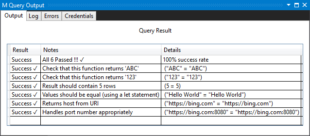

# Handling Unit Testing

For both simple and complex connectors, adding unit tests is a best practice and highly recommended.

Unit testing is accomplished in the context of Visual Studio's [Power Query SDK](https://marketplace.visualstudio.com/items?itemName=Dakahn.PowerQuerySDK). Each test is defined as a `Fact` that has a name, an expected value, and an actual value. In most cases, the "actual value" will be an M expression that tests part of your expression.

Consider a very simple extension that exports three functions:

```powerquery-m
section Unittesting;

shared UnitTesting.ReturnsABC = () => "ABC";
shared UnitTesting.Returns123 = () => "123";
shared UnitTesting.ReturnTableWithFiveRows = () => Table.Repeat(#table({"a"},{{1}}),5);
```

This unit test code is made up of a number of Facts, and a bunch of common code for the unit test framework (`ValueToText`, `Fact`, `Facts`, `Facts.Summarize`). The following code provides an example set of Facts (go to [UnitTesting.query.pq](https://github.com/Microsoft/DataConnectors/tree/master/samples/UnitTesting) for the common code):

```powerquery-m
section UnitTestingTests;

shared MyExtension.UnitTest = 
[
    // Put any common variables here if you only want them to be evaluated once

    // Fact(<Name of the Test>, <Expected Value>, <Actual Value>)
    facts = 
    {
        Fact("Check that this function returns 'ABC'",  // name of the test
            "ABC",                                      // expected value
            UnitTesting.ReturnsABC()                    // expression to evaluate (let or single statement)
        ),
        Fact("Check that this function returns '123'",
            "123",
            UnitTesting.Returns123()
        ),
        Fact("Result should contain 5 rows",
            5,
            Table.RowCount(UnitTesting.ReturnTableWithFiveRows())
        ),
        Fact("Values should be equal (using a let statement)",
            "Hello World",
            let
                a = "Hello World"
            in
                a
        )
    },
    report = Facts.Summarize(facts)
][report];
```

Running the sample in Visual Studio will evaluate all of the Facts and give you a visual summary of the pass rates:


Implementing unit testing early in the connector development process enables you to follow the principles of test-driven development. Imagine that you need to write a function called `Uri.GetHost` that returns only the host data from a URI. You might start by writing a test case to verify that the function appropriately performs the expected function:

```powerquery-m
Fact("Returns host from URI",
    "https://bing.com",
    Uri.GetHost("https://bing.com/subpath/query?param=1&param2=hello")
),
Fact("Handles port number appropriately",
    "https://bing.com:8080",
    Uri.GetHost("https://bing.com:8080/subpath/query?param=1&param2=hello")
)
```

Additional tests can be written to ensure that the function appropriately handles edge cases.

An early version of the function might pass some but not all tests:

```powerquery-m
Uri.GetHost = (url) =>
    let
        parts = Uri.Parts(url)
    in
        parts[Scheme] & "://" & parts[Host]
```


The [final version of the function](helper-functions.md) should pass all unit tests. This also makes it easy to ensure that future updates to the function do not accidentally remove any of its basic functionality.


