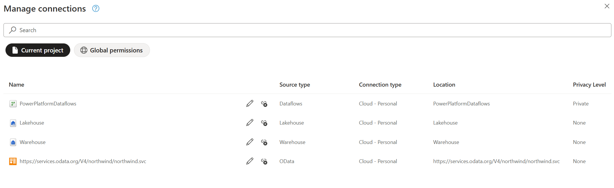
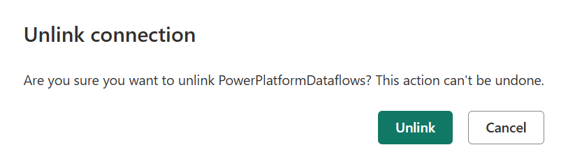

# Manage connections (Preview)

>[!NOTE]
>This feature is currently only available in Power Query Online and is in public preview.

Power Query allows you to [connect to a multitude of data sources](https://learn.microsoft.com/en-us/power-query/connectors/). When you connect to a data source, you fundamentally create a connection to it, which consists of your data source, credentials, and more information such as privacy levels and optional parameters for such data source. The Manage connections dialog is one centralized way in your Power query project to manage the connections that are being reference by your project.

The entry to the **Manage connections** dialog is available in the Home tab of the ribbon in the *Data sources* group.

Manage connections dialog displays a list of all connections being referenced in your Power Query project and the ability to disconnect any of the connections from your project.

## Disconnect a connection

Right next to the name of connection, and before the *Source type* column, you find an icon to disconnect the connection.

When you disconnect a connection, you're simply removing the reference of the connection from your project. This means that the definition of the connection won't be removed from the back-end and it will not be used in your project.

A new prompt asks you to confirm that you wish to disconnect the connection.

>[!NOTE]
>If you wish to delete a connection from within a specific product integration, such as Microsoft Power BI or Microsoft Fabric, be sure to check out the documentation from each product on how a centralized connections portal can be leveraged.
