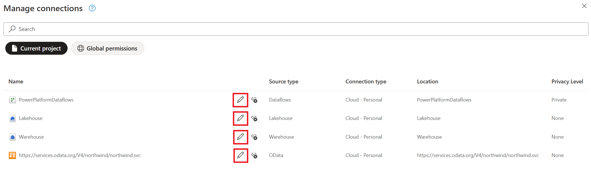
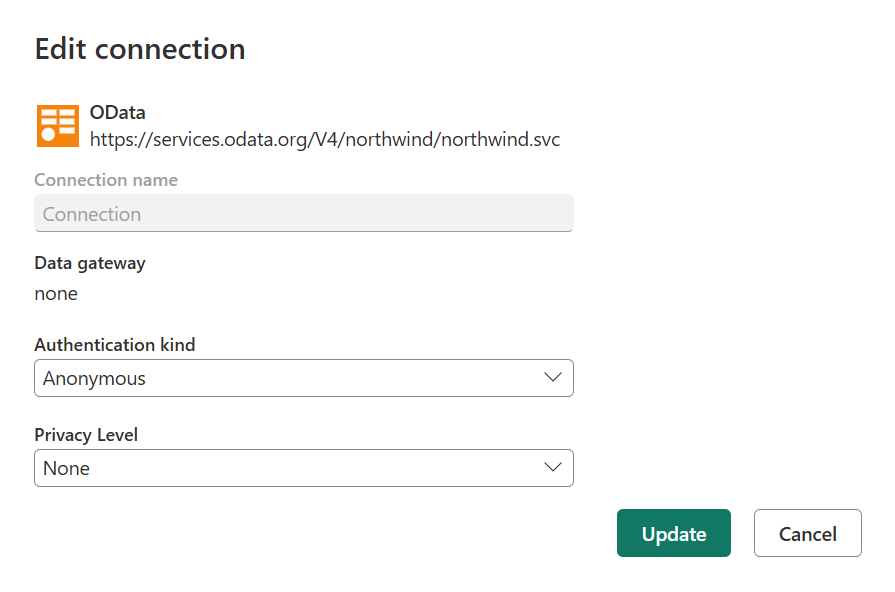

# Manage connections (Preview)

>[!NOTE]
>This feature is currently available only in Power Query Online and is in public preview.

With Power Query, you can [connect to a multitude of data sources](connectors/index.md). When you connect to a data source, you fundamentally create a connection to it. This connection consists of your data source, credentials, and more information, such as privacy levels and optional parameters for each data source. The **Manage connections** dialog is one centralized way in your Power Query project to manage the connections that are being referenced by your project.

The entry to the **Manage connections** dialog is available in the Power Query **Home tab** in the ribbon's **Data sources** group.

:::image type="content" source="media/manage-connections/entry-point.png" alt-text="Screenshot of the Manage connections button in the Data sources group of the Power Query ribbon Home tab.":::

**Manage connections** displays a list of all connections being referenced in your Power Query project. It also notes the ability to unlink and edit from any of the connections in your project.

:::image type="content" source="media/manage-connections/manage-connections-dialog.png" alt-text="Screenshot of the Manage connections dialog showcasing multiple connections on its page." lightbox="media/manage-connections/manage-connections-dialog.png":::

## Unlink a connection

Right next to the name of connection, and before the **Source type** column, there's an icon to unlink the connection.

When you unlink a connection, you're simply removing the reference of the connection from your project. Unlinking means that the definition of the connection isn't removed from the back-end and it can't be used in your project.

:::image type="content" source="media/manage-connections/disconnect-icon.png" alt-text="Screenshot emphasizing the unlink icon next to a connection in the Manage Connections dialog.":::

A new prompt then asks you to confirm that you want to unlink the connection.

:::image type="content" source="media/manage-connections/confirmation-prompt.png" alt-text="Screenshot of the prompt asking you to confirm the unlink action.":::

>[!NOTE]
>If you want to delete a connection from within a specific product integration, such as Microsoft Power BI or Microsoft Fabric, be sure to check out the documentation for each product on how a centralized connections portal can be used.

## Edit a connection

Right next to the name of connection, and before the disconnect icon, there's an icon to edit the connection. 

The edit functionality allows you to change the following values:

* **Data gateway:** If your data source uses a data gateway, you can modify the gateway using the dropdown list from this field.
* **Authentication kind & credentials:** Depending on the connector, you're presented with multiple authentication kind options that are available to establish a connection, and fields where you enter your credentials.

## More Resources

* [Get Data experience in Power Query](get-data-experience.md)
* [Connectors available in Power Query](connectors/index.md)
