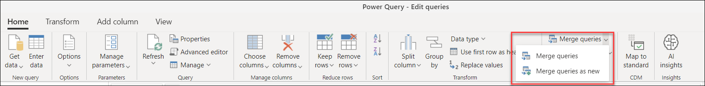
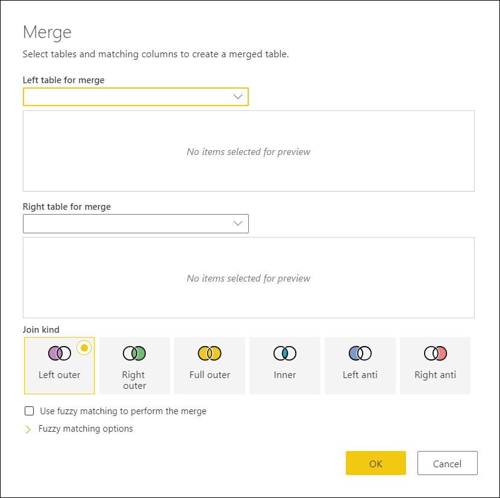

# Merge operations overview

You can merge queries when you have one or more columns that you’d like to add to another query.
A merge operation creates a new query from two existing queries by performing a join between both tables using one or multiple columns from both tables. 

## To merge queries

You can find the *Merge queries* icon in the **Home** tab under the *Combine* group. From the dropdown you'll see two options:
* **Merge queries** - displays the Merge window with the selected query as the left table of the merge operation.
* **Merge queries as new** - displays the Merge window without any preselected tables for the Merge operation.

The Merge operation requires two tables to be defined:
* **Left table for merge** - the first selection from top to bottom
* **Right table for merge** - the last selection from top to bottom

>[!Note]
>The position, left or right, of the tables is incredibly important when selecting the correct Join Kind to be used.

### Select column pairs

After both the left and right table have been selected, you can select the columns that should drive the join or merge of the tables. In the example below, there are have two tables:
* **Sales** - the field CountryID is a key or an identifier from the Countries table.
* **Countries** - this table contains the CountryID as well as the name of the Country.

The goal is to join these tables using the CountryID column from both tables, so you simply select each column from each table. After the selection is made, a simple message with an estimated number of matches is displayed at the bottom of the window.

>[!Note]
> While this example shows the same column header for both tables, it is not a requirement for the Merge operation. Column headers do not need to match between tables. It is also important to note that the columns must be of the same data type, otherwise Power Query does not guarantee the correct results.

You can also select multiple columns to perform the join by holding the *ctrl* key when selecting the columns. When doing so, the order in which the columns were selected will be displayed next to the column headers as small numbers starting from the number one. 

In the following sample, you have the tables **Sales** and **Countries**. Each of them have the columns *CountryID* and *StateID* which you need to pair for the join between both columns. 
In this case we'll first select the CountryID from the Sales table, hold the ctrl key and then select the StateID. This will show the small numbers mentioned before, and you can now do the same set of column selection for the Countries table. The result of selecting those columns will look like this:

### New merged table column

After hitting OK in the Merge window, the base table of your query will have all of the columns from your left table and a new column with the same name of your right table which holds the values correspondant from the right table on a row by row basis.

From here, you can choose to expand the fields from this new table column, which will be the fields from your right table:

## Join Kinds

A Join Kind specifies how a merge operation should be performed. The following is a table with the available Join Kinds in Power Query:

|Join Kind| Icon| Description| Sample Article|
|---------------|-----|-----------|---------------|
|Left outer| | All rows from left table, matching from right table|url|
|Right outer| | All rows from right table, matching from left table| url|
|Full outer| | All rows from both tables|url|
|Inner| | Only matching rows from both tables|url|
|Left anti| | Only rows from left table|url|
|Right anti| | Only rows from right table|url|

## Fuzzy Matching

Fuzzy Merge allows you to apply Fuzzy Matching algorithms when comparing columns and try to find matches across tables being merged. You can enable this by selecting the **Use fuzzy matching to perform the merge** option inside the Merge window. You can expand the **Fuzzy matching options** to view all the available configurations.

>[!Note]
>Fuzzy matching is only supported on merge operations over text columns. 