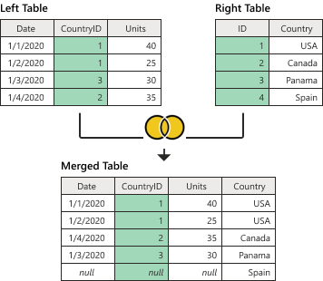
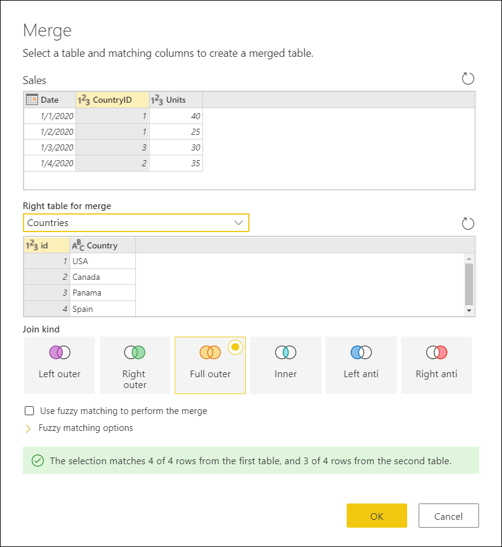
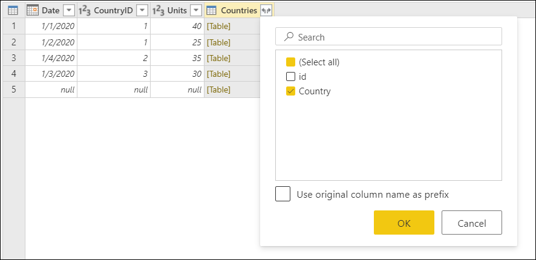

# Merge queries: Full outer join

A full outer join is one of the join kinds available inside the **Merge queries** window in Power Query. To read more about the merge operations in Power Query, see [Merge operations overview](merge-queries-overview.md).

A full outer join brings all the rows from both the left and right table.

This article demonstrates, with a practical example, how to do a merge operation using the full outer join as the join kind.

>[!Note]
>Samples used in this article are only to showcase the concepts. The concepts showcased here apply to all queries in Power Query.

## Sample input and output tables

The sample source tables for this example are:

* **Sales**&mdash;with the fields **Date**, **CountryID**, and **Units**. The *CountryID* is a whole number value that represents the unique identifier from the **Countries** table.

* **Countries**&mdash;this table is a reference table with the fields **id** and **Country**. The *id* represents the unique identifier of each record.

The goal is to merge both tables, where the **Sales** table will be the left table and the **Countries** table the right one. The join will be made between the following columns:

|Field from Sales table| Field from Countries table|
|-----------|------------------|
|CountryID|id|

The goal is to reach the following table where the name of the country appears as a new **Country** column in the **Sales** table. Because of how the Full outer join works, all rows from both the left and right table will be brought, regardless if they only appear in one of the tables.

## Full outer join

To do a full outer join:

1. Select the **Sales** query and then select **Merge queries** to create a new step inside the Sales query that will merge the **Sales** query with the **Countries** query.
2. Select the **Countries** as the **Right table for merge**.
3. Select the **CountryID** column from the **Sales** table.
4. Select the **id** column from the **Countries** table.
5. From the **Join Kind** section, select the **Full outer** option.
6. Select **OK** button.

>[!TIP]
>Take a closer look at the message at the bottom of the Merge window that reads *"The selection matches 4 of 4 rows from the first table, and 3 of 4  rows from the second table"* as this is crucial to understand the result that you get from this operation. 

In the **Countries** table, you have the *Country* Spain with the id 4, but there are no records for *CountryID* 4 in the Sales table, hence why only 3 of 4 rows from the right table found a match. All rows from the right table that didn't have matching rows from the left table will be grouped and shown in a new row in the output table with no values for the fields from the left table. 

From the newly created **Countries** column after the merge operation, expand the **Country** field without using the original column name as prefix.

After doing this operation, the desired result is reached.

