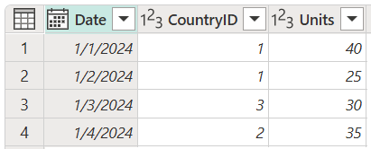
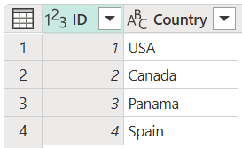
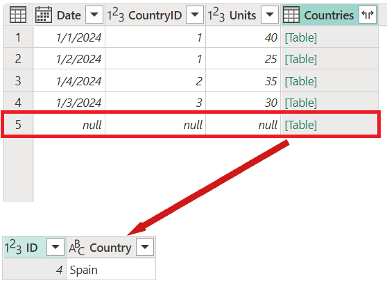

# Full outer join

One of the join kinds available in the **Merge** dialog box in Power Query is a *full outer join*, which brings in all the rows from both the left and right tables. More information: [Merge operations overview](merge-queries-overview.md)

:::image type="complex" source="media/merge-queries-full-outer/full-outer-join-operation.png" alt-text="Full outer join example.":::
   Figure shows a table on the left with Date, CountryID, and Units columns. The emphasized CountryID column contains values of 1 in rows 1 and 2, 3 in row 3, and 2 in row 4. A table on the right contains ID and Country columns. The emphasized ID column contains values of 1 in row 1 (denoting USA), 2 in row 2 (denoting Canada), 3 in row 3 (denoting Panama), and 4 (denoting Spain) in row 4. A table below the first two tables contains Date, CountryID, Units, and Country columns. All rows have been rearranged in numerical order according to the CountryID value. The country associated with the CountryID number is shown in the Country column. Because the country ID for Spain wasn't contained in the left table, a new row is added, and the date, country ID, and units values for this row are set to null.
:::image-end:::

This article uses sample data to show how to do a merge operation with the full outer join. The sample source tables for this example are:

* **Sales**: This table includes the fields **Date**, **CountryID**, and **Units**. **CountryID** is a whole number value that represents the unique identifier from the **Countries** table.

   

* **Countries**: This is a reference table with the fields **id** and **Country**. The **id** field represents the unique identifier for each record.

   

In this example, you'll merge both tables, with the **Sales** table as the left table and the **Countries** table as the right one. The join will be made between the following columns.

|Field from the Sales table| Field from the Countries table|
|-----------|------------------|
|CountryID|id|

The goal is to create a table like the following, where the name of the country appears as a new **Country** column in the **Sales** table. Because of how the full outer join works, all rows from both the left and right tables will be brought in, regardless of whether they only appear in one of the tables.

:::image type="complex" source="media/merge-queries-full-outer/full-outer-final-table.png" alt-text="Final table for full outer join operation.":::
   Full outer join final table with Date, a CountryID, and Units derived from the Sales table, and a Country column derived from the Countries table. A fifth row was added to contain data from Spain, but that row contains null in the Date, CountryID, and Units columns since those values did not exist for Spain in the Sales table.
:::image-end:::

<!--markdownlint-disable MD036-->
**To perform a full outer join**
<!--markdownlint-enable MD036-->
1. Select the **Sales** query, and then select **Merge queries**.
2. In the **Merge** dialog box, under **Right table for merge**, select **Countries**.
3. In the **Sales** table, select the **CountryID** column.
4. In the **Countries** table, select the **id** column.
5. In the **Join kind** section, select **Full outer**.
6. Select **OK**

:::image type="content" source="media/merge-queries-full-outer/full-outer-merge-window.png" alt-text="Merge dialog box showing the results of following the previous full outer join procedure.":::

>[!NOTE]
>You can merge on more than one column by selecting and holding Ctrl and then selecting the columns.

>[!TIP]
>Take a closer look at the message at the bottom of the dialog box that reads "The selection matches 4 of 4 rows from the first table, and 3 of 4 rows from the second table." This message is crucial for understanding the result that you get from this operation.

In the **Countries** table, you have the **Country** Spain with **id** of 4, but there are no records for **CountryID** 4 in the **Sales** table. That's why only three of four rows from the right table found a match. All rows from the right table that didn't have matching rows from the left table will be grouped and shown in a new row in the output table with no values for the fields from the left table.

From the newly created **Countries** column after the merge operation, expand the **Country** field. Don't select the **Use original column name as prefix** check box.

:::image type="content" source="media/merge-queries-full-outer/full-outer-expand-field.png" alt-text="Expand table column for Country.":::

After performing this operation, you'll create a table that looks like the following image.

:::image type="complex" source="media/merge-queries-full-outer/full-outer-final-table-2.png" alt-text="Full outer join final table.":::
   Full outer join final table containing Date, a CountryID, and Units derived from the Sales table, and a Country column derived from the Countries table. A fifth row was added to contain data from Spain, but that row contains null in the Date, CountryID, and Units columns since those values didn't exist for Spain in the Sales table.
:::image-end:::
