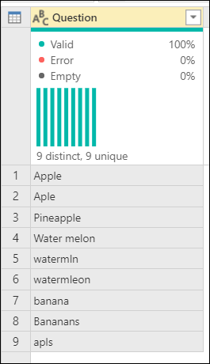
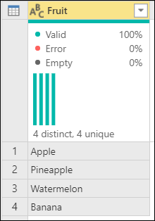
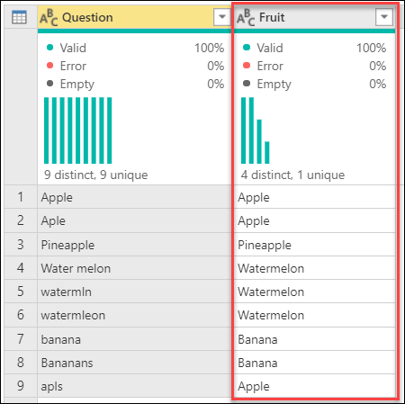
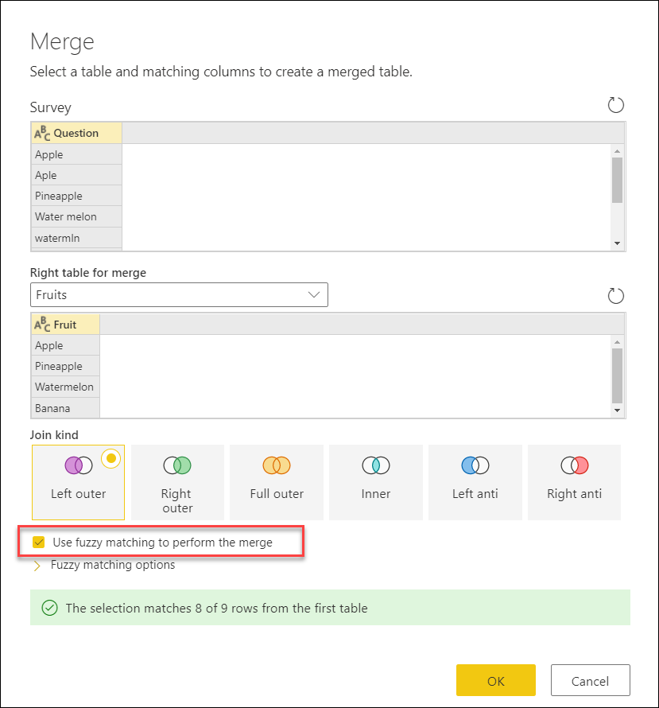
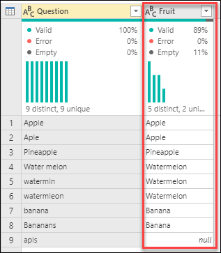
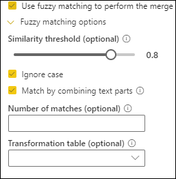
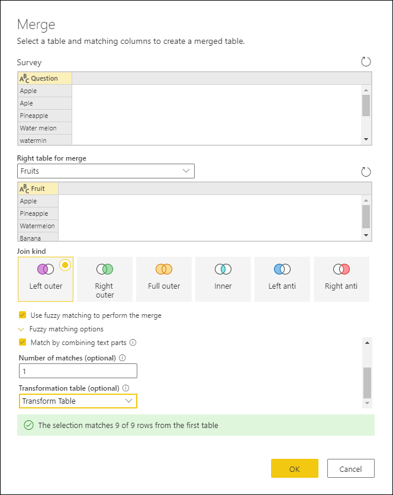

# Fuzzy merge

*Fuzzy merge* is a smart data preparation feature you can use to apply fuzzy matching algorithms when comparing columns, to try to find matches across the tables that are being merged. 

You can enable fuzzy matching at the bottom of the **Merge** dialog box by selecting the **Use fuzzy matching to perform the merge** option button. More information: [Merge operations overview](merge-queries-overview.md)

>[!NOTE]
>Fuzzy matching is only supported on merge operations over text columns. Power Query uses the Jaccard similarity algorithm to measure the similarity between pairs of instances. 

## Sample scenario

A common use case for fuzzy matching is with freeform text fields, such as in a survey. For this article, the sample table was taken directly from an online survey sent to a group with only one question: *What is your favorite fruit?*

The results of that survey are shown in the following image.

The nine records reflect the survey submissions. Take a closer look at the values provided: some have typos, some are plural, some are singular, some are uppercase, and some are lowercase.

We have a **Fruits** reference table, which will help us<!--Edit okay?--> standardize these values.

>[!NOTE]
>For simplicity, this **Fruits** reference table only includes the name of the fruits that will be needed for this scenario. Your reference table can have as many rows as you need.

The goal is to create a table like the following, where you've standardized all these values so you can do more analysis.

*Table 1. Final table for the fuzzy merge example* 

## Fuzzy merge

To perform the fuzzy merge, you start by doing a merge. In this case, you'll use a left outer join where the left table is the one from the survey and the right table is the **Fruits** reference table. At the bottom of the dialog box, select the **Use fuzzy matching to perform the merge**check box.

After you select **OK**, you can see a new column in your table as a result of this merge operation. If you expand it, you'll notice that there's one row that doesn't have any values in it. That's exactly what the dialog box message in the previous image stated when it said "The selection matches 8 of 9 rows from the first table."

## Fuzzy matching options

You can modify the **Fuzzy matching options** to tweak how the approximate match should be done. First, select the **Merge queries** command, and then in the **Merge** dialog box, expand **Fuzzy matching options**.

The available options are:

* **Similarity threshold (optional)**: A value between 0.00 and 1.00 that provides the ability to match records above a given similarity score. A threshold of 1.00 is the same as specifying an exact match criteria. For example, **Grapes** matches with **Graes** (missing the letter *p*) only if the threshold is set to less than 0.90. By default, this value is set to 0.80.
* **Ignore case**: Allows matching records no matter what the case of the text.
* **Match by combining text parts**: Allows combining text parts to find matches. For example, **Micro soft** is matched with **Microsoft** if this option is enabled.
* **Number of matches (optional)**: Specifies the maximum number of matching rows that can be returned.
* **Transformation table (optional)**: Allows matching records based on custom value mappings. For example, **Grapes** is matched with **Raisins** if a transformation table is provided where the **From** column contains **Grapes** and the **To** column contains **Raisins**.

## Transformation table
<!--In the screenshot, it looks like the name of the transformation table is **Transform Table**. Where is the transformation table created and saved? If its name is **Transform Table**, should that be the name of this heading?-->
For the example in this article, you can use a transformation table to map the value that has a missing pair. That value is **apls**, which needs to be mapped to **Apple**. Your transformation table has two columns:

* **From** contains the values to find.
* **To** contains the values that will be used to replace the values found by using the **From** column.

For this article, the transformation table will look as follows:

|From|To|
|---|---|
|apls|Apple|

You can go back to the **Merge** dialog box, and in **Fuzzy matching options** under **Number of matches (optional)**, enter **1**, and under **Transformation table (optional)**, select **Transform Table** from the drop-down menu.<!--Edits okay? I wasn't sure what was UI and what is to be entered by the user. -->

After you select **OK**, you'll create a table that looks like Table 1, with all values mapped correctly. Note how the example started with nine distinct values, but after the fuzzy merge, there are only four distinct values.
<!--

-->

