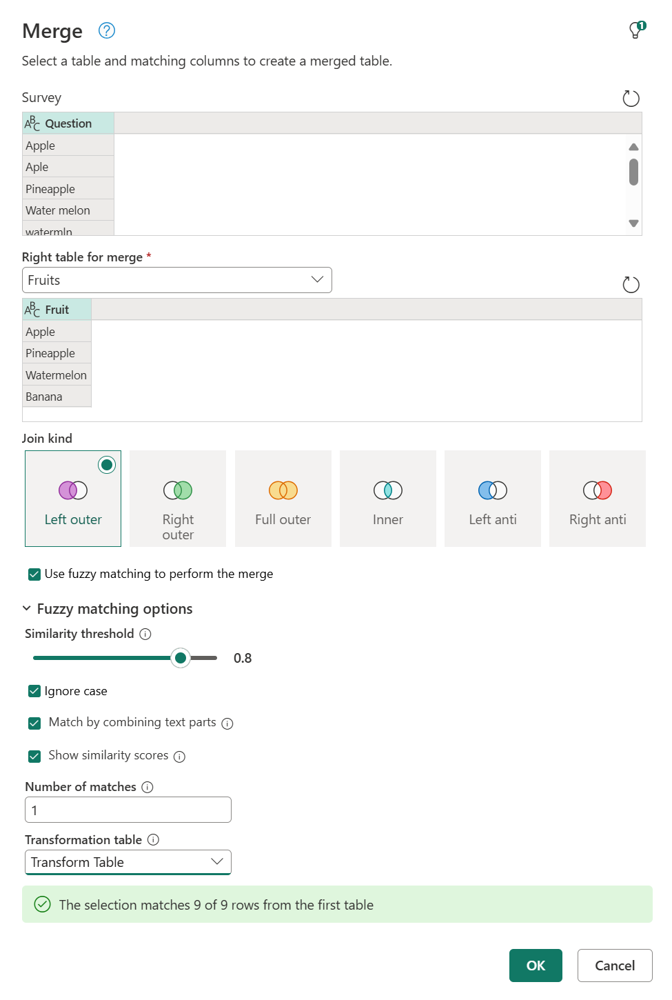

# Fuzzy merge

*Fuzzy merge* is a smart data preparation feature you can use to apply fuzzy matching algorithms when comparing columns, to try to find matches across the tables that are being merged.

You can enable fuzzy matching at the bottom of the **Merge** dialog box by selecting the **Use fuzzy matching to perform the merge** option button. More information: [Merge operations overview](merge-queries-overview.md)

>[!NOTE]
>Fuzzy matching is only supported on merge operations over text columns. Power Query uses the Jaccard similarity algorithm to measure the similarity between pairs of instances.

## Sample scenario

A common use case for fuzzy matching is with freeform text fields, such as in a survey. For this article, the sample table was taken directly from an online survey sent to a group with only one question: *What is your favorite fruit?*

The results of that survey are shown in the following image.

:::image type="complex" source="media/merge-queries-fuzzy-match/sample-table.png" alt-text="Sample survey with raw entries.":::
   Sample survey output table containing the column distribution graph showing nine distinct answers with all answers unique, and the answers to the survey with all the typos, plural or singular, and case problems.
:::image-end:::

The nine records reflect the survey submissions. The problem with the survey submissions is that some have typos, some are plural, some are singular, some are uppercase, and some are lowercase.

To help standardize these values, in this example you have a **Fruits** reference table.

:::image type="complex" source="media/merge-queries-fuzzy-match/sample-reference-table.png" alt-text="Fruits reference table.":::
   Fruits reference table containing column distribution graph showing four distinct fruits with all fruits unique, and the list of fruits: apple, pineapple, watermelon, and banana.
:::image-end:::

>[!NOTE]
>For simplicity, this **Fruits** reference table only includes the name of the fruits that will be needed for this scenario. Your reference table can have as many rows as you need.

The goal is to create a table like the following, where you've standardized all these values so you can do more analysis.

:::image type="complex" source="media/merge-queries-fuzzy-match/sample-output-table.png" alt-text="Sample survey output table.":::
   Sample survey output table with the Question column containing the column distribution graph showing nine distinct answers with all answers unique, and the answers to the survey with all the typos, plural or singular, and case problems, and also contains the Fruit column containing the column distribution graph showing four distinct answers with one unique answer and lists all of the fruits properly spelled, singular, and proper case.
:::image-end:::

## Fuzzy merge operation

To do the fuzzy merge, you start by doing a merge. In this case, you'll use a left outer join, where the left table is the one from the survey and the right table is the **Fruits** reference table. At the bottom of the dialog box, select the **Use fuzzy matching to perform the merge** check box.

:::image type="content" source="media/merge-queries-fuzzy-match/simple-merge-window.png" alt-text="Use fuzzy matching to perform the merge option.":::

After you select **OK**, you can see a new column in your table because of this merge operation. If you expand it, you'll notice that there's one row that doesn't have any values in it. That's exactly what the dialog box message in the previous image stated when it said "The selection matches 8 of 9 rows from the first table."

:::image type="complex" source="media/merge-queries-fuzzy-match/expand-no-transform-table.png" alt-text="Fuzzy match results in Fruit column.":::
   Fruit column added to the Survey table, with all rows in the Question column expanded, except for row 9, which could not expand and the Fruit column contains null.
:::image-end:::

## Fuzzy matching options

You can modify the **Fuzzy matching options** to tweak how the approximate match should be done. First, select the **Merge queries** command, and then in the **Merge** dialog box, expand **Fuzzy matching options**.

:::image type="content" source="media/merge-queries-fuzzy-match/fuzzy-matching-options.png" alt-text="Fuzzy matching options.":::

The available options are:

* **Similarity threshold (optional)**: A value between 0.00 and 1.00 that provides the ability to match records above a given similarity score. A threshold of 1.00 is the same as specifying an exact match criteria. For example, **Grapes** matches with **Graes** (missing the letter *p*) only if the threshold is set to less than 0.90. By default, this value is set to 0.80.
* **Ignore case**: Allows matching records no matter what the case of the text.
* **Match by combining text parts**: Allows combining text parts to find matches. For example, **Micro soft** is matched with **Microsoft** if this option is enabled.
* **Show similarity scores**: Shows similarity scores between the input and the matches values after fuzzy matching.
* **Number of matches (optional)**: Specifies the maximum number of matching rows that can be returned for every input row.
* **Transformation table (optional)**: Allows matching records based on custom value mappings. For example, **Grapes** is matched with **Raisins** if a transformation table is provided where the **From** column contains **Grapes** and the **To** column contains **Raisins**.

## Transformation table

For the example in this article, you can use a transformation table to map the value that has a missing pair. That value is **apls**, which needs to be mapped to **Apple**. Your transformation table has two columns:

* **From** contains the values to find.
* **To** contains the values that will be used to replace the values found by using the **From** column.

For this article, the transformation table will look as follows:

|From|To|
|---|---|
|apls|Apple|

You can go back to the **Merge** dialog box, and in **Fuzzy matching options** under **Number of matches**, enter **1**. Enable the **Show similarity scores** option, and then, under **Transformation table**, select **Transform Table** from the drop-down menu.

After you select **OK**, you can go to the merge step. When you expand the column with table values, you'll notice that besides the **Fruit** field you'll also see the **Similarity score field**. Select both and expand them without adding a prefix.

:::image type="content" source="media/merge-queries-fuzzy-match/expand-similarity-score.png" alt-text="Table expand dialog for the Fruits column that contains the Fruit and Similarity score fields selected.":::

After expanding these two fields, they'll be added to your table. Note the values you get for the similarity scores of each value. These scores can help you with further transformations if needed to determine if you should lower or raise your similarity threshold.

:::image type="content" source="media/merge-queries-fuzzy-match/similarity-scores-results.png" alt-text="Table output after the fuzzy merge process occurred showcasing both the new Fruit and Similarity score fields for each value from the original query.":::

For this example, the **Similarity score** serves only as additional information and isn't needed in the output of this query, so you can remove it. Note how the example started with nine distinct values, but after the fuzzy merge, there are only four distinct values.

:::image type="complex" source="media/merge-queries-fuzzy-match/sample-output-table-2.png" alt-text="Fuzzy merge survey output table.":::
   Fuzzy merge survey output table with the Question column containing the column distribution graph showing nine distinct answers with all answers unique, and the answers to the survey with all the typos, plural or singular, and case problems. Also contains the Fruit column with the column distribution graph showing four distinct answers with one unique answer and lists all of the fruits properly spelled, singular, and proper case.
:::image-end:::
