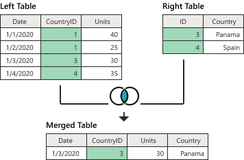
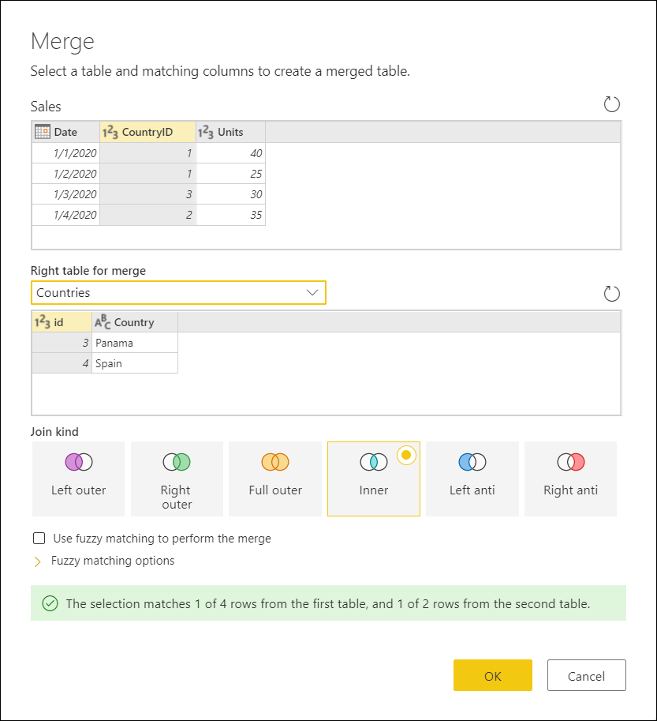

# Inner join

One of the join kinds available in the **Merge** dialog box in Power Query, an *inner join* brings only matching rows from both the left and right tables. More information: [Merge operations overview](merge-queries-overview.md)

This article uses sample data to show how to do a merge operation with the inner join. The sample source tables for this example are:

* **Sales**: This table includes the fields **Date**, **CountryID**, and **Units**. **CountryID** is a whole number value that represents the unique identifier from the **Countries** table.

   

* **Countries**: This is a reference table with the fields **id** and **Country**. The **id** field represents the unique identifier for each record.

   

In this example, you'll merge both tables, with the **Sales** table as the left table and the **Countries** table as the right one. The join will be made between the following columns.

|Field from the Sales table| Field from the Countries table|
|-----------|------------------|
|CountryID|id|

The goal is to create a table like the following, where the name of the country appears as a new **Country** column in the **Sales** table. Because of how the inner join works, only matching rows from both the left and right tables will be brought in.

*Table 1. Final table for the inner join example* 

<!--markdownlint-disable MD036-->
**To perform an inner join**
<!--markdownlint-enable MD036-->
1. Select the **Sales** query, and then select **Merge queries**.
2. In the **Merge** dialog box, under **Right table for merge**, select **Countries**.
3. In the **Sales** table, select the **CountryID** column.
4. In the **Countries** table, select the **id** column.
5. In the **Join kind** section, select **Inner**.
6. Select **OK**.

>[!TIP]
>Take a closer look at the message at the bottom of the dialog box that reads "The selection matches 1 of 4 rows from the first table, and 1 of 2 rows from the second table." This is crucial to understanding the result that you get from this operation. 

In the **Sales** table, you have a **CountryID** of 1 and 2, but neither of these values are found in the **Countries** table. That's why the match only found one of four rows in the left (first) table.

In the **Countries** table, you have the **Country** Spain with the **id** 4, but there are no records for a **CountryID** of 4 in the **Sales** table. That's why only one of two rows from the right (second) table found a match.

From the newly created **Countries** column, expand the **Country** field. Don't select the **Use original column name as prefix** check box.

After performing this operation, you'll create a table that looks like Table 1, shown earlier in this article.
<!--

-->
