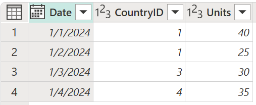
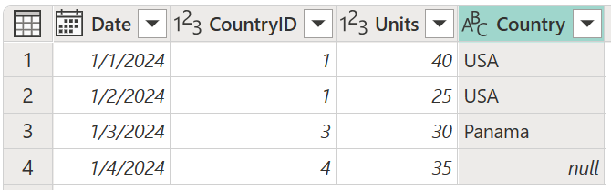

# Left outer join

One of the join kinds available in the **Merge** dialog box in Power Query is a *left outer join*, which keeps all the rows from the left table and brings in any matching rows from the right table. More information: [Merge operations overview](merge-queries-overview.md)

:::image type="complex" source="media/merge-queries-left-outer/left-outer-join-operation.png" alt-text="Left outer join example.":::
   Figure shows a table on the left with Date, CountryID, and Units columns. The emphasized CountryID column contains values of 1 in rows 1 and 2, 3 in row 3, and 4 in row 4. A table on the right contains ID and Country columns. The emphasized ID column contains values of 1 in row 1 (denoting USA), 2 in row 2 (denoting Canada), and 3 in row 3 (denoting Panama). A table below the first two tables contains Date, CountryID, Units, and Country columns. The table has four rows, with the top two rows containing the data for CountryID 1, one row for CountryID 3, and one row for Country ID 4. Since the right table didn't contain an ID of 4, the value of the fourth row in the Country column contains null.
   :::image-end:::

This article uses sample data to show how to do a merge operation with the left outer join. The sample source tables for this example are:

* **Sales**: This table includes the fields **Date**, **CountryID**, and **Units**. **CountryID** is a whole number value that represents the unique identifier from the **Countries** table.

   

* **Countries**: This table is a reference table with the fields **id** and **Country**. The **id** field represents the unique identifier for each record.

   :::image type="complex" source="media/merge-queries-left-outer/left-outer-join-countries-table.png" alt-text="Sample Country table for left outer join.":::
      Countries table with id set to 1 in row 1, 2 in row 2, and 3 in row 3, and Country set to USA in row 1, Canada in row 2, and Panama in row 3.
   :::image-end:::

In this example, you'll merge both tables, with the **Sales** table as the left table and the **Countries** table as the right one. The join will be made between the following columns.

|Field from the Sales table| Field from the Countries table|
|-----------|------------------|
|CountryID|id|

The goal is to create a table like the following, where the name of the country appears as a new **Country** column in the **Sales** table as long as the **CountryID** exists in the **Countries** table. If there are no matches between the left and right tables, a *null* value is the result of the merge for that row. In the following image, this is shown to be the case for **CountryID** 4, which was brought in from the **Sales** table.

:::image type="content" source="media/merge-queries-left-outer/left-outer-final-table.png" alt-text="Left outer join final table with the Country column added with the value of the fourth row of that column set to null.":::
<!--markdownlint-disable MD036-->
**To do a left outer join**
<!--markdownlint-enable MD036-->
1. Select the **Sales** query, and then select **Merge queries**.
2. In the **Merge** dialog box, under **Right table for merge**, select **Countries**.
3. In the **Sales** table, select the **CountryID** column.
4. In the **Countries** table, select the **id** column.
5. In the **Join kind** section, select **Left outer**.
6. Select **OK**.

:::image type="content" source="media/merge-queries-left-outer/left-outer-merge-window.png" alt-text="Merge dialog box showing the results of following the previous left outer join procedure.":::

From the newly created **Countries** column, expand the **Country** field. Don't select the **Use original column name as prefix** check box.

:::image type="content" source="media/merge-queries-left-outer/left-outer-expand-field.png" alt-text="Expand table column for Country.":::

After performing this operation, you'll create a table that looks like the following image.

