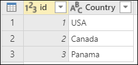
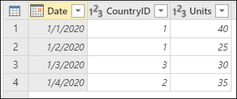
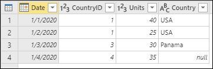
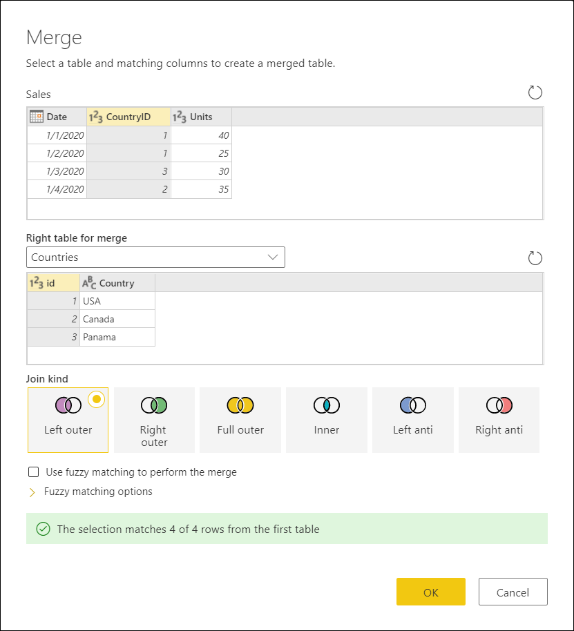
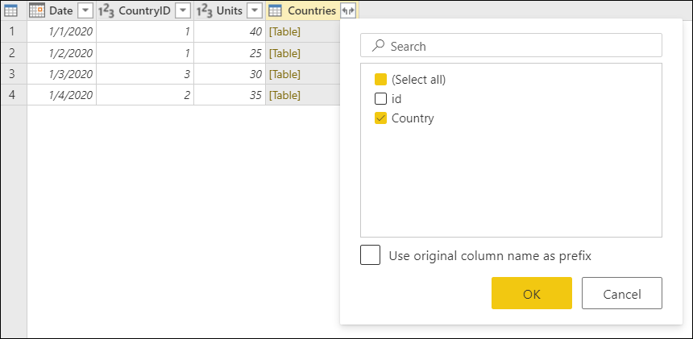

# Merge queries: left outer join

A left outer join is one of the join kinds available inside the **Merge queries** window in Power Query. To read more about the merge operations in Power Query, see [Merge operations overview](merge-queries-overview.md).

A left outer join keeps all the rows from the left table, and brings any matching rows from the right table.

This article demonstrates, with a practical example, how to perform a merge operation using the left outer join as the join kind.

>[!Note]
>Samples used in this article are only to showcase the concepts. The concepts showcased here apply to all queries in Power Query.

## Sample input and output tables

The sample source tables for this example are:
* **Countries**&mdash;this table is a reference table with the fields **id** and **Country**. The *id* represents the unique identifier of each record.

* **Sales**&mdash;with the fields **Date**, **CountryID**, and **Units**. The *CountryID* is a whole number value that represents the unique identifier from the **Countries** table.

The goal is to merge both tables, where the **Sales** table will be the left table and the **Countries** table the right one. The join will be made between the following columns:

|Field from Sales table| Field from Countries table|
|-----------|------------------|
|CountryID|id|

The goal is to reach the following table where the name of the country appears as a new **Country** column in the **Sales** table.

## Left outer join

To do a left outer join:

1. Select the **Sales** query and then select **Merge queries** to create a new step inside the Sales query that will merge the **Sales** query with the **Countries** query.
2. Select the **Countries** as the **Right table for merge**.
3. Select the **CountryID** column from the **Sales** table.
4. Select the **id** column from the **Countries** table.
5. From the **Join Kind** section, select the **Left outer** option.
6. Select **OK** button.

From the newly created **Countries** column after the merge operation, expand the **Country** field without using the original column name as prefix.

After doing this operation, the desired result is reached.

