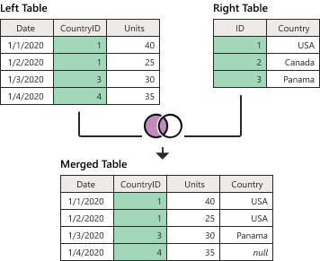

# Left outer join
<!--I think the structure of the join kind articles can be streamlined quite a bit. I'll follow this pattern for the others, but without all the editorial commentary.-->
One of the join kinds available in the **Merge** dialog box in Power Query, a *left outer join* keeps all the rows from the left table and brings any matching rows from the right table. More information: [Merge operations overview](merge-queries-overview.md)

<!--I don't understand the intent of this note; recommend deleting.
>[!NOTE]
>Samples used in this article are only to showcase the concepts. The concepts showcased here apply to all queries in Power Query.-->

This article uses sample data to show how to do a merge operation with the left outer join. The sample source tables for this example are:

* **Sales**: This table includes the fields **Date**, **CountryID**, and **Units**. **CountryID** is a whole number value that represents the unique identifier from the **Countries** table.

   

* **Countries**: This is a reference table with the fields **id** and **Country**. The **id** field represents the unique identifier for each record.

   

In this example, you'll merge both tables, with the **Sales** table as the left table and the **Countries** table as the right one. The join will be made between the following columns.

|Field from the Sales table| Field from the Countries table|
|-----------|------------------|
|CountryID|id|

The goal is to create a table like the following, where the name of the country appears as a new **Country** column in the **Sales** table as long as the **CountryID** exists in the **Countries** table. If there are no matches between the left and right tables, a *null* value is the result of the merge for that row. In Table 1, this is shown to be the case for **CountryID** 4, which was brought in from the **Sales** table. 

*Table 1. Final table for the left outer join example* 

<!--markdownlint-disable MD036-->
**To perform a left outer join**
<!--markdownlint-enable MD036-->
1. Select the **Sales** query, and then select **Merge queries**.<!--Suggested. The original didn't seem prescriptive enough. In the middle of a numbered step is no place for all that commentary.-->
2. In the **Merge** dialog box, under **Right table for merge**, select **Countries**.
3. In the **Sales** table, select the **CountryID** column.
4. In the **Countries** table, select the **id** column.
5. In the **Join kind** section, select **Left outer**.
6. Select **OK**.

From the newly created **Countries** column, expand the **Country** field. Don't select the **Use original column name as prefix** check box.

After performing this operation, you'll create a table that looks like Table 1, shown earlier in this article.
<!--
 -->
