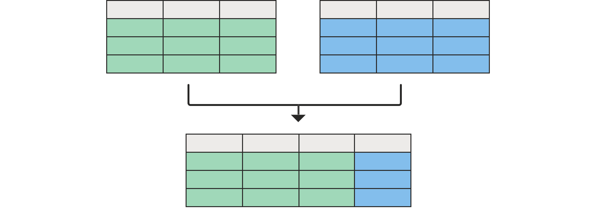

# Merge queries overview

A merge operation joins two existing tables together based on matching values from one or multiple columns. There are different types of joins that could used depending the desired output. 

## To merge queries

You can find **Merge queries** in the **Home** tab under the **Combine** group. From the dropdown you'll see two options:
* **Merge queries**&mdash;displays the **Merge** window with the selected query as the left table of the merge operation.
* **Merge queries as new**&mdash;displays the **Merge** window without any preselected tables for the merge operation.

The merge operation requires two tables:
* **Left table for merge**&mdash;the first selection from top to bottom.
* **Right table for merge**&mdash;the last selection from top to bottom.

>[!Note]
>The position, left or right, of the tables is very important when selecting the correct **Join kind** to be used.

### Select column pairs

After both the left and right table have been selected, you can select the columns that should drive the join between the tables. In the example below, there are two tables:
* **Sales**&mdash;the **CountryID** field is a key or an identifier from the countries table.
* **Countries**&mdash;this table contains the **CountryID** as well as the name of the country.

The goal is to join these tables using the **CountryID** column from both tables, so you select the **CountryID** column from each table. After the selection is made, a simple message with an estimated number of matches is displayed at the bottom of the window.

>[!Note]
> While this example shows the same column header for both tables, it isn't a requirement for the merge operation. Column headers don't need to match between tables. It's also important to note that the columns must be of the same data type, otherwise Power Query does not guarantee the correct results.

You can also select multiple columns to perform the join by holding the *Ctrl* key when selecting the columns. When doing so, the order in which the columns were selected will be displayed next to the column headers as small numbers starting from the number one. 

In the following sample, you have the **Sales** and **Countries** tables. Each of the tables have the **CountryID** and **StateID** columns, which you need to pair for the join between both columns. 
In this case, first select the **CountryID** column from the **Sales** table, hold the *Ctrl* key, and then select the **StateID** column. This will show the small numbers mentioned before, and you can now do the same set of column selections for the **Countries** table. The following image shows the result of selecting those columns.

### New merged table column

After selecting **OK** in the **Merge** window, the base table of your query will have all of the columns from your left table. Also, a new column is added with the same name as your right table. This column holds the values corresponding to the right table on a row by row basis.

From here, you can choose to expand or aggregate the fields from this new table column, which will be the fields from your right table.

>[!Note]
>Currently the Power Query Online experience only provides the expand operation in its interface. The option to *aggregate* will be added later on this year.

## Join kinds

A join kind specifies how a merge operation should be performed. The following table describes the available join kinds in Power Query:

|Join Kind| Icon| Description|
|---------------|-----|-----------|
|Left outer| | All rows from left table, matching from right table|
|Right outer| | All rows from right table, matching from left table|
|Full outer| | All rows from both tables|
|Inner| | Only matching rows from both tables|
|Left anti| | Only rows from left table|
|Right anti| | Only rows from right table|

## Fuzzy matching

Fuzzy merge allows you to apply fuzzy matching algorithms when comparing columns to try to find matches across tables being merged. You can enable this feature by selecting the **Use fuzzy matching to perform the merge** option inside the **Merge** window. You can expand the **Fuzzy matching options** to view all the available configurations.

>[!Note]
>Fuzzy matching is only supported on merge operations over text columns. 
